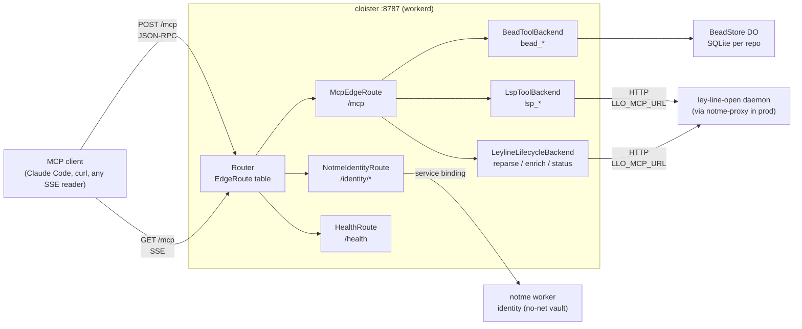

# cloister

SSE/HTTP edge router for the ART constellation. Same TypeScript bundle runs
locally on `workerd` and on Cloudflare Workers in production. One HTTP port,
one routing table, protocol-agnostic backends.



The architecture: ADR-0002 reframes cloister as an SSE/HTTP edge router with
protocol-agnostic backends. MCP is one tenant of the pipe; identity is
another; future tenants (gRPC, WebSocket) plug into the same `EdgeRoute`
table. Read the rationale: [ADR-0002](docs/adr/0002-edge-router-protocol-agnostic-backends.md).

The route table is **declared, not coded** — `cloister.capnp` at the repo
root is the source of truth, compiled by `task manifest` to a typed TS
module that `src/index.ts` imports. To add an MCP-fronted service, edit
`cloister.capnp`. See [ADR-0004](docs/adr/0004-capnp-manifest.md).

## What it does

- **Bead CRUD** — `bead_create | update | search | list | close | comment` against
  per-repo Durable Objects (native SQLite, one DB instance per repo path).
- **LSP forwarding** — `lsp_hover | defs | refs | symbols | diagnostics` proxied
  to `ley-line-open` over HTTP, via `notme-proxy` UDS in prod.
- **Daemon lifecycle** — `reparse | enrich | status` forwarded to the same
  `ley-line-open` daemon. The Claude Code plugin auto-fires `reparse` on every
  edit so LSP results stay fresh.
- **Identity proxy** — `/identity/*` forwards to [notme](https://github.com/agentic-research/notme)
  over a workerd service binding (the notme vault has no network — cloister
  is the only thing on the network in front of it).
- **SSE streaming** — `GET /mcp` returns standard `text/event-stream`; any
  language's EventSource reads it without MCP-specific libraries.
- **Claude Code plugin** — `cloister-stale-sync` ships in this repo; closes the
  stale-rust-analyzer gap inside long CC sessions. See [hooks/README.md](hooks/README.md).

## Quickstart

```bash
# Terminal 1 — ley-line-open daemon (for lsp_* + reparse/enrich/status)
leyline daemon --mcp-port 8384

# Terminal 2 — cloister
pnpm install && task dev    # → http://localhost:8787

# Terminal 3 — notme (optional, for /identity/*)
cd ../notme/worker && wrangler dev --port 8788
```

Wire Claude Code:

```json
{
  "mcpServers": {
    "cloister": { "transport": "http", "url": "http://localhost:8787/mcp" }
  }
}
```

Smoke test:

```bash
curl -s -X POST http://localhost:8787/mcp \
  -H 'Content-Type: application/json' \
  -d '{"jsonrpc":"2.0","method":"tools/list","id":1}' \
  | jq '.result.tools[].name'
```

For step-by-step setup including upstream wiring and end-to-end verification,
see [GETTING-STARTED.md](GETTING-STARTED.md).

## Run via workerd directly (no Cloudflare account)

```bash
pnpm run build:local                           # bundle → dist/index.js
npx workerd serve config.capnp --experimental
```

`config.capnp` and `wrangler.toml` are kept in sync: same bindings (`BEAD_STORE`,
`NOTME`, `ROSARY_MCP_URL`, `LLO_MCP_URL`, `SIGNET_URL`) on both paths.

## Tasks

```bash
task lint           # tsc + worker tests + plugin tests
task test           # vitest in real workerd (real DOs, real SQLite)
task test:plugin    # node --test for the CC plugin script
task manifest       # cloister.capnp → src/generated/manifest.ts (ADR-0004)
task build:local    # bundle for workerd (depends on `manifest`)
task dev            # wrangler dev hot-reload (depends on `manifest`)
task serve:local    # workerd serve config.capnp
task smoke          # spins up leyline + cloister, exercises full chain
task apk            # build APK via melange (signed)
task image          # compose distroless OCI image via apko (→ cloister.tar)
task image:check    # validate melange.yaml + apko.yaml without a real build
```

## Hardening knobs

- **`ALLOWED_ORIGINS`** (env var, comma-separated) — CORS allowlist. Default
  is wildcard echo for dev convenience. Set to e.g.
  `http://localhost:*,https://app.example.com` for prod. Supports a single
  trailing `:*` port wildcard per entry; no general globs. Disallowed
  origins get the `null` sentinel back, which browsers refuse.
- **Container** — `task image` produces a distroless OCI image
  (`cloister.tar`), workerd + bundle only, no shell/pkgmgr, runs as
  uid `65532`. Mount `/data` for DO SQLite persistence.

## Claude Code plugin

The repo doubles as a Claude Code plugin. The plugin root is the repo root
(`.claude-plugin/plugin.json`) — the worker code and the plugin ship together.

```sh
# Install:
claude plugin add ~/path/to/cloister
```

It registers a `PostToolUse` hook (`Edit | Write | MultiEdit | NotebookEdit`)
that fires `reparse` against cloister so `lsp_*` tools stay accurate inside
long sessions. Config + tests: [hooks/README.md](hooks/README.md).

## Ecosystem

| Service                                                      | Runtime              | Role                                          |
| ------------------------------------------------------------ | -------------------- | --------------------------------------------- |
| cloister                                                     | workerd / CF Workers | Edge router (this repo)                       |
| [notme](https://github.com/agentic-research/notme)           | workerd / CF Workers | Identity authority + UDS-front for daemons    |
| [ley-line-open](https://github.com/agentic-research/ley-line-open) | Rust daemon    | Tree-sitter parse + LSP enrichment + MCP HTTP |
| rosary                                                       | Rust binary          | Orchestration, bead tracking, dispatch        |
| mache                                                        | Go binary            | Code intelligence FUSE                        |
| signet                                                       | Go binary            | Key exchange                                  |

## Documentation map

- [GETTING-STARTED.md](GETTING-STARTED.md) — install, run, smoke-test, wire upstreams, install the plugin
- [docs/ARCHITECTURE.md](docs/ARCHITECTURE.md) — runtime model, request routing, component map, packaging
- [docs/adr/0001-workerd-mcp-gateway.md](docs/adr/0001-workerd-mcp-gateway.md) — why workerd
- [docs/adr/0002-edge-router-protocol-agnostic-backends.md](docs/adr/0002-edge-router-protocol-agnostic-backends.md) — why edge router, not MCP gateway
- [docs/adr/0003-content-addressed-bead-store.md](docs/adr/0003-content-addressed-bead-store.md) — bead storage as content-addressed DAG + CAS refs
- [docs/adr/0004-capnp-manifest.md](docs/adr/0004-capnp-manifest.md) — Cap'n Proto manifest for declarative route + backend registration
- [docs/adr/0005-internal-wire-leyline-net.md](docs/adr/0005-internal-wire-leyline-net.md) — internal wire = leyline-net (signed capnp); MCP only at the public face
- [hooks/README.md](hooks/README.md) — `cloister-stale-sync` Claude Code plugin

## License

AGPL-3.0 — see [LICENSE](LICENSE).
