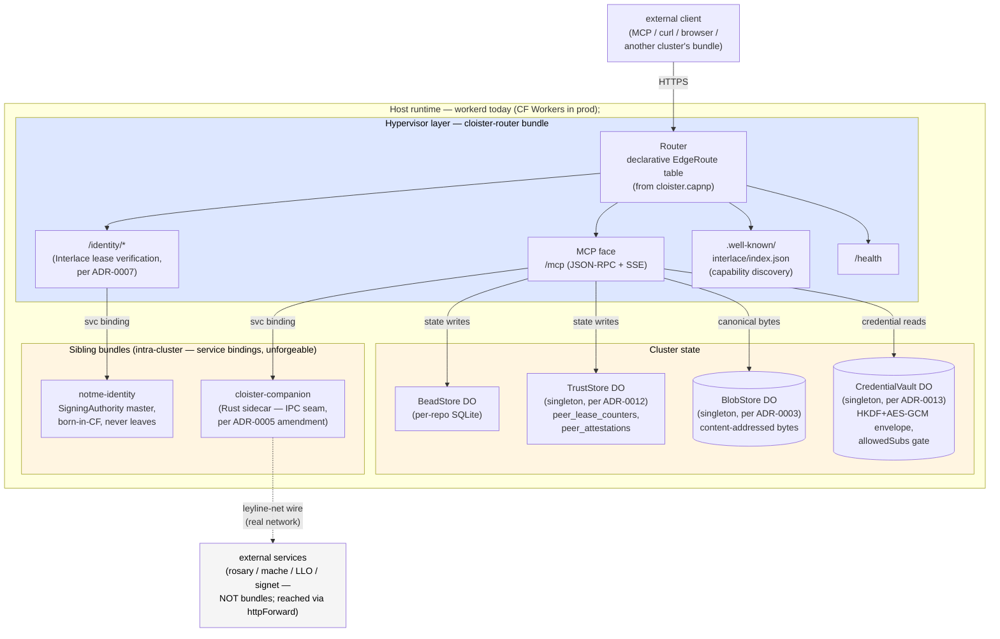

# cloister

**Cloister hosts MCP servers behind one HTTP face.** Identity, audit,
and per-bundle credential scoping are wired through the substrate, not
bolted on per-tenant. It's offline-first: runs locally on `workerd`
with no cloud account required. The same TypeScript bundle deploys to
Cloudflare Workers when you want a public endpoint — cloud is optional,
not load-bearing.

The interface is a declarative manifest at [`cloister.capnp`](cloister.capnp).
Today's hosted tenants are `bead_*`, `mache_*`, `lsp_*`, lifecycle
(`reparse`/`enrich`/`status`), and the Interlace identity bridge —
anything HTTP-shaped plugs into the same route table without touching
the substrate. Backend kinds and schema rules live in
[ADR-0004](docs/adr/0004-manifest-as-build-time-config.md).

## Load-bearing claims (and how they're defended)

The security properties cloister publishes are defended by running
code + tests + cross-implementation byte-equality, not just stated
in ADRs. Four specific claims worth knowing about:

| Claim | Where it lives | How it's defended |
|---|---|---|
| **§13.2 "silence is evidence"** *(known gap — see note)* — every authenticated request advances a hash-chained counter, every state-boundary write advances an attestation chain. A third party with the master pubkey can verify the chain offline; a missing row indicates the actor admitted the request off-record. **Today this property holds under honest-actor-at-admission assumption only on the response side** (TLS provides no post-session non-repudiation on application records, so a peer cannot mathematically prove to a third-party auditor that the actor returned 2xx). The request side is already non-repudiable in 0.1.0 (P signs the canonical request under its lease cert). interlace-spec 0.2.0 closes the response-side gap with mandatory signed receipts (commitments to request_hash + body_hash + allowlisted headers, with archival CA-bundle resolution for historical audit and a normative streaming-chain construction for SSE where the close commitment is cryptographically paired to the open via `open_commitment_hash`); see [`interlace-spec/0.2.0-draft/RECEIPTS.md`](interlace-spec/0.2.0-draft/RECEIPTS.md) (revised three times per math-friend review). **Phase 1 shipped 2026-05-12** (`cloister-ae713f`, commit `a0d3fd3`) — full TypeScript implementation in emit-but-don't-enforce mode. `RECEIPT_SIGNING_KEY` unset → no emission (default for dev/test). | [ADR-0007](docs/adr/0007-interlace-substrate.md); receipts emission at [`src/routes/receipt-emitter.ts`](src/routes/receipt-emitter.ts); orchestrator at [`src/routes/bead-create-orchestrator.ts`](src/routes/bead-create-orchestrator.ts) | Phase 1 runtime path on every authenticated 2xx response (`cloister-ae713f`). End-to-end smoke at [`test/security/disclosure-attestation-smoke.test.ts`](test/security/disclosure-attestation-smoke.test.ts) proves `BlobStore digest = BeadStore.content_hash = peer_attestations.content_hash`. 104 new receipts tests at `test/wire/`, `test/storage/`, `test/routes/`, `test/spec/interlace-receipts.test.ts`. Cross-implementation: Python ref impl in [`interlace-spec/0.1.0/ref-impl-py/`](interlace-spec/0.1.0/ref-impl-py/) passes the same 27 conformance vectors (0.2.0 vectors are future work). **The chain-completeness claim becomes load-bearing only at 0.2.0 Phase 2 cutover (operator flips `RECEIPT_SIGNING_KEY` env + peers fail-closed on missing receipts); Phase 1 emits but doesn't enforce, so selective-drop attacks remain undetectable in that phase.** |
| **§9.4 constant-time 404** — the disclosure endpoint can't be used as a peer-enumeration oracle. Auth-fail / bad-cursor / unknown-peer all return byte-identical 404s in within-clock-grain time. | [`src/routes/disclosure.ts`](src/routes/disclosure.ts) + `TrustStore.peerHasChain` | Bench-pinned ([`docs/perf/2026-05-10-disclosure-endpoint.md`](docs/perf/2026-05-10-disclosure-endpoint.md)). Constant-cost via SQL semantics (`SELECT 1 ... LIMIT 1`), not padding or placeholders. Pre-fix delta was 17×; post-fix is 60µs, inside workerd's `performance.now()` floor. |
| **Slice-grant via V8 isolate + service-binding-as-syscall** — a compromised tool bundle cannot exfiltrate credentials outside its `allowedSubs`. Plaintext credential bytes never cross the RPC boundary. | [ADR-0013](docs/adr/0013-slice-grant-enforcement.md); [`src/vault-store.ts`](src/vault-store.ts) | Prompt-injection demo at [`test/security/prompt-injection.test.ts`](test/security/prompt-injection.test.ts) — 19 cases including glob-boundary edge cases, sealed-at-rest verification, cross-slice denial without leak. |
| **Substrate overhead is bounded + measured** — the lease pipeline is <1ms p50 / 1ms p99 / 3ms p99 (post-batching). 85% of cost is DO RPCs; crypto is cheap. | [`docs/perf/2026-05-10-lease-pipeline.md`](docs/perf/2026-05-10-lease-pipeline.md) | Reproducible bench harness at [`test/perf/lease-pipeline.test.ts`](test/perf/lease-pipeline.test.ts) (opt-in via `task bench:lease`). Five surface benches total. |

If any of those break, the substrate's claim breaks; the gate at
[`docs/security/threat-model.md`](docs/security/threat-model.md) §11
is where the test-vs-claim accounting lives.

Cloister's wire protocol is **documented standalone** at
[`interlace-spec/0.1.0/`](interlace-spec/0.1.0/README.md) — formal CDDL
schemas, 27 deterministic test vectors. The Python reference impl
passes the same vectors as cloister's TypeScript runtime; that's the
mechanism cloister uses to cross-check its own correctness. The spec
exists for cloister's rigor, not as a campaign to standardize
externally.

**Three entry points depending on what you're here for:**
- **Run it locally** → [GETTING-STARTED.md](GETTING-STARTED.md)
- **Verify the security claims** → [Load-bearing claims](#load-bearing-claims-and-how-theyre-defended) below
- **Understand the architecture** → keep reading

> **Contents**
> - [Load-bearing claims](#load-bearing-claims-and-how-theyre-defended) — what cloister actually defends
> - [Hypervisor layer](#what-runs-at-the-hypervisor-layer) — what cloister itself owns
> - [Bundles + tenants](#what-rides-on-top-bundles--tenants) — what rides on the route table
> - [What cloister is NOT](#what-cloister-is-not) — decide whether to keep reading
> - [Quickstart](#quickstart) — 5-minute local boot
> - [Run via workerd directly](#run-via-workerd-directly-no-cloudflare-account) — no Cloudflare account
> - [Tasks](#tasks) — the `task` targets you'll use most
> - [Hardening knobs](#hardening-knobs) — what to flip before prod
> - [Plugin](#claude-code-plugin) — the Claude Code plugin in [`hooks/`](hooks/)
> - [Ecosystem](#ecosystem) — sibling repos cloister talks to
> - [Architectural framing](#architectural-framing) — the ADR story
> - [Documentation map](#documentation-map) — where each kind of doc lives



The route table is **declared, not coded** — [`cloister.capnp`](cloister.capnp)
at the repo root is the source of truth, compiled by `task manifest`
(runs at build + on-save; see [Tasks](#tasks)) to a typed TS module
that [`src/index.ts`](src/index.ts) imports. To add a route, backend,
or new bundle to the cluster, edit [`cloister.capnp`](cloister.capnp).
See [ADR-0004](docs/adr/0004-capnp-manifest.md) for the manifest
substrate and [ADR-0011](docs/adr/0011-hypervisor-bundle-boundary.md)
for which responsibilities live at the hypervisor layer vs the bundle
layer.

## What runs at the hypervisor layer

Per [ADR-0011](docs/adr/0011-hypervisor-bundle-boundary.md): code is
hypervisor-layer if it (a) mediates between bundles or to the outside,
(b) compromise blast-radius is multi-bundle, (c) singleton per cluster.

- **Routing** — `Router` + `EdgeRoute` dispatch over the public face
  (`/mcp`, `/health`, `/identity/*`, `/.well-known/*`,
  `/interlace/peers/{fp}`).
- **Lease verification** — verify Signet ephemeral certs against the
  pinned master + freshly-fetched epoch bundle (per
  [ADR-0007](docs/adr/0007-interlace-substrate.md) audit amendment).
  Bundles see only the verified cert + resolved scope.
- **Capability distribution** — credential reads go through the
  `CredentialVault` DO; per-credential `allowedSubs` glob lists gate
  access against the caller's identity. Enforcement is **V8 isolate
  + service-binding-as-syscall**, not signed slice tokens
  (per [ADR-0013](docs/adr/0013-slice-grant-enforcement.md), the
  ratification of [ADR-0010](docs/adr/0010-vault-and-bundle-clusters.md)'s
  framing).
- **State-boundary attestation** — on bead writes (the cluster's
  durable state), the cross-DO orchestrator at
  [`src/routes/bead-create-orchestrator.ts`](src/routes/bead-create-orchestrator.ts)
  runs the ADR-0012 four-step handoff (`BlobStore.put → BeadStore.write
  → TrustStore.applyAttestation → optional pending-retry enqueue`) so
  every authenticated `bead_create` lands an attestation row keyed by
  the canonical-bytes digest. Per-call lease counters update on every
  authenticated request. The §13.2 "silence is evidence" invariant is
  runtime-load-bearing (per `cloister-492c08`), not just specified —
  end-to-end smoke at
  [`test/security/disclosure-attestation-smoke.test.ts`](test/security/disclosure-attestation-smoke.test.ts)
  proves `BlobStore digest = BeadStore.content_hash = peer_attestations.content_hash`.
- **Inter-cluster identity** — Interlace handshake,
  `.well-known/interlace/` publication, selective-disclosure read
  endpoint for peer attestations.

## What rides on top (bundles + tenants)

- **Bead state** — `bead_create | update | search | list | close | comment`
  against per-repo Durable Objects. The `cloister-router` bundle's
  state surface; one of the cluster's tenants.
- **Code intelligence forward** — `lsp_hover | defs | refs | symbols |
  diagnostics` and `reparse | enrich | status` proxied to `ley-line-open`
  over HTTP. ley-line-open is **not** a bundle; it's an external service
  the cluster reaches via `httpForward`.
- **Code intelligence cluster** — `mache_*` tools auto-derived from
  `mache`'s upstream `tools/list` (per
  [ADR-0006](docs/adr/0006-derived-tool-schemas.md)). Same external
  pattern.
- **Notme identity** — sibling bundle in the cluster
  (workerd-resident); reachable via service binding only. The Signet
  master lives in its `SigningAuthority` DO and never leaves.
- **Identity ecosystem bridge** — the cluster's native Interlace
  identity (master pubkey + manifest capabilities) is also published
  under OIDC discovery (`/.well-known/openid-configuration`,
  `/.well-known/jwks.json`), WebFinger (`/.well-known/webfinger`),
  and Nostr NIP-05 (`/.well-known/nostr.json`), with a
  `client_credentials` token endpoint at `/oauth/token`. First
  non-MCP tenant — same routing fabric, different wire format
  (`cloister-c9922f`; see [`src/routes/well-known-identity.ts`](src/routes/well-known-identity.ts)).
- **In-cluster OCI registry** — the same `BlobStore` that holds bead
  canonical bytes (ADR-0003 phase 1) doubles as a content-addressed
  blob store for OCI images. `cloister` serves the OCI Distribution
  Spec v1.1 read-only pull path at `/v2/*` (handshake, catalog,
  tags/list, manifest + blob `GET`/`HEAD`), with a small
  `registry_tags` index in TrustStore keyed by `(repo, tag)`. Air-
  gapped deploys can `task registry:import cloister.tar` and
  `docker pull localhost:8787/cloister:latest` without an external
  registry. Second non-MCP tenant — load-bearing demonstration that
  the ADR-0002 protocol-agnostic seam holds for content-addressed
  binary wires too (`cloister-cabd57`; see
  [`src/routes/oci-registry.ts`](src/routes/oci-registry.ts)).
- **Claude Code plugin** — `cloister-stale-sync` ships in this repo;
  closes the stale-rust-analyzer gap inside long CC sessions.
  See [hooks/README.md](hooks/README.md).

## What cloister is NOT

So you can decide whether to read further, here's what cloister
*explicitly isn't*:

- **Not an MCP server.** MCP is the most visible tenant today, but
  cloister is a substrate (edge router + bundle host + auth
  middleware). MCP is one route table entry; the identity-format-
  shifting bridge (OIDC / WebFinger / NIP-05) at `/.well-known/*` is
  another (`cloister-c9922f`). The protocol-agnostic framing is
  load-bearing for ADR-0002 — adding further tenants (gRPC, WebSocket,
  anything HTTP-shaped) plugs into the same `EdgeRoute` table without
  touching the substrate.
- **Not Kubernetes.** cloister's cluster shape (`cluster.capnp` →
  multi-container pod) targets containerd / podman / nerdctl / kubelet,
  but it doesn't replace them. You bring your container runtime;
  cloister provides the manifest + the wiring. K8s can run the same
  pod manifest.
- **Not a service mesh.** No Envoy sidecar per service. The lease
  middleware lives in cloister-router itself — one gate at the cluster
  edge, not N gates at N sidecars. Auth verification is centralized.
- **Not a database.** Durable Objects hold bead/trust/blob state, but
  they're an integration point, not the system of record. Replicas +
  multi-region storage are an ADR-0010 follow-on; today's DOs are
  per-cluster singletons.
- **Not a build tool.** apko / melange build the OCI images; cloister
  consumes those artifacts via the manifest. The container ecosystem
  is BYO.
- **Not a replacement for Cloudflare Workers.** workerd runs on CF
  Workers identically; cloister cluster-in-a-pod is for self-hosters
  who don't want a CF account. Same code, different host.

## Quickstart

Three-terminal smoke. For the longer walkthrough (toolchain, ports,
auth setup), see [GETTING-STARTED.md](GETTING-STARTED.md).

```bash
# Terminal 1 — ley-line-open daemon (for lsp_* + reparse/enrich/status)
leyline daemon --mcp-port 8384

# Terminal 2 — cloister
pnpm install && task dev    # → http://localhost:8787

# Terminal 3 — notme (optional, for /identity/*)
cd ../notme/worker && wrangler dev --port 8788
```

Wire Claude Code:

```json
{
  "mcpServers": {
    "cloister": { "transport": "http", "url": "http://localhost:8787/mcp" }
  }
}
```

Smoke test:

```bash
curl -s -X POST http://localhost:8787/mcp \
  -H 'Content-Type: application/json' \
  -d '{"jsonrpc":"2.0","method":"tools/list","id":1}' \
  | jq '.result.tools[].name'
```

For step-by-step setup including upstream wiring and end-to-end verification,
see [GETTING-STARTED.md](GETTING-STARTED.md). For wiring details specific
to MCP clients (Claude Code, Cursor, raw curl) — auth, transport, common
failure modes — see [docs/integration/mcp-client.md](docs/integration/mcp-client.md).

## Run via workerd directly (no Cloudflare account)

```bash
pnpm run build:local                           # bundle → dist/index.js
npx workerd serve config.capnp --experimental
```

[`config.capnp`](config.capnp) and [`wrangler.toml`](wrangler.toml) are kept in sync: same bindings (`BEAD_STORE`,
`NOTME`, `ROSARY_MCP_URL`, `LLO_MCP_URL`, `SIGNET_URL`) on both paths.

## Tasks

```bash
task lint           # tsc + worker tests + plugin tests
task test           # vitest in real workerd (real DOs, real SQLite)
task test:plugin    # node --test for the CC plugin script
task manifest       # cloister.capnp → src/generated/manifest.ts (ADR-0004)
task build:local    # bundle for workerd (depends on `manifest`)
task dev            # wrangler dev hot-reload (depends on `manifest`)
task serve:local    # workerd serve config.capnp
task smoke          # spins up leyline + cloister, exercises full chain
task apk            # build APK via melange (signed)
task image          # compose distroless OCI image via apko (→ cloister.tar)
task image:check    # validate melange.yaml + apko.yaml without a real build
```

## Hardening knobs

- **`ALLOWED_ORIGINS`** (env var, comma-separated) — CORS allowlist. Default
  is wildcard echo for dev convenience. Set to e.g.
  `http://localhost:*,https://app.example.com` for prod. Supports a single
  trailing `:*` port wildcard per entry; no general globs. Disallowed
  origins get the `null` sentinel back, which browsers refuse.
- **Container** — `task image` produces a distroless OCI image
  (`cloister.tar`), workerd + bundle only, no shell/pkgmgr, runs as
  uid `65532`. Mount `/data` for DO SQLite persistence.
- **`VAULT_KEK_SOURCE`** (env var, URL) — picks where the vault DO
  resolves its envelope-encryption KEK from at boot. Schemes:
  `env://NAME` (plaintext binding, legacy default), `file:///path`
  (workerd `disk` service via `KEK_DISK`), `keychain://service-name`
  (macOS Keychain via the `kek-helper` sidecar bound as `KEK_HELPER`),
  or `http(s)://...` (generic helper). See
  [ADR-0014](docs/adr/0014-pluggable-kek-source.md) +
  [GETTING-STARTED §9](GETTING-STARTED.md#vault-kek--keep-it-out-of-plaintext-bindings)
  for the self-host walkthrough. **Don't put a production KEK in a
  plaintext `text` binding if you can avoid it.**

## Claude Code plugin

The repo doubles as a Claude Code plugin. The plugin root is the repo root
(`.claude-plugin/plugin.json`) — the worker code and the plugin ship together.

```sh
# Install:
claude plugin add ~/path/to/cloister
```

It registers a `PostToolUse` hook (`Edit | Write | MultiEdit | NotebookEdit`)
that fires `reparse` against cloister so `lsp_*` tools stay accurate inside
long sessions. Config + tests: [hooks/README.md](hooks/README.md).

## Ecosystem

| Service                                                      | Runtime              | Role                                          |
| ------------------------------------------------------------ | -------------------- | --------------------------------------------- |
| cloister                                                     | workerd / CF Workers | Edge router (this repo)                       |
| [notme](https://github.com/agentic-research/notme)           | workerd / CF Workers | Identity authority + UDS-front for daemons    |
| [ley-line-open](https://github.com/agentic-research/ley-line-open) | Rust daemon    | Tree-sitter parse + LSP enrichment + MCP HTTP |
| rosary                                                       | Rust binary          | Orchestration, bead tracking, dispatch        |
| mache                                                        | Go binary            | Code intelligence FUSE                        |
| signet                                                       | Go binary            | Key exchange                                  |

## Architectural framing

Looked at from the right height, cloister is **a v8-isolate hypervisor**:
it hosts workerd Workers, wires them into clusters via service bindings,
mediates their access to credentials and identity, and routes external
traffic to them. ADR-0007 adds Interlace identity (Signet ephemeral
leases + bilateral attestation chains + `.well-known/interlace/`
discovery) at the public face. The Interlace protocol is also
[specified standalone](interlace-spec/0.1.0/README.md) so a second
implementation (Python, Rust, Go) can reach byte-compatible digests
against shared test vectors. ADR-0010 reframed the tenant primitive
as **bundles in a cluster** with **vault-slice** capabilities;
ADR-0013 ratified the *enforcement* model (V8 isolate +
service-binding-as-syscall, no signed tokens) and the
[`CredentialVault`](src/vault-store.ts) DO shipped 2026-05-10 with
that contract. ADR-0010 stays Proposed for the manifest-side
question of whether `Bundle.vaultSlice` should appear in
`cluster.capnp` as a tooling hint.

If you want a concrete entry point: read ARCHITECTURE.md for the runtime
model as it stands today, then walk the ADRs in order. The ADRs are the
source of truth for *why*; this README and ARCHITECTURE.md describe
*what*.

## MCP Proxy Server framing

Cloister is, in MCP-spec terms, an **MCP Proxy Server** — a pattern named
in the [Security Best Practices](https://modelcontextprotocol.io/docs/tutorials/security/security_best_practices)
document but not yet modeled at the data layer. The conflation produces
real failure modes (silent client-side lifecycle non-compliance, ad-hoc
tool namespacing, no host-side proxy awareness).

The design note at [docs/mcp-seps/SEP-XXXX-mcp-proxy-server-formalization.md](docs/mcp-seps/SEP-XXXX-mcp-proxy-server-formalization.md)
describes what a first-class data-layer representation could look like
(a `proxy` capability with normative obligations + a `proxy/upstreams`
introspection RPC). Cloister implements this shape today as a working
prototype.

This is internal design documentation, not a campaign for upstream
ratification. Per the [MCP SEP guidelines](https://modelcontextprotocol.io/community/sep-guidelines),
spec changes derive from working-group consensus + sponsor review, not
from cold spec drops. Kept here so the rationale survives if the
conversation becomes useful later.

### Cloister as a private MCP Registry

Cloister exposes its upstream catalog via the [MCP Registry OpenAPI
surface](https://github.com/modelcontextprotocol/registry/blob/main/docs/reference/api/openapi.yaml)
at `/.well-known/mcp-registry/`. Host applications that already know how to
consume the public [MCP Registry](https://modelcontextprotocol.io/registry/about)
discover cloister's tenants the same way — no cloister-specific client
path required.

```sh
# List all servers proxied through this cloister.
curl -s http://localhost:8787/.well-known/mcp-registry/v0.1/servers | jq

# Fetch a single server's metadata.
curl -s "http://localhost:8787/.well-known/mcp-registry/v0.1/servers/art.agentic-research/cloister/mache" | jq
```

Names follow the reverse-DNS form
`art.agentic-research/cloister/<backend-id>`. Each entry's `remotes` block
points back at this cloister's `/mcp` endpoint. Read-only in this phase;
publish endpoints are deferred. See [ADR-0016](docs/adr/0016-cloister-as-private-mcp-registry.md)
for the design.

## Performance

Per-surface latency + throughput — workerd-local numbers, not
Cloudflare Workers prod. See [docs/perf/README.md](docs/perf/README.md)
for the full index.

- [docs/perf/2026-05-10-lease-pipeline.md](docs/perf/2026-05-10-lease-pipeline.md) —
  per-step + full-pipeline timings for `verifyAndUpsertLease`. TL;DR:
  520 µs full pipeline post-batching; TrustStore DO RPCs are ~85% of
  the cost, wasm32 cert verify ~10%, everything else noise.
- [docs/perf/2026-05-10-tools-call-dispatch.md](docs/perf/2026-05-10-tools-call-dispatch.md) —
  `tools/call` dispatch cost. TL;DR: 16 µs direct, < 1 µs of CPU work;
  dispatch is 0.005% of an authenticated POST /mcp budget.
- [docs/perf/2026-05-10-trust-store-contention.md](docs/perf/2026-05-10-trust-store-contention.md) —
  TrustStore RPC under load. TL;DR: 10k-row prefill doesn't move
  the needle; throughput ceiling ~5,000 req/s on the singleton's
  input gate.
- [docs/perf/2026-05-10-disclosure-endpoint.md](docs/perf/2026-05-10-disclosure-endpoint.md) —
  `GET /interlace/peers/{fp}` paths. TL;DR: 107k rows/sec page
  throughput; **§9.4 timing-channel finding — the constant-time
  404 isn't.**
- [docs/perf/2026-05-10-cold-start.md](docs/perf/2026-05-10-cold-start.md) —
  `wrangler dev` → first 200 on `/health`. TL;DR: 610 ms warm,
  1.9 s cold-cache.

Reproduce with `task bench:<surface>` (`lease`, `dispatch`,
`trust-store`, `disclosure`, `cold-start`, `all`) — all opt-in,
excluded from `task lint` / `task test`.

## Documentation map

- [GETTING-STARTED.md](GETTING-STARTED.md) — install, run, smoke-test, wire upstreams, install the plugin
- [docs/ARCHITECTURE.md](docs/ARCHITECTURE.md) — runtime model, request routing, component map, packaging
- [docs/perf/](docs/perf/) — perf write-ups (5 surfaces; see `docs/perf/README.md` for the index)
- [docs/deployment/off-platform-peers.md](docs/deployment/off-platform-peers.md) — CF Tunnel / WARP for peers outside the platform (per ADR-0007)
- [interlace-spec/0.1.0/](interlace-spec/0.1.0/README.md) — **Interlace protocol v0.1.0** (vendor-neutral spec extracted from ADR-0007; canonical wire + test vectors for a second implementation)
- [docs/adr/0001-workerd-mcp-gateway.md](docs/adr/0001-workerd-mcp-gateway.md) — why workerd
- [docs/adr/0002-edge-router-protocol-agnostic-backends.md](docs/adr/0002-edge-router-protocol-agnostic-backends.md) — why edge router, not MCP gateway
- [docs/adr/0003-content-addressed-bead-store.md](docs/adr/0003-content-addressed-bead-store.md) — bead storage as content-addressed DAG + CAS refs
- [docs/adr/0004-capnp-manifest.md](docs/adr/0004-capnp-manifest.md) — Cap'n Proto manifest for declarative route + backend registration
- [docs/adr/0005-internal-wire-leyline-net.md](docs/adr/0005-internal-wire-leyline-net.md) — internal wire = leyline-net (signed capnp); MCP only at the public face
- [docs/adr/0006-derived-tool-schemas.md](docs/adr/0006-derived-tool-schemas.md) — dynamic tools/list passthrough with TTL cache
- [docs/adr/0007-interlace-substrate.md](docs/adr/0007-interlace-substrate.md) — **Interlace identity + attestation + discovery** (Accepted; substrate shipped 2026-05-09; spec extracted to `interlace-spec/0.1.0/` on 2026-05-10)
- [docs/adr/0008-companion-pool.md](docs/adr/0008-companion-pool.md) — companion pool / load balancing (Deferred; multi-companion scale not yet a real signal)
- [docs/adr/0009-compute-substrate-portability.md](docs/adr/0009-compute-substrate-portability.md) — Linux / Firecracker / WASM / unikernel as deployment knob (Accepted; Phase 1: OCI + workerd)
- [docs/adr/0010-vault-and-bundle-clusters.md](docs/adr/0010-vault-and-bundle-clusters.md) — **vault as scoped slices, bundles as the unit of trust, clusters as the unit of identity** (Proposed; manifest-side wiring still open — enforcement model ratified by ADR-0013)
- [docs/adr/0011-hypervisor-bundle-boundary.md](docs/adr/0011-hypervisor-bundle-boundary.md) — **hypervisor vs bundle responsibilities, and what cloister's k8s analogy actually means** (Accepted)
- [docs/adr/0012-truststore-vs-beadstore.md](docs/adr/0012-truststore-vs-beadstore.md) — TrustStore vs BeadStore DO classification (Accepted)
- [docs/adr/0013-slice-grant-enforcement.md](docs/adr/0013-slice-grant-enforcement.md) — **slice-grant enforcement via V8 isolate + service-binding-as-syscall** (Accepted; the substrate-level security claim no longer waits on ADR-0010 to land)
- [docs/adr/0014-pluggable-kek-source.md](docs/adr/0014-pluggable-kek-source.md) — **pluggable vault KEK source: env / file / OS keystore via kek-helper sidecar** (Accepted; ships the self-host story for r/mcp launch)
- [docs/adr/0015-mcp-spec-alignment.md](docs/adr/0015-mcp-spec-alignment.md) — MCP-Proxy-Server framing alignment with the upstream spec (Accepted)
- [docs/adr/0016-cloister-as-private-mcp-registry.md](docs/adr/0016-cloister-as-private-mcp-registry.md) — cloister as a private MCP registry surface (Accepted)
- [docs/adr/0017-emit-workerd-config-generator.md](docs/adr/0017-emit-workerd-config-generator.md) — `scripts/emit-workerd-config.mjs` generator rationale (Accepted)
- [docs/adr/0018-notme-co-location.md](docs/adr/0018-notme-co-location.md) — **notme co-location (Alternative 4 split surface — internal in-process, public separate Worker)** (Accepted 2026-05-12; external-consumer survey decisive)
- [docs/adr/0019-sign-only-helper-protocol.md](docs/adr/0019-sign-only-helper-protocol.md) — **sign-only trust-anchor-helper protocol** (Accepted 2026-05-12; POST /sign returns sig+kid, never key bytes — cross-cutting prerequisite for ADR-0018 + ADR-0014 v2b)
- [docs/adr/0020-adversarial-team-charter.md](docs/adr/0020-adversarial-team-charter.md) — **cloister adversarial red-team rotation** (Proposed 2026-05-12; 7-role specialist team complementing math-friend + code-architect; weekly cycle, synthesis-lead owns the threat model; first cycle report at [`docs/security/adversarial-cycles/2026-05-12.md`](docs/security/adversarial-cycles/2026-05-12.md))
- [docs/adr/0021-per-bundle-vault-instances.md](docs/adr/0021-per-bundle-vault-instances.md) — **per-bundle vault DO instances** (Proposed 2026-05-12; implements the binding-layer identity design from ADR-0013, resolves dos-friend F2 finding, gated by ADR-0018 notme-as-bundle landing)
- [hooks/README.md](hooks/README.md) — `cloister-stale-sync` Claude Code plugin
- [src/README.md](src/README.md) — worker source layout map (routes / manifest / wire / backends)
- [manifest/README.md](manifest/README.md) — capnp schema for the gateway (the `Cloister.Gateway` type)
- [wire/README.md](wire/README.md) — capnp wire schemas (cloister↔companion + test fixtures)

## License

**AGPL-3.0** — see [LICENSE](LICENSE). The hypervisor substrate in this
repository is copyleft.

The companion Interlace protocol specification
([`interlace-spec/`](interlace-spec/)) and the `notme` / `signet`
identity primitives (sibling repos) are licensed under **Apache 2.0**.
The protocol is independent of any specific implementation; multiple
implementations can speak it without any AGPL implications.

Practical effect:

- **Running cloister** as-is in any deployment (including managed
  services and behind paid APIs) is unrestricted by AGPL — AGPL only
  triggers on modified-and-distributed code.
- **Integrating over the wire** (any client, any service that talks to
  cloister) is unrestricted; the wire is a network boundary, not a
  derived-work boundary.
- **Implementing the Interlace protocol** from the
  [`interlace-spec/`](interlace-spec/) specification is Apache 2.0 — no
  AGPL inheritance to the implementation.
- **Forking cloister and shipping a modified substrate** requires
  publishing the modifications under the same license per AGPL §13.
