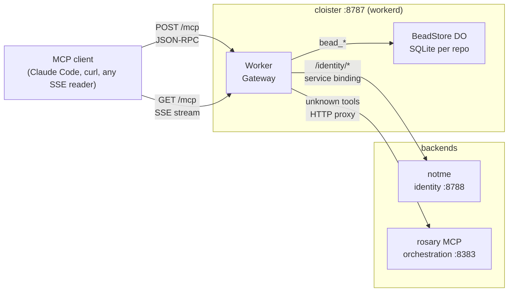

# cloister

Portable MCP gateway. Runs identically on your laptop via `workerd` and on Cloudflare Workers in production. One HTTP port, routes everywhere.



## What it does

- **Bead CRUD** — creates, searches, and tracks work items in per-repo Durable Objects (native SQLite, no Dolt required at the gateway layer)
- **Identity proxy** — forwards `/identity/*` to [notme](https://github.com/agentic-research/notme) via workerd service binding (no network hop in prod)
- **Orchestration proxy** — forwards rosary tools (decompose, dispatch, workspace) to rosary's MCP HTTP endpoint
- **SSE streaming** — standard `text/event-stream` (`data: {...}\n\n`) — any language's EventSource reads it

## Quickstart

```bash
# Terminal 1 — rosary (orchestration)
rsry serve --transport http --port 8383

# Terminal 2 — notme (identity, optional)
cd ../notme/worker && wrangler dev --port 8788

# Terminal 3 — cloister
pnpm dev   # → http://localhost:8787
```

Wire Claude Code:

```json
{
  "mcpServers": {
    "cloister": { "transport": "http", "url": "http://localhost:8787/mcp" }
  }
}
```

Smoke test:

```bash
curl -s -X POST http://localhost:8787/mcp \
  -H 'Content-Type: application/json' \
  -d '{"jsonrpc":"2.0","method":"tools/list","id":1}' | jq .result.tools[].name
```

## Run via workerd directly (no Cloudflare account)

```bash
pnpm run build:local          # bundle → dist/index.js
npx workerd serve config.capnp --experimental
```

## Tasks

```bash
task test          # 22 tests in real workerd (real DOs, real SQLite)
task build:local   # bundle for workerd
task dev           # wrangler dev hot-reload
task serve:local   # workerd serve config.capnp
```

## Ecosystem

| Service | Runtime | Role |
|---------|---------|------|
| cloister | workerd / CF Workers | MCP gateway (this repo) |
| [notme](https://github.com/agentic-research/notme) | workerd / CF Workers | Agent identity, Ed25519 certs |
| rosary | Rust binary | Orchestration, bead tracking, dispatch |
| mache | Go binary | Code intelligence FUSE |
| signet | Go binary | Key exchange |
| ley-line-open | Rust library | Data plane primitives |

## License

AGPL-3.0 — see [LICENSE](LICENSE).
