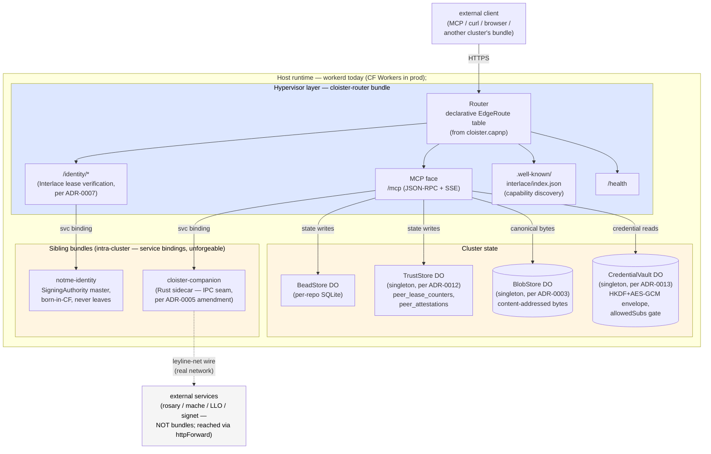

# cloister

A **v8-isolate hypervisor** that hosts workerd Workers, wires them into
clusters via service bindings, mediates their access to identity and
credentials, and routes external traffic to them. The same TypeScript
bundle runs locally on `workerd` and on Cloudflare Workers in
production — one HTTP port, one declarative route table, capability-
shaped capabilities through it.

The MCP/JSON-RPC face most consumers see today is **one tenant** of the
public pipe — bead state, code intelligence, and an Interlace-discoverable
identity surface ride on the same routing fabric. Future tenants (gRPC,
WebSocket, anything HTTP-shaped) plug into the same `EdgeRoute` table
without touching the substrate.

**New here?** Start with [GETTING-STARTED.md](GETTING-STARTED.md) for
the end-to-end setup, then come back here for the architectural map.

> **Contents**
> - [Hypervisor layer](#what-runs-at-the-hypervisor-layer) — what cloister itself owns
> - [Bundles + tenants](#what-rides-on-top-bundles--tenants) — what rides on the route table
> - [What cloister is NOT](#what-cloister-is-not) — decide whether to keep reading
> - [Quickstart](#quickstart) — 5-minute local boot
> - [Run via workerd directly](#run-via-workerd-directly-no-cloudflare-account) — no Cloudflare account
> - [Tasks](#tasks) — the `task` targets you'll use most
> - [Hardening knobs](#hardening-knobs) — what to flip before prod
> - [Plugin](#claude-code-plugin) — the Claude Code plugin in [`hooks/`](hooks/)
> - [Ecosystem](#ecosystem) — sibling repos cloister talks to
> - [Architectural framing](#architectural-framing) — the ADR story
> - [Documentation map](#documentation-map) — where each kind of doc lives



The route table is **declared, not coded** — [`cloister.capnp`](cloister.capnp)
at the repo root is the source of truth, compiled by `task manifest`
(runs at build + on-save; see [Tasks](#tasks)) to a typed TS module
that [`src/index.ts`](src/index.ts) imports. To add a route, backend,
or new bundle to the cluster, edit [`cloister.capnp`](cloister.capnp).
See [ADR-0004](docs/adr/0004-capnp-manifest.md) for the manifest
substrate and [ADR-0011](docs/adr/0011-hypervisor-bundle-boundary.md)
for which responsibilities live at the hypervisor layer vs the bundle
layer.

## What runs at the hypervisor layer

Per [ADR-0011](docs/adr/0011-hypervisor-bundle-boundary.md): code is
hypervisor-layer if it (a) mediates between bundles or to the outside,
(b) compromise blast-radius is multi-bundle, (c) singleton per cluster.

- **Routing** — `Router` + `EdgeRoute` dispatch over the public face
  (`/mcp`, `/health`, `/identity/*`, `/.well-known/*`,
  `/interlace/peers/{fp}`).
- **Lease verification** — verify Signet ephemeral certs against the
  pinned master + freshly-fetched epoch bundle (per
  [ADR-0007](docs/adr/0007-interlace-substrate.md) audit amendment).
  Bundles see only the verified cert + resolved scope.
- **Capability distribution** — credential reads go through the
  `CredentialVault` DO; per-credential `allowedSubs` glob lists gate
  access against the caller's identity. Enforcement is **V8 isolate
  + service-binding-as-syscall**, not signed slice tokens
  (per [ADR-0013](docs/adr/0013-slice-grant-enforcement.md), the
  ratification of [ADR-0010](docs/adr/0010-vault-and-bundle-clusters.md)'s
  framing).
- **State-boundary attestation** — on bead writes (the cluster's
  durable state), the middleware writes `peer_attestations` rows;
  per-call lease counters update on every authenticated request.
- **Inter-cluster identity** — Interlace handshake,
  `.well-known/interlace/` publication, selective-disclosure read
  endpoint for peer attestations.

## What rides on top (bundles + tenants)

- **Bead state** — `bead_create | update | search | list | close | comment`
  against per-repo Durable Objects. The `cloister-router` bundle's
  state surface; one of the cluster's tenants.
- **Code intelligence forward** — `lsp_hover | defs | refs | symbols |
  diagnostics` and `reparse | enrich | status` proxied to `ley-line-open`
  over HTTP. ley-line-open is **not** a bundle; it's an external service
  the cluster reaches via `httpForward`.
- **Code intelligence cluster** — `mache_*` tools auto-derived from
  `mache`'s upstream `tools/list` (per
  [ADR-0006](docs/adr/0006-derived-tool-schemas.md)). Same external
  pattern.
- **Notme identity** — sibling bundle in the cluster
  (workerd-resident); reachable via service binding only. The Signet
  master lives in its `SigningAuthority` DO and never leaves.
- **Claude Code plugin** — `cloister-stale-sync` ships in this repo;
  closes the stale-rust-analyzer gap inside long CC sessions.
  See [hooks/README.md](hooks/README.md).

## What cloister is NOT

So you can decide whether to read further, here's what cloister
*explicitly isn't*:

- **Not an MCP server.** MCP is the public tenant most consumers see
  today, but cloister is a substrate (edge router + bundle host + auth
  middleware). MCP is one route table entry. The protocol-agnostic
  framing is load-bearing for ADR-0002 — adding a second tenant (gRPC,
  WebSocket, anything HTTP-shaped) is a known follow-up
  (`cloister-6fc72e`, see the beads ledger).
- **Not Kubernetes.** cloister's cluster shape (`cluster.capnp` →
  multi-container pod) targets containerd / podman / nerdctl / kubelet,
  but it doesn't replace them. You bring your container runtime;
  cloister provides the manifest + the wiring. K8s can run the same
  pod manifest.
- **Not a service mesh.** No Envoy sidecar per service. The lease
  middleware lives in cloister-router itself — one gate at the cluster
  edge, not N gates at N sidecars. Auth verification is centralized.
- **Not a database.** Durable Objects hold bead/trust/blob state, but
  they're an integration point, not the system of record. Replicas +
  multi-region storage are an ADR-0010 follow-on; today's DOs are
  per-cluster singletons.
- **Not a build tool.** apko / melange build the OCI images; cloister
  consumes those artifacts via the manifest. The container ecosystem
  is BYO.
- **Not a replacement for Cloudflare Workers.** workerd runs on CF
  Workers identically; cloister cluster-in-a-pod is for self-hosters
  who don't want a CF account. Same code, different host.

## Quickstart

Three-terminal smoke. For the longer walkthrough (toolchain, ports,
auth setup), see [GETTING-STARTED.md](GETTING-STARTED.md).

```bash
# Terminal 1 — ley-line-open daemon (for lsp_* + reparse/enrich/status)
leyline daemon --mcp-port 8384

# Terminal 2 — cloister
pnpm install && task dev    # → http://localhost:8787

# Terminal 3 — notme (optional, for /identity/*)
cd ../notme/worker && wrangler dev --port 8788
```

Wire Claude Code:

```json
{
  "mcpServers": {
    "cloister": { "transport": "http", "url": "http://localhost:8787/mcp" }
  }
}
```

Smoke test:

```bash
curl -s -X POST http://localhost:8787/mcp \
  -H 'Content-Type: application/json' \
  -d '{"jsonrpc":"2.0","method":"tools/list","id":1}' \
  | jq '.result.tools[].name'
```

For step-by-step setup including upstream wiring and end-to-end verification,
see [GETTING-STARTED.md](GETTING-STARTED.md).

## Run via workerd directly (no Cloudflare account)

```bash
pnpm run build:local                           # bundle → dist/index.js
npx workerd serve config.capnp --experimental
```

[`config.capnp`](config.capnp) and [`wrangler.toml`](wrangler.toml) are kept in sync: same bindings (`BEAD_STORE`,
`NOTME`, `ROSARY_MCP_URL`, `LLO_MCP_URL`, `SIGNET_URL`) on both paths.

## Tasks

```bash
task lint           # tsc + worker tests + plugin tests
task test           # vitest in real workerd (real DOs, real SQLite)
task test:plugin    # node --test for the CC plugin script
task manifest       # cloister.capnp → src/generated/manifest.ts (ADR-0004)
task build:local    # bundle for workerd (depends on `manifest`)
task dev            # wrangler dev hot-reload (depends on `manifest`)
task serve:local    # workerd serve config.capnp
task smoke          # spins up leyline + cloister, exercises full chain
task apk            # build APK via melange (signed)
task image          # compose distroless OCI image via apko (→ cloister.tar)
task image:check    # validate melange.yaml + apko.yaml without a real build
```

## Hardening knobs

- **`ALLOWED_ORIGINS`** (env var, comma-separated) — CORS allowlist. Default
  is wildcard echo for dev convenience. Set to e.g.
  `http://localhost:*,https://app.example.com` for prod. Supports a single
  trailing `:*` port wildcard per entry; no general globs. Disallowed
  origins get the `null` sentinel back, which browsers refuse.
- **Container** — `task image` produces a distroless OCI image
  (`cloister.tar`), workerd + bundle only, no shell/pkgmgr, runs as
  uid `65532`. Mount `/data` for DO SQLite persistence.

## Claude Code plugin

The repo doubles as a Claude Code plugin. The plugin root is the repo root
(`.claude-plugin/plugin.json`) — the worker code and the plugin ship together.

```sh
# Install:
claude plugin add ~/path/to/cloister
```

It registers a `PostToolUse` hook (`Edit | Write | MultiEdit | NotebookEdit`)
that fires `reparse` against cloister so `lsp_*` tools stay accurate inside
long sessions. Config + tests: [hooks/README.md](hooks/README.md).

## Ecosystem

| Service                                                      | Runtime              | Role                                          |
| ------------------------------------------------------------ | -------------------- | --------------------------------------------- |
| cloister                                                     | workerd / CF Workers | Edge router (this repo)                       |
| [notme](https://github.com/agentic-research/notme)           | workerd / CF Workers | Identity authority + UDS-front for daemons    |
| [ley-line-open](https://github.com/agentic-research/ley-line-open) | Rust daemon    | Tree-sitter parse + LSP enrichment + MCP HTTP |
| rosary                                                       | Rust binary          | Orchestration, bead tracking, dispatch        |
| mache                                                        | Go binary            | Code intelligence FUSE                        |
| signet                                                       | Go binary            | Key exchange                                  |

## Architectural framing

Looked at from the right height, cloister is **a v8-isolate hypervisor**:
it hosts workerd Workers, wires them into clusters via service bindings,
mediates their access to credentials and identity, and routes external
traffic to them. ADR-0007 adds Interlace identity (Signet ephemeral
leases + bilateral attestation chains + `.well-known/interlace/`
discovery) at the public face. ADR-0010 reframed the tenant primitive
as **bundles in a cluster** with **vault-slice** capabilities;
ADR-0013 ratified the *enforcement* model (V8 isolate +
service-binding-as-syscall, no signed tokens) and the
[`CredentialVault`](src/vault-store.ts) DO shipped 2026-05-10 with
that contract. ADR-0010 stays Proposed for the manifest-side
question of whether `Bundle.vaultSlice` should appear in
`cluster.capnp` as a tooling hint.

If you want a concrete entry point: read ARCHITECTURE.md for the runtime
model as it stands today, then walk the ADRs in order. The ADRs are the
source of truth for *why*; this README and ARCHITECTURE.md describe
*what*.

## Performance

Per-pipeline latency for the lease middleware — workerd-local numbers,
not Cloudflare Workers prod:

- [docs/perf/2026-05-10-lease-pipeline.md](docs/perf/2026-05-10-lease-pipeline.md) —
  per-step + full-pipeline timings for `verifyAndUpsertLease`. TL;DR:
  ~900µs full pipeline; TrustStore DO RPCs are ~85% of the cost,
  wasm32 cert verify ~10%, everything else noise.

Reproduce with `task bench:lease` (excluded from `task lint` / `task test`).

## Documentation map

- [GETTING-STARTED.md](GETTING-STARTED.md) — install, run, smoke-test, wire upstreams, install the plugin
- [docs/ARCHITECTURE.md](docs/ARCHITECTURE.md) — runtime model, request routing, component map, packaging
- [docs/perf/](docs/perf/) — perf write-ups (`2026-05-10-lease-pipeline.md` is the first; more in `cloister-747d98b`)
- [docs/deployment/off-platform-peers.md](docs/deployment/off-platform-peers.md) — CF Tunnel / WARP for peers outside the platform (per ADR-0007)
- [docs/adr/0001-workerd-mcp-gateway.md](docs/adr/0001-workerd-mcp-gateway.md) — why workerd
- [docs/adr/0002-edge-router-protocol-agnostic-backends.md](docs/adr/0002-edge-router-protocol-agnostic-backends.md) — why edge router, not MCP gateway
- [docs/adr/0003-content-addressed-bead-store.md](docs/adr/0003-content-addressed-bead-store.md) — bead storage as content-addressed DAG + CAS refs
- [docs/adr/0004-capnp-manifest.md](docs/adr/0004-capnp-manifest.md) — Cap'n Proto manifest for declarative route + backend registration
- [docs/adr/0005-internal-wire-leyline-net.md](docs/adr/0005-internal-wire-leyline-net.md) — internal wire = leyline-net (signed capnp); MCP only at the public face
- [docs/adr/0006-derived-tool-schemas.md](docs/adr/0006-derived-tool-schemas.md) — dynamic tools/list passthrough with TTL cache
- [docs/adr/0007-interlace-substrate.md](docs/adr/0007-interlace-substrate.md) — **Interlace identity + attestation + discovery** (Proposed; lease ≠ state, offline verification, audit-amended 2026-05-08)
- [docs/adr/0008-companion-pool.md](docs/adr/0008-companion-pool.md) — companion pool / load balancing (Proposed; orthogonal to Interlace)
- [docs/adr/0009-compute-substrate-portability.md](docs/adr/0009-compute-substrate-portability.md) — Linux / Firecracker / WASM / unikernel as deployment knob (Proposed)
- [docs/adr/0010-vault-and-bundle-clusters.md](docs/adr/0010-vault-and-bundle-clusters.md) — **vault as scoped slices, bundles as the unit of trust, clusters as the unit of identity** (Proposed)
- [docs/adr/0011-hypervisor-bundle-boundary.md](docs/adr/0011-hypervisor-bundle-boundary.md) — **hypervisor vs bundle responsibilities, and what cloister's k8s analogy actually means** (Proposed)
- [hooks/README.md](hooks/README.md) — `cloister-stale-sync` Claude Code plugin
- [src/README.md](src/README.md) — worker source layout map (routes / manifest / wire / backends)
- [manifest/README.md](manifest/README.md) — capnp schema for the gateway (the `Cloister.Gateway` type)
- [wire/README.md](wire/README.md) — capnp wire schemas (cloister↔companion + test fixtures)

## License

AGPL-3.0 — see [LICENSE](LICENSE).
