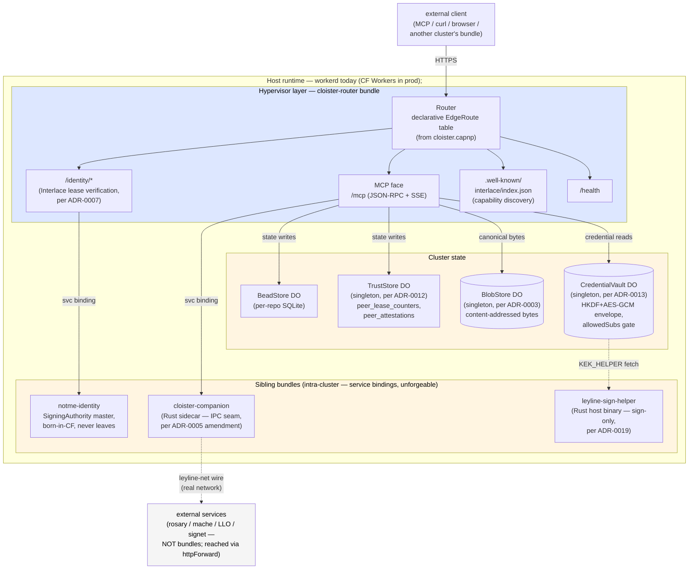

# cloister

Cloister hosts AI tools (MCP servers, today) behind one HTTPS
endpoint. You declare what to host in a config file; the same bundle
runs locally on your machine for development and on Cloudflare Workers
in production — no rewrites, no deployment-specific code.

```sh
task serve:local                       # → http://localhost:8787
curl http://localhost:8787/health
```

**What you get for free:**

- **Sandboxed tools.** Each hosted tool runs in its own isolate with
  its own scoped credentials. A compromised tool can't reach the
  others' secrets.
- **Identity without bearer tokens.** Tools authenticate to each
  other via short-lived certificates rather than long-lived API
  keys — nothing to rotate, nothing to leak.
- **Signed audit trail.** Every state-changing call leaves a
  hash-chained, signed receipt. A third party can verify what
  happened offline, with only the master public key.

**Three entry points depending on what brought you here:**

- **Run it locally** → [GETTING-STARTED.md](GETTING-STARTED.md)
- **Understand the architecture** → [docs/ARCHITECTURE.md](docs/ARCHITECTURE.md)
- **Verify the security claims** → [docs/security/load-bearing-claims.md](docs/security/load-bearing-claims.md)

## Architecture

Cloister is a v8-isolate hypervisor on `workerd` with a declarative
Cap'n Proto manifest. Routes, backends, and per-bundle credential
scopes are substrate concerns — identity (Interlace), audit (signed
receipts), and credential isolation are wired in at the substrate, not
bolted on per-tenant. It's offline-first: runs locally on `workerd`
with no cloud account required, and the same TypeScript bundle deploys
to Cloudflare Workers when you want a public endpoint.

Today's primary application is hosting MCP servers behind one HTTP
face. `bead_*`, `mache_*`, `lsp_*`, lifecycle
(`reparse`/`enrich`/`status`), and the Interlace identity bridge are
the first tenants — but the contract is
[`cloister.capnp`](cloister.capnp): anything HTTP-shaped plugs into
the same route table without touching the substrate. See
[ADR-0004](docs/adr/0004-capnp-manifest.md) for the manifest shape,
[ADR-0009](docs/adr/0009-compute-substrate-portability.md) for the
substrate-portability claim, and
[ADR-0011](docs/adr/0011-hypervisor-bundle-boundary.md) for what lives
at the hypervisor layer vs the bundle layer.



## Quickstart

Five-minute three-terminal smoke. For the full walkthrough (toolchain,
ports, auth setup, plugin install), see
[GETTING-STARTED.md](GETTING-STARTED.md).

```bash
# Terminal 1 — ley-line-open daemon (for lsp_* + reparse/enrich/status)
leyline daemon --mcp-port 8384

# Terminal 2 — cloister
pnpm install && task dev:bootstrap && task dev    # → http://localhost:8787

# Terminal 3 — notme (optional, for /identity/*)
cd ../notme/worker && wrangler dev --port 8788
```

Smoke test:

```bash
curl -s -X POST http://localhost:8787/mcp \
  -H 'Content-Type: application/json' \
  -d '{"jsonrpc":"2.0","method":"tools/list","id":1}' \
  | jq '.result.tools[].name'
```

Wire Claude Code:

```jsonc
{
  "mcpServers": {
    "cloister": { "transport": "http", "url": "http://localhost:8787/mcp" }
  }
}
```

Client-specific wiring (Cursor, raw curl, auth, common failure modes)
is in [docs/integration/mcp-client.md](docs/integration/mcp-client.md).

## What cloister is NOT

So you can decide whether to keep reading, here's what cloister
*explicitly isn't*:

- **Not an MCP server.** MCP is the most visible tenant today, but
  cloister is a substrate (edge router + bundle host + auth
  middleware). The identity-format-shifting bridge (OIDC / WebFinger /
  NIP-05) at `/.well-known/*` is another tenant; adding further tenants
  (gRPC, WebSocket, anything HTTP-shaped) plugs into the same
  `EdgeRoute` table without touching the substrate
  (per [ADR-0002](docs/adr/0002-edge-router-protocol-agnostic-backends.md)).
- **Not Kubernetes.** cloister's cluster shape (`cluster.toml` →
  multi-container pod) targets containerd / podman / nerdctl / kubelet,
  but it doesn't replace them. You bring your container runtime;
  cloister provides the manifest + the wiring. The operator surface
  is TOML (`cluster.toml` at the repo root, see
  [ADR-0025](docs/adr/0025-bidi-toml-pipeline.md)); capnp remains the
  substrate schema authority.
- **Not a service mesh.** No Envoy sidecar per service. The lease
  middleware lives in cloister-router itself — one gate at the cluster
  edge, not N gates at N sidecars.
- **Not a database.** Durable Objects hold bead/trust/blob/vault state,
  but they're an integration point, not the system of record. Replicas
  + multi-region storage are an ADR-0010 follow-on.
- **Not a build tool.** apko / melange build the OCI images; cloister
  consumes those artifacts via the manifest. The container ecosystem
  is BYO.
- **Not a replacement for Cloudflare Workers.** workerd runs on CF
  Workers identically; cloister cluster-in-a-pod is for self-hosters
  who don't want a CF account. Same code, different host.

## Load-bearing claims

Five security properties cloister publishes are defended by running
code + tests + cross-implementation byte-equality. The full prose with
status, test pointers, and honest caveats is at
[docs/security/load-bearing-claims.md](docs/security/load-bearing-claims.md);
the gate at [docs/security/threat-model.md](docs/security/threat-model.md)
is where the test-vs-claim accounting lives.

Each row is a one-line summary; the [full doc](docs/security/load-bearing-claims.md) carries the prose, test pointers, and honest caveats.

| Claim | Where it lives | Status |
|---|---|---|
| **§13.2 "silence is evidence" — request side**: every authenticated request advances a hash-chained counter. | [ADR-0007](docs/adr/0007-interlace-substrate.md); [`src/storage/peer-lease-counters.ts`](src/storage/peer-lease-counters.ts) | Shipped 0.1.0. |
| **§13.2 "silence is evidence" — response side**: every state-boundary write advances an attestation chain (Interlace 0.2.0 receipts). | [ADR-0007](docs/adr/0007-interlace-substrate.md); [`interlace-spec/0.2.0-draft/RECEIPTS.md`](interlace-spec/0.2.0-draft/RECEIPTS.md) | Phase 1 shipped 2026-05-12 (emit-but-don't-enforce). Phase 2 cutover (peers fail-closed) is operator action. |
| **§9.4.b constant-time 404** — the disclosure endpoint can't be used as a peer-enumeration oracle. | [`src/routes/disclosure.ts`](src/routes/disclosure.ts) + `TrustStore.peerHasChain` | Bench-pinned ([`docs/perf/2026-05-10-disclosure-endpoint.md`](docs/perf/2026-05-10-disclosure-endpoint.md)). Pre-fix delta 17×; post-fix 60µs inside workerd's quantization floor. **CLOSED** (re-verified 2026-05-12 by oracle-friend). |
| **Slice-grant via V8 isolate + service-binding-as-syscall** — a compromised tool bundle cannot exfiltrate credentials outside its `allowedSubs`. Plaintext credential bytes never cross the RPC boundary. | [ADR-0013](docs/adr/0013-slice-grant-enforcement.md); [`src/vault-store.ts`](src/vault-store.ts) | Prompt-injection demo at [`test/security/prompt-injection.test.ts`](test/security/prompt-injection.test.ts) (19 cases). Per-bundle DO design (ADR-0021) Proposed not Implemented. |
| **Trust-anchor-helper sign-only protocol** — `leyline-sign-helper` holds master_sk; only `POST /sign` exposes signing; key bytes never leave the helper. | [ADR-0019](docs/adr/0019-sign-only-helper-protocol.md); [`rs/crates/sign/`](rs/crates/sign/) | 5-cycle adversarial review 2026-05-12 closed 6 of 7 §15 invariants; supervisor binary-attestation deferred. `rs/crates/sign/tests/host_adversarial.rs` (5 tests). |
| **Substrate overhead bounded + measured** — lease pipeline <1ms p50 / 1ms p99 / 3ms p99 (post-batching). 85% of cost is DO RPCs. | [`docs/perf/2026-05-10-lease-pipeline.md`](docs/perf/2026-05-10-lease-pipeline.md) | Bench-pinned; reproduce via `task bench:lease`. |

The wire protocol is **documented standalone** at
[`interlace-spec/0.1.0/`](interlace-spec/0.1.0/README.md) — formal CDDL
schemas, 27 deterministic test vectors. The Python reference impl
passes the same vectors as cloister's TypeScript runtime; that's the
cross-check mechanism. The spec exists for cloister's rigor, not as a
campaign to standardize externally.

## How it's shaped

**At the hypervisor layer** (per
[ADR-0011](docs/adr/0011-hypervisor-bundle-boundary.md) — code is
hypervisor-layer if it mediates between bundles, multi-bundle blast
radius if compromised, singleton per cluster):

- **Routing** — `Router` + `EdgeRoute` dispatch over `/mcp`, `/health`,
  `/identity/*`, `/.well-known/*`, `/interlace/peers/{fp}`.
- **Lease verification** — verify Signet ephemeral certs against the
  pinned master + freshly-fetched epoch bundle. Bundles see only the
  verified cert + resolved scope.
- **Capability distribution** — credential reads gate through the
  `CredentialVault` DO; per-credential `allowedSubs` glob lists filter
  against the caller's identity. Enforcement is **V8 isolate +
  service-binding-as-syscall** (ADR-0013), not signed slice tokens.
- **State-boundary attestation** — bead writes go through the cross-DO
  orchestrator at
  [`src/routes/bead-create-orchestrator.ts`](src/routes/bead-create-orchestrator.ts)
  per ADR-0012's four-step handoff.

**At the bundle layer**: HTTP-shaped tenants registered in
`cloister.capnp` (today: `bead_*`, `mache_*`, `lsp_*`, lifecycle, the
identity bridge). Sibling bundles reach cloister-router via UDS service
bindings — the full cluster bundle map (tier + transport + purpose) is
[`docs/reference/bundle-topology.md`](docs/reference/bundle-topology.md).

Read [docs/ARCHITECTURE.md](docs/ARCHITECTURE.md) for the runtime
model + component map + sequence diagrams.

## Run it

Three local paths, same code:

```bash
task dev            # Path A — wrangler dev hot-reload, easiest
task serve:local    # Path B — workerd serve dist/config.capnp (no CF account)
task cluster:dev    # Path C — mac-native cluster topology with UDS bindings
```

Path B is closest to the production OCI image and writes to `/data/do`
by default (matches the apko image's mount point). Create the dir
once on Linux: `sudo mkdir -p /data/do && sudo chown "$USER" /data/do`.
**On macOS or any host where `/data` isn't writable**, set
`CLOISTER_DO_PATH` to a writable absolute path before `task build:local --force` —
per [ADR-0023](docs/adr/0023-host-path-resolution.md). Path A
(`task dev`) uses `.wrangler/state/` (already in `.gitignore`) and
needs no setup. Full walkthrough:
[GETTING-STARTED.md](GETTING-STARTED.md).

> **⚠️ DO SQLite is unencrypted at rest.** Whichever path you pick
> (`/data/do`, `.wrangler/state/`, `$XDG_DATA_HOME/cloister/do` via
> `CLOISTER_DO_PATH`, or `$HOME/.cache/cloister-dev/do/` for
> `cluster:dev`), the DO SQLite databases — beads, trust state,
> blob digests, vault ciphertext metadata — live on disk in plaintext
> SQLite files. The vault ciphertexts *inside* those files ARE
> AES-GCM-encrypted (per ADR-0013/0014); the bead/trust/blob tables
> are not. Don't drop production-sensitive data into a dev install;
> if you need on-disk encryption-at-rest of the SQLite files
> themselves, that's an open follow-on (no ADR yet — file one if you
> need it).

## Tasks

```bash
task lint           # tsc + worker tests + plugin tests + lint:* — ~10s
task verify         # lint + wire roundtrip + leyline-stub smoke
task smoke          # spins up leyline + cloister, exercises full chain
task test           # vitest in real workerd (real DOs, real SQLite)
task manifest       # cloister.capnp → src/generated/manifest.ts
task build:local    # bundle for workerd (depends on `manifest`)
task dev            # wrangler dev hot-reload
task serve:local    # workerd serve dist/config.capnp
task helper:start   # leyline-sign-helper foreground on 127.0.0.1:8786
task apk            # build APK via melange (signed)
task image          # compose distroless OCI image via apko
task image:check    # validate melange.yaml + apko.yaml without a real build
task bench:lease    # opt-in perf bench (or :dispatch / :trust-store / :disclosure / :cold-start / :all)
```

Full task surface: `task --list-all`.

## Hardening + plugin

- **`ALLOWED_ORIGINS`** — CORS allowlist (env var, comma-separated).
  Default is wildcard echo for dev. Set to e.g.
  `http://localhost:*,https://app.example.com` for prod. Supports a
  trailing `:*` port wildcard per entry; no general globs.
- **`VAULT_KEK_SOURCE`** — picks where the vault DO resolves its
  envelope-encryption KEK from. Schemes: `keychain://`,
  `apple-password://`, `keyring://`, `op://`, `secret-tool://`,
  `file://`, `env://`, `http(s)://`. See
  [ADR-0014](docs/adr/0014-pluggable-kek-source.md) +
  [GETTING-STARTED §9](GETTING-STARTED.md#vault-kek--keep-it-out-of-plaintext-bindings).
- **`LEYLINE_SIGN_CALLER_TOKENS`** + `--require-auth` —
  trust-anchor-helper auth (production deploys MUST set; ADR-0019).
  Additional helper env vars frozen in ADR-0019 reqs 14–18:
  `LEYLINE_SIGN_RESOLVE_ALLOW`, `LEYLINE_SIGN_SIGN_ALLOW`,
  `LEYLINE_SIGN_OP_BIN`, `LEYLINE_SIGN_SECURITY_BIN`,
  `LEYLINE_SIGN_RESOLVE_TTL_MS`, `LEYLINE_SIGN_RESOLVE_CACHE_MAX`.
- **Container** — `task image` produces a distroless OCI image
  (`cloister.tar`), workerd + bundle only, no shell/pkgmgr, runs as
  uid `65532`. Mount `/data` for DO SQLite persistence.

**Claude Code plugin.** The repo doubles as a CC plugin (root
`.claude-plugin/plugin.json`). Install:

```sh
claude plugin add ~/path/to/cloister
```

Registers a `PostToolUse` hook that fires `reparse` against cloister
so `lsp_*` tools stay accurate inside long sessions. Config + tests:
[hooks/README.md](hooks/README.md).

## Ecosystem

| Service                                                      | Runtime              | Role                                          |
| ------------------------------------------------------------ | -------------------- | --------------------------------------------- |
| cloister                                                     | workerd / CF Workers | Edge router (this repo)                       |
| [notme](https://github.com/agentic-research/notme)           | workerd / CF Workers | Identity authority + UDS-front for daemons    |
| [ley-line-open](https://github.com/agentic-research/ley-line-open) | Rust daemon    | Tree-sitter parse + LSP enrichment + MCP HTTP |
| rosary                                                       | Rust binary          | Orchestration, bead tracking, dispatch        |
| mache                                                        | Go binary            | Code intelligence FUSE                        |
| signet                                                       | Go binary            | Key exchange                                  |

## Where to go next

- **Operator setup** — [GETTING-STARTED.md](GETTING-STARTED.md) (install, run, wire upstreams, plugin)
- **Substrate description** — [docs/ARCHITECTURE.md](docs/ARCHITECTURE.md) (runtime model, sequence diagrams, bindings, component map)
- **All `docs/`** — [docs/README.md](docs/README.md) (orientation map for the 8 subdirs)
- **Architectural decisions** — [docs/adr/](docs/adr/) (27 numbered ADRs; 0001–0027, with ADR-0022 added by `cloister-9443f0` as the schema-bridge + substrate-IDL positioning ADR and ADR-0027 added by `cloister-1b59a2` as the substrate-as-kernel capability matchmaker; start with 0001 → 0002 → 0007 → 0011 for the core mental model). Per-ADR status table in [`docs/STATUS.md`](docs/STATUS.md).
