# Architecture

cloister is a **v8-isolate hypervisor**: it hosts workerd Workers,
wires them into clusters via service bindings, mediates their access
to identity and credentials, and routes external traffic to them. The
same TypeScript bundle runs locally via the `workerd` binary and on
Cloudflare Workers in production — no code changes, only config
differs. The MCP/JSON-RPC face is **one tenant** of the public pipe;
the substrate underneath (declarative routing, capability
distribution, state-boundary attestation, Interlace identity) is the
hypervisor layer per
[ADR-0011](adr/0011-hypervisor-bundle-boundary.md).

This document covers the runtime model and request routing as
implemented today. The decisions behind it are in the ADRs — every one,
grouped, with its **current** status, is the generated
[ADR index](adr/INDEX.md) (derived from each ADR's frontmatter, never
hand-maintained here). Read them in `docs/adr/`; start with **0001 → 0002
→ 0007 → 0011** for the core mental model. The load-bearing arcs: substrate
foundations (0001–0006), Interlace identity + trust (0007–0021), MCP-spec
+ operator surface (0015–0028), and the isolation + LLO substrate (0030
process-per-tenant, 0035 LLO boundary, 0044 microVM, and the harness
sandbox).

**The forward arc:** ADRs 0007 + 0010 + 0013 + 0014 + 0019 together
replace today's env-var-bindings world (`LLO_MCP_URL`, `MACHE_MCP_URL`,
`INTERLACE_MASTER_PUBKEY`) with a layered trust substrate: V8 isolate
sandboxing (ADR-0013) + per-bundle vault DOs (ADR-0021) +
trust-anchor-helper for master_sk custody (ADR-0019). The runtime
described in this document is the *current* shape; the ADRs describe
where it's going.

If you're trying to *run* cloister rather than understand its shape, start
at [../GETTING-STARTED.md](../GETTING-STARTED.md). If you want the
"why" of any specific decision, walk into the linked ADR — they're the
source of truth.

## Runtime model

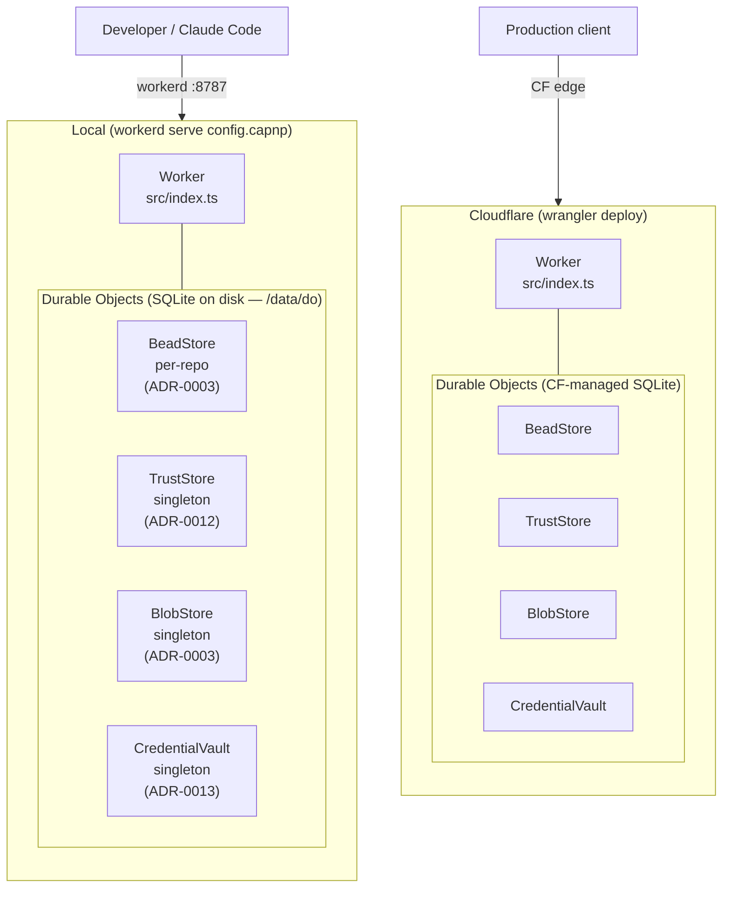

The code is identical. Storage differs: local disk vs Cloudflare-managed
Durable Object SQLite. Both use the same DO SQL API (`ctx.storage.sql`).
Tier classification per ADR-0011's three-criterion test: **BeadStore** is
bundle-tier (per-repo, idFromName(repo)); **TrustStore**, **BlobStore**,
and **CredentialVault** are hypervisor-tier singletons (idFromName("cluster")).
The full hypervisor-tier DO map + the per-bundle topology live in
[`docs/reference/bundle-topology.md`](reference/bundle-topology.md).

## Request routing — two layers

ADR-0002 introduces two small interfaces. The outer layer dispatches HTTP
requests to `EdgeRoute`s. The MCP edge route, in turn, dispatches tool
calls to `ToolBackend`s.

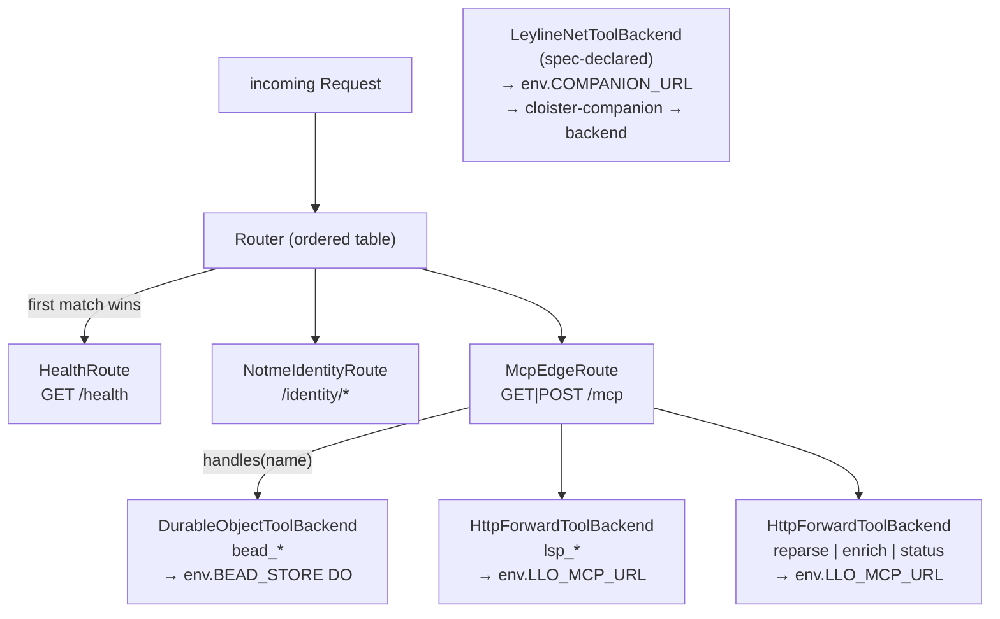

### EdgeRoute — HTTP/SSE multiplexing

Each `EdgeRoute` answers `match(request)` and `handle(request, env)`. The
router tries them in order; the first match wins, and falls through to a
404. Routes never see one another and never call back into the Router.

### ToolBackend — MCP tool dispatch

`McpEdgeRoute` aggregates a list of `ToolBackend`s. For `tools/list` it
returns the *union* of every backend's `tools()`. For `tools/call` it finds
the first backend whose `handles(name)` returns true and delegates
`invoke(name, args, env)`.

The route throws at construction if two backends advertise the same tool
name — duplicate-tool-name shadowing is loud, not silent.

## Sequence diagrams

### bead_create — local DO

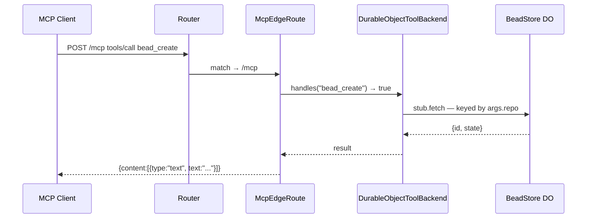

### lsp_hover — HTTP forward to ley-line-open

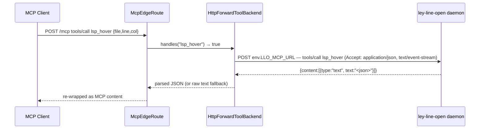

### Generic leylineNet via cloister-companion (ADR-0005)

> **Note (2026-06-24)**: this section shows the leylineNet backend
> flow generically, using `rsry_status` as the example tool name.
> **The current cloister manifest does NOT use leylineNet for the
> `rsry_*` surface** — per cloister-c2bd47, `rsry_*` tools are
> dispatched via an `mcpProxy` backend with `serviceBinding =
> "ROSARY_BUNDLE"` (HTTP MCP over UDS to the rosary bundle). The
> leylineNet pattern remains the substrate's transport-agnostic
> escape hatch for future tool surfaces that need cross-host AEAD-
> wrapped wire.

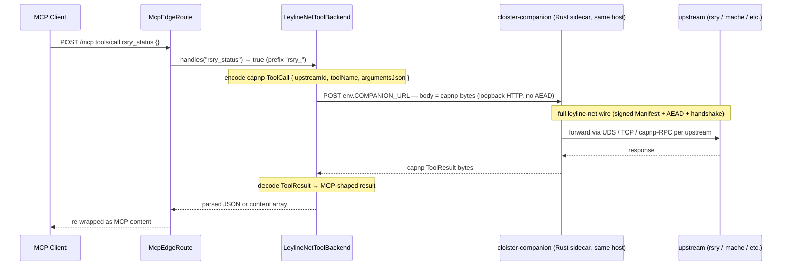

The cloister↔companion hop is **IPC** (loopback HTTP, no AEAD) per
ADR-0005's 2026-04-30 amendment. The full leyline-net wire — signed
capnp manifests, ChaCha20-Poly1305 AEAD, X25519 handshake — lives at
the companion↔backend hop where bytes traverse a real network.

### reparse — fired by the CC plugin

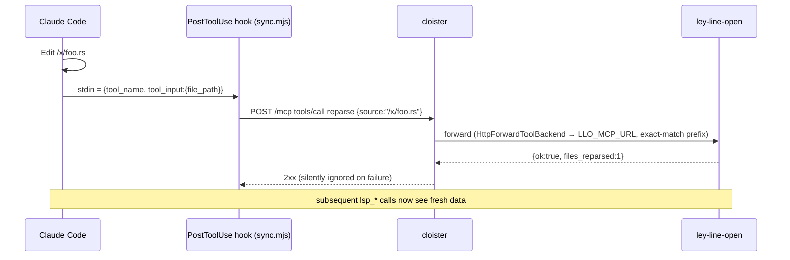

### /identity/* — service binding to notme

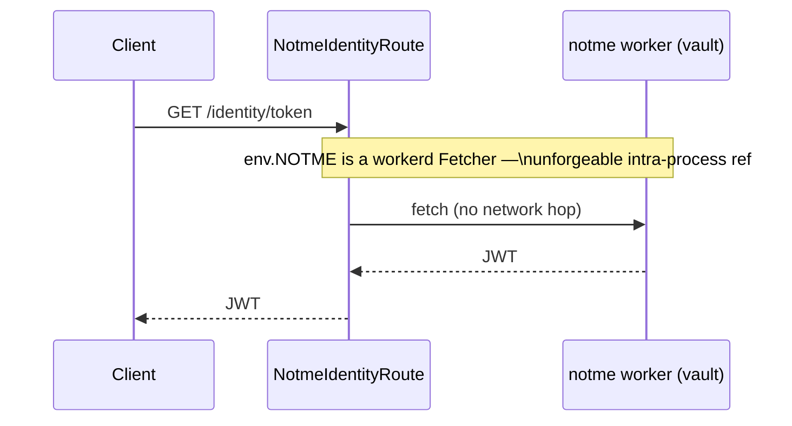

The notme vault has *no network*. It is reachable only through this service
binding, which is an unforgeable reference. cloister is the only thing on
the network in front of it. See ADR-0002 §"Capability boundary".

## SSE (Server-Sent Events)

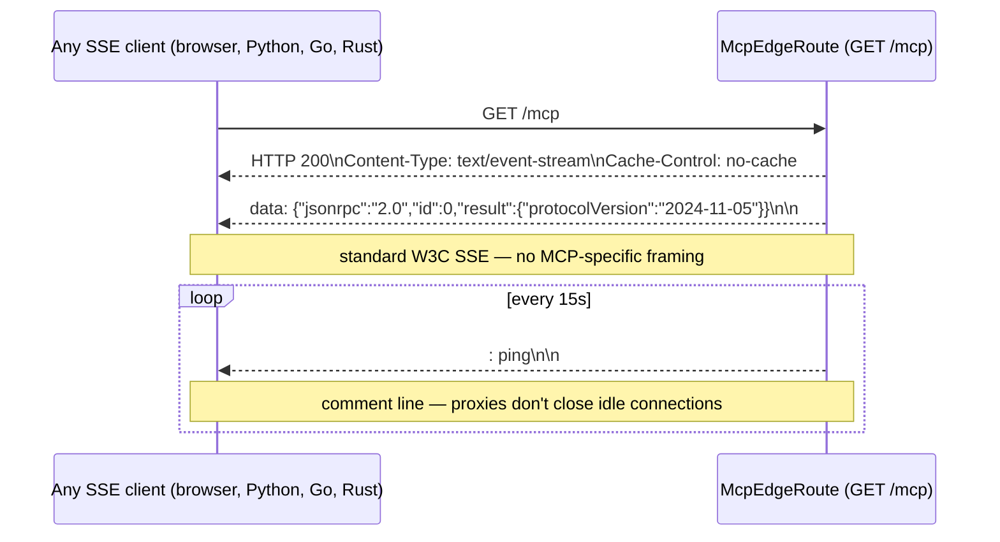

Any language's EventSource implementation works without MCP-specific
libraries.

## Component map

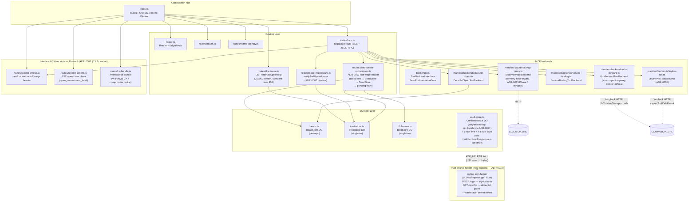

`router.ts`, `backends.ts`, and the four route/backend modules are the
*entire* abstraction surface. New tenants are new files in `routes/` or
`backends/` plus one line in `index.ts`'s ROUTES table. There is no
plugin loader, manifest, or registry. ADR-0002 details the contract.

## Bead store per repo

Each repo gets its own Durable Object instance, keyed by repo path:

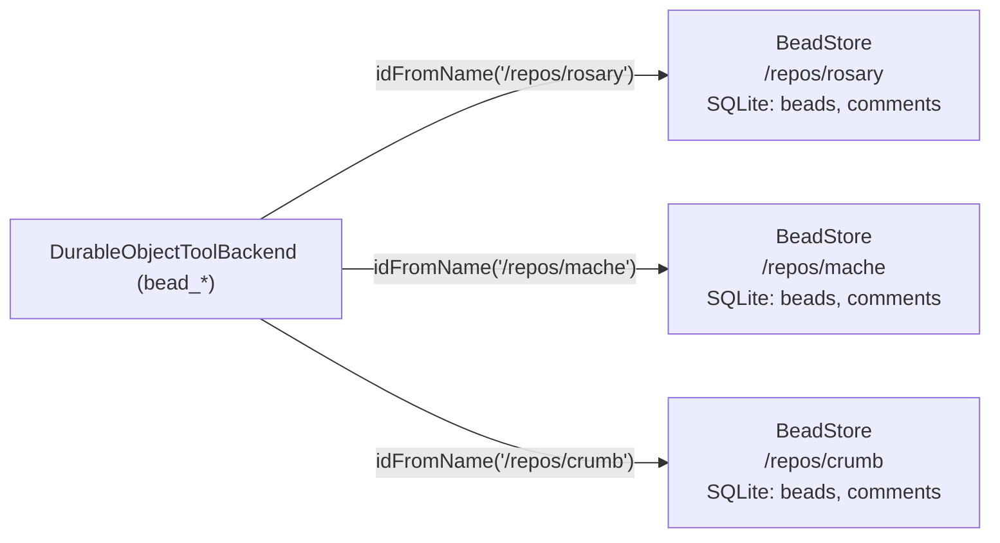

Isolation is physical: separate SQLite files, separate DO instances, no
shared state.

## Content-addressing — two hash algorithms

Cloister uses **two** content-addressing schemes at different layers:

| Layer | Algorithm | Implementation | Used for |
| --- | --- | --- | --- |
| Application | SHA-256 | `crypto.subtle.digest` (`src/storage/canonical.ts`) | Bead `content_hash`, attestation references, default `BlobStore` key, OCI tag verification |
| Substrate | BLAKE3-256 | wasm32 FFI to LLO `leyline-cas-ffi` (`src/wire/cas-hash.ts`) | Blob identity in build-cache/v1, arena roots, substrate content addressing (Σ §3.4) |

Both produce 64-character lowercase hex digests. The BLAKE3 path is
**synchronous** — CAS hashing is on the attestation / provenance path
and must never yield mid-digest.

**The build-cache/v1 wire overloads the OCI `sha256:` prefix with
BLAKE3 hex** — `sha256:<blake3-hex>`, not `sha256:<sha256-hex>`. This
is a deliberate v1 convention documented in
`leyline-schema-spec/build-cache/v1/wire/digest-encoding.md`. `BlobStore.put`
dual-verifies caller-provided keys against both algorithms
(`src/storage/workerd.ts`) so OCI-native and build-cache clients both
work.

## Bindings

Bindings live in two files that must stay in sync — one source of truth for
each launcher:

| Binding                          | Type                        | Where                                       | Used by                                        |
| -------------------------------- | --------------------------- | ------------------------------------------- | ---------------------------------------------- |
| `BEAD_STORE`                     | `DurableObjectNamespace`    | `wrangler.toml`, `config.capnp`             | `BeadToolBackend`                              |
| `TRUST_STORE`                    | `DurableObjectNamespace`    | `wrangler.toml`, `config.capnp`             | lease-middleware, disclosure, bead-create-orchestrator |
| `BLOB_STORE`                     | `DurableObjectNamespace`    | `wrangler.toml`, `config.capnp`             | bead-create-orchestrator (ADR-0003 CAS)        |
| `VAULT_STORE`                    | `DurableObjectNamespace`    | `wrangler.toml`, `config.capnp`             | CredentialVault DO (ADR-0013)                  |
| `NOTME`                          | `Fetcher` (service binding) | `wrangler.toml`, `config.capnp`             | `NotmeIdentityRoute`                           |
| `MACHE_MCP`                      | `Fetcher` (service binding) | `wrangler.toml`, `config.capnp`             | `mache_*` upstream (workerd ExternalServer)    |
| `LSP_MCP`                        | `Fetcher` (service binding) | `wrangler.toml`, `config.capnp`             | `lsp_*` + lifecycle upstream                   |
| `KEK_HELPER`                     | `Fetcher` (service binding) | `wrangler.toml`, `config.capnp`             | CredentialVault `#getKEK` (ADR-0014; URL→bytes resolver — superseded by ADR-0019 helper) |
| `LLO_MCP_URL`                    | text var                    | `wrangler.toml`, `config.capnp`             | LspToolBackend, LeylineLifecycleBackend (CF-prod fallback) |
| `MACHE_MCP_URL`                  | text var                    | `wrangler.toml`, `config.capnp`             | mache backend (CF-prod fallback)               |
| `ROSARY_MCP_URL`                 | text var                    | `wrangler.toml`, `config.capnp`             | (future) rosary passthrough                    |
| `VAULT_KEK_SOURCE`               | text var (URL spec)         | `wrangler.toml`, `config.capnp`             | CredentialVault — ADR-0014 v2; required non-empty URL (env://, file://, keychain://, apple-password://, keyring://, op://, secret-tool://, http(s)://) |
| `INTERLACE_MASTER_PUBKEY`        | text var (b64)              | `wrangler.toml`, `config.capnp`             | lease verification (cert-chain root)           |
| `INTERLACE_ROOT_PUBKEY`          | text var (b64; optional)    | `wrangler.toml`, `config.capnp`             | lease-gate activation switch (unset = dev mode) |
| `INTERLACE_DISCLOSURE_HMAC_KEY`  | text var                    | `wrangler.toml`, `config.capnp`             | DisclosureRoute HMAC cursor signing            |
| `RECEIPT_SIGNING_KEY`            | text var (b64; optional)    | `wrangler.toml`, `config.capnp`             | Interlace 0.2.0 receipt emitter — unset = no emission (Phase 1 default) |
| `RECEIPT_EPOCH`                  | text var (int; optional)    | `wrangler.toml`, `config.capnp`             | receipt epoch stamp (ADR-0007 rotation alignment) |
| `ALLOWED_ORIGINS`                | text var (optional)         | env-only (unset in wrangler/capnp defaults) | `pickAllowedOrigin` in `src/cors.ts`           |

**Host-process env (leyline-sign-helper binary; NOT in wrangler/capnp).
Env-var surface anchored to ADR-0019 (normative reqs 1–15 + §"Implementation
pins" subsections):**

| Env var                            | Required? | Used by                                              |
| ---------------------------------- | --------- | ---------------------------------------------------- |
| `LEYLINE_SIGN_CALLER_TOKENS`       | Yes (prod; `--require-auth` fail-stops if unset) | bearer-token → caller-name map (ADR-0019 + threat-model §15.2) |
| `LEYLINE_SIGN_RESOLVE_ALLOW`       | Optional (deny-all if unset) | `/resolve` URL-prefix allow-list (threat-model §15.1; startup-validated per `cloister-9bee1f`) |
| `LEYLINE_SIGN_SIGN_ALLOW`          | Optional (overlay; deny-all if unset) | `/sign` URL-prefix allow-list overlay (ADR-0019 req 14) |
| `LEYLINE_SIGN_OP_BIN`              | Optional (defaults to `op` on PATH) | subprocess path for 1Password CLI `op://` scheme (ADR-0019 §"Implementation pins" → "Subprocess hardening") |
| `LEYLINE_SIGN_SECURITY_BIN`        | Optional (defaults to `/usr/bin/security`) | subprocess path for macOS `security` keychain CLI (same subsection) |
| `LEYLINE_SIGN_RESOLVE_TTL_MS`      | Optional (default 30000; `0` disables) | positive-cache TTL on `/resolve` (ADR-0019 §"Subprocess-scheme TTL cache amendment"; threat-model §17.7) |
| `LEYLINE_SIGN_RESOLVE_CACHE_MAX`   | Optional (default 1024) | FIFO eviction cap on `/resolve` cache (same amendment; threat-model §17.8) |

## Packaging (melange + apko)

cloister ships as a **distroless OCI image** built by `task image`. The
recipe lives in `melange.yaml` (APK build) + `apko.yaml` (image compose).

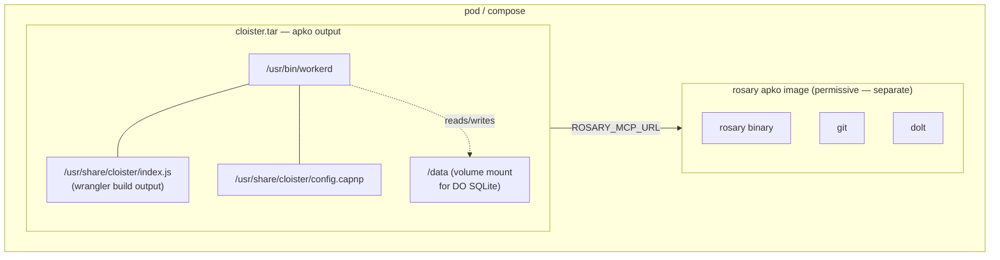

What `task image` produces:

- workerd binary + the wrangler-built JS bundle + `config.capnp`
- no shell, no package manager, no subprocesses
- runs as `uid 65532` (non-root)
- entrypoint `workerd serve --experimental /usr/share/cloister/config.capnp`
- two architectures: `x86_64` + `aarch64`
- per-origin layering — same upstream packages share a layer, so updates
  pull only the changed layer (~70% smaller deltas)

cloister's security profile is fully hardenable. rosary lives in its own
image because it needs subprocess caps (git, dolt, claude-cli) and writable
volumes.

`task image:check` parses `melange.yaml` + `apko.yaml` end-to-end without
running a real build — useful in CI before bumping versions.

## Lease verification (ADR-0007 / cloister-bd7770)

Every authenticated `POST /mcp` call is verified by
`src/routes/lease-middleware.ts:verifyAndUpsertLease` before reaching
the JSON-RPC dispatch. The pipeline:

1. **Header parse** — `Authorization: Signet <base64-cert-DER>`,
   `X-Signet-Sig`, `X-Signet-Ts`, `X-Signet-Nonce`. Malformed headers
   short-circuit to JSON-RPC error code -32001 / HTTP 401.
2. **Cert chain verify** — `verifyCertChain` (TS wrapper around
   wasm32-built `leyline-sign`) checks the cert is signed by the active
   master in the CA bundle, falling back to the previous master during
   a rotation window. Source: LLO `rs/ll-open/sign/src/cert_chain.rs` →
   `src/wire/signet-verify.ts`.
3. **Claims required** — Phase 1 mandates `epoch` + `peer_fp` + `scope`
   (Interlace OID extensions at `1.3.6.1.4.1.99999.1.{4,5,6}`). Certs
   without them fail closed.
4. **Epoch currency** — `isCertEpochCurrent` accepts the current bundle
   epoch and (during a rotation window) `bundle.epoch - 1`.
5. **Validity window** — server clock ∈ `[not_before, not_after]`.
6. **Request signature** — `crypto.subtle.verify("Ed25519", …)` over
   `canonicalRequestBytes(method, url, ts, nonce, body)`. Web Crypto's
   raw-key import path; no extra wasm hop.
7. **Scope match** — `scopeAllows(cert.scope, deriveRequestScope(...))`.
   Glob semantics: `X:*` matches any `X:Y`; `*` matches anything (admin
   only).
8. **Lease counter UPSERT** — `TrustStore.upsertLeaseCounter(...)` via
   workerd RPC. ADR-0007 §13.2: every authenticated call is recorded so
   silence is evidence.

The `INTERLACE_DEV_BYPASS` escape hatch was removed by the 2026-05-08
ADR-0007 amendment. Auth is always-on in production. Dev workflow mints
short-lived dev certs through `notme` against a real master.

The substrate (header parse, canonical bytes, cert verify, sig verify,
scope, TrustStore upsert) is end-to-end tested in
`test/routes/lease-middleware.test.ts`. **Wired into `McpEdgeRoute.handlePost`**
as of cloister-b89fdb — the gate is active when `INTERLACE_ROOT_PUBKEY`
is set (deployment-binding granularity, NOT per-request bypass).

## Running a tool under confinement

Everything above describes cloister as a **server**: routes in, backends out.
There is a second execution model, and it is what `cloister run` uses — cloister
as the **only thing a coding tool can reach**.

```
cloister run --harness claude-code --repo /abs/path/to/repo
```

The tool runs on your machine, not in a container. What changes is what the
kernel will let it touch.

### The boundary is the kernel, not a wrapper

Confinement is applied by the `nono` crate, consumed as a **library** (pinned at
`nono = "0.70"` in `tools/harness-sandbox/Cargo.toml`), which maps one declared
policy onto Seatbelt on macOS and Landlock on Linux. Consuming it as a library
rather than shelling out to its CLI matters: the CLI seeds some grants of its
own, so the two do not enforce the same thing. The
launcher builds the policy; `cloister-harness` applies it and then `exec`s the
tool.

Two properties follow, and both are load-bearing:

- **It is not advisory.** There is no shim to bypass and no environment variable
  to unset. A denied read returns `EPERM` from the operating system.
- **It is inherited.** Descendants cannot escape it, so a skill's shell script
  that runs Python that runs `curl` is bounded by the same policy. Verified
  three levels deep across a language boundary in
  `tools/harness-sandbox/test/`.

Grants are a **union, not an intersection** — this is the part that surprises
people. Adding a read grant for a subdirectory does **not** narrow a writable
parent, and `deny` is a full deny rather than a write-deny. So the way to make
something read-only is to **move the bytes**, not to add a narrower grant.

### What the policy actually says

| | |
|---|---|
| the repos passed with `--repo` | read + write |
| a per-run scratch directory | read + write |
| system paths needed to execute anything | read only |
| everything else — other repos, `~/.ssh`, `~/.aws`, shell history | denied |
| the network | denied before a packet leaves |
| `127.0.0.1` → cloister | the single reachable destination |

That last row is the point of the whole design. Cloister is not *a* way for the
tool to reach the outside — it is the **only** way, which is what makes the
tools it serves auditable rather than merely available.

The allow-list of system paths was **discovered by hitting errors**, not derived
from a specification. Making `git` work took `/var`, `/etc`, `~/.config/git`,
`~/.gitconfig` and `~/.gitignore_global` — each found when something failed. It
is complete only up to what has been exercised (`cloister-cd30a6`).

### The policy is committed to before it is applied

The policy is not merely built and used. A run mints an ephemeral identity whose
certificate carries a digest of the confinement **shape**, and `cloister-harness`
recomputes that digest over the manifest it is about to enforce and compares —
**before** the irreversible `apply`. A mismatch stops the run.

```
cloister-harness: §7 confinement commitment verified —
  the manifest to be enforced matches the identity-committed digest
```

The digest covers symbolic paths rather than absolute ones, so it is identical
whichever repos you pass and different for how *many*. This is what makes "the
tool ran confined" a checkable claim rather than a launcher's assertion. Per
ADR-0053 and the threat model's §7.

### Credentials never enter the tool's environment

Two lanes, chosen by whether `ANTHROPIC_API_KEY` is set:

- **Custody** — the key is vaulted and injected at the proxy. The tool's
  environment never holds it, so a compromised tool cannot exfiltrate what it
  cannot read. This is `cloister/credential-isolation/v1` (ADR-0024), and every
  call emits a signed receipt.
- **Audit** — no key vaulted; whatever authentication the tool already had is
  forwarded, and calls are still receipted. Under confinement this is often
  *unauthenticated*, because a Claude subscription authenticates through the
  macOS keychain and the sandbox denies keychain access by design. The launcher
  says so before minting anything rather than letting it surface as a confusing
  "not logged in".

### A run owns its processes

`cloister run` starts cloister itself, a lease shim, optionally companion
Workers, and the tool. Each is spawned into **its own process group**, and
teardown signals the group.

This is not tidiness. `task dev` starts wrangler which starts workerd — those
are grandchildren, and killing only the leader left them holding ports. Because
wrangler silently moves to the next free port when one is taken, a later run
would bind 8788 while its health check polled 8787 and got a healthy response
**from the stale server**: every signal said fine while the tool talked to an
old build. A fail-closed port preflight now refuses to start on a held port.
Per `cloister-de4c78`.

### Where the code lives

| | |
|---|---|
| `scripts/lib/harness/launch.mjs` | the orchestration — plan, setup, launch |
| `scripts/cli-run.mjs` | `cloister run`, calls `launch()` in-process |
| `tools/harness-sandbox/` | the Rust binary that applies the policy and execs |
| `tools/harness-shim/` | the localhost endpoint the tool is allowed to reach |
| `docs/RUNNING.md` | the operator walkthrough, including known gaps |

Design decisions: ADR-0042 (turnkey local run), ADR-0044 and ADR-0050
(compute isolation), ADR-0049 (host runtime), ADR-0060 (a tool's selector is not
its executable), ADR-0061 (skills declared and digest-verified).

## Security surface

| Layer            | Risk                                | Mitigation                                                |
| ---------------- | ----------------------------------- | --------------------------------------------------------- |
| `POST /mcp`      | Unauthenticated request execution   | `McpEdgeRoute.handlePost` wraps every POST in the lease pipeline: `getCABundle` (with sig verify) → `verifyAndUpsertLease` (wasm32 cert chain + clock-skew + Ed25519 request-sig + scope + replay defense + TrustStore counter upsert). Gate is active when `INTERLACE_ROOT_PUBKEY` is set; unset = dev/test mode. ADR-0007 (Accepted). |
| `POST /mcp` response | §13.2 "silence is evidence" gap on the response side | **Interlace 0.2.0 receipts (Phase 1, shipped 2026-05-12)** — every authenticated 2xx response carries an `Interlace-Receipt` header. Commitment over `(request_hash, body_hash, allowlisted_headers, timestamp_ms, actor_fp, epoch)`. SSE streams use cryptographically-paired open/close commitments via `open_commitment_hash`. Archival CA bundle at `/interlace/ca-bundle` + compromise-notice mechanism for V-archival verifiers. `RECEIPT_SIGNING_KEY` unset → no emission (Phase 1 default; peers verify-but-don't-enforce). ADR-0007 §13.2 + `interlace-spec/0.2.0-draft/RECEIPTS.md`. |
| `GET /interlace/peers/{fp}` | Peer-existence oracle, paginated-tail oracle, attestation forgery, cert reuse for chain reads | `DisclosureRoute` (src/routes/disclosure.ts): URLPattern path match, HMAC-signed cursors (rejects unsigned), constant-time 404 across all error classes (not_found / denied / bad_cursor are byte-identical), cross-peer cursor reuse rejected. Lease-gated when `INTERLACE_ROOT_PUBKEY` is set (scope `disclosure:<fp>`); auth-failure collapses into the same 404. JSONL stream includes the cluster master pubkey for offline verification. ADR-0007 §11 + threat model §9. Registered in `cloister.capnp` as a `disclosure` route kind. **§9.4.b CLOSED claim verified by oracle-friend cycle 2026-05-12** (threat-model §16). |
| Vault `proxyRequest` / `putCredential` | Per-caller resource exhaustion via tight loop; oversized payload blocks single-threaded DO | **F1 token-bucket** per `subject_fp` (`vault/src/rate-bucket.ts`): cost-weighted (read=1, write=3, proxy=5), capacity 100, refill 10/sec, persisted in SQL so DO eviction doesn't reset attacker's budget. Structured `vault.rate_limit_reject` emit for audit. **F4 payload caps** (`vault/src/vault.ts:validateCredentialPayload`): 32 headers max, 16 KiB total (UTF-8 bytes), 64 allowedSubs entries. Rejected before encrypt + SQL write. dos-friend cycle 2026-05-12; beads `cloister-211b68` (F1) + `cloister-21b5eb` (F4). |
| Vault 403 vs 404 status-code distinguishability | Credential-name enumeration oracle (DORMANT today — only cloister-router calls vault) | OPEN; activates with first non-router bundle (ADR-0021 implementation). Closing playbook = collapse 403→404, always run the same SQL+parse+checkAccess work, preserve reason in structured logs but byte-identical wire response. Threat-model §16.1 / bead `cloister-aa9376`. |
| Trust-anchor-helper (leyline-sign-helper) | Master_sk exfil via byte-return path; cross-UID loopback; CSRF simple-POST; body-size bypass | Rust host binary (LLO `rs/ll-open/sign/`, ADR-0019). `POST /sign` returns `sig+kid` only — key bytes never leave the helper. Bearer-token auth (`LEYLINE_SIGN_CALLER_TOKENS`) keyed per-caller for rate-limit fairness. Strict `Content-Type: application/json` blocks CORS-simple-POST CSRF. `tower_http::RequestBodyLimitLayer` + Content-Length guard cap bodies at 64 KiB. `--require-auth` flag fail-stops if env unset (supervisor templates pass it). `/resolve` allow-list gated (deny-all default). ed25519-dalek pinned `~2.1`. Threat-model §15 + §15.A; beads cloister-7aaab1/7afedc/7b5b9d/7c2179/7c737a/7cd202 (cycle 1, shipped) + cloister-9bd96c (cycle 2 NEW-1, shipped). |
| BeadStore SQL    | Parameterized queries throughout    | No injection risk                                         |
| TrustStore SQL   | Singleton DO, parameterized queries | No injection risk; per-DO ACID; `seen_nonces` blocks request replay (cloister-c5c846); `peer_attestations` chain-integrity defense rejects forks (cloister-bdcbe7) |
| notme proxy      | SSRF?                               | `NOTME` is a service binding (not a user-controlled URL)  |
| LLO HTTP         | SSRF                                | `LLO_MCP_URL` is an env var, not a request param          |
| rosary proxy     | SSRF                                | `ROSARY_MCP_URL` is an env var                            |
| CORS             | `*` in local dev                    | `ALLOWED_ORIGINS` env var enables a literal+`:*`-port allowlist; disallowed origins receive `null` sentinel — see `src/cors.ts` |
| notme vault      | Side channel                        | Vault has no network — only reachable via service binding |
| Container surface| Shell, pkgmgr, root                 | Distroless apko image; no shell, no pkgmgr, runs as uid 65532 |

## Adversarial review rotation (ADR-0020)

Substrate-level security is reviewed by a 7-role specialist team
defined in ADR-0020 + the agent definitions in
`~/github/jamestexas/agents/agents/`. Each specialist's findings flow
into the threat model + a per-cycle report under
`docs/security/adversarial-cycles/<date>.md`.

| Role                          | Threat class                                                                |
| ----------------------------- | --------------------------------------------------------------------------- |
| `dos-resilience-auditor`      | Resource exhaustion, self-DoS, fairness                                     |
| `enumeration-oracle-hunter`   | Side-channel + response-shape oracles                                       |
| `bundle-isolation-tester`     | Cross-tenant slice escapes, manifest misconfig                              |
| `protocol-replay-adversary`   | Replay, epoch confusion, chain forking                                      |
| `trust-root-adversary`        | Helper-binary tamper, keystore confusion, kid collisions                    |
| `observability-gap-auditor`   | Silent failures, alert deadlock under load                                  |
| `adversarial-synthesis-lead`  | Cross-cut integration, threat-model owner (only role with write access)     |

Specialists are read-only — they file beads tagged `red-team:<class>`,
never patch. Synthesis-lead integrates findings into
[`docs/security/threat-model.md`](security/threat-model.md) §§14, 15,
15.A, 16 and writes the cycle report. The first three cycles ran
2026-05-12 (trust-root × 2 on PR #1 + oracle × 1 on vault + disclosure)
— 11 findings, 8 shipped same-day, 3 follow-up beads.

## Where to next

- Set it up: [../GETTING-STARTED.md](../GETTING-STARTED.md)
- Verify the security claims: [security/threat-model.md](security/threat-model.md)
  §§9.4.b, 13.2, 13.4, 13.6, 15, 16; reproduce via the adversarial
  cycle reports under [security/adversarial-cycles/](security/adversarial-cycles/)
- Add a new MCP tool family: see `LspToolBackend` / `LeylineLifecycleBackend`
  for templates, register via `cloister.capnp`'s `mcp.backends` list
  (declarative — no TS edits in `src/index.ts`)
- Add a new HTTP tenant: implement `EdgeRoute`, register via
  `cloister.capnp`'s `routes` list
- Add a substrate-changing decision: draft a numbered ADR in
  `docs/adr/` (0037 reserved for secure MCP ingress; the current list +
  status is the generated [ADR index](adr/INDEX.md), never hand-counted;
  rules at the top of each ADR file)
- Claude Code stale-sync plugin contract: owned by ley-line-open at
  [`wrappers/claude-code`](https://github.com/agentic-research/ley-line-open/tree/main/wrappers/claude-code).
  Cloister's `cloister-stale-sync` was retired 2026-07-27 (ADR-0035: LLO
  owns the parse / LSP surface)
