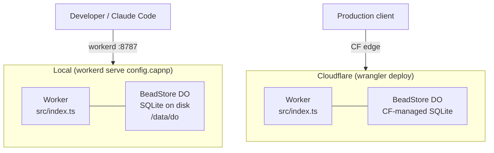
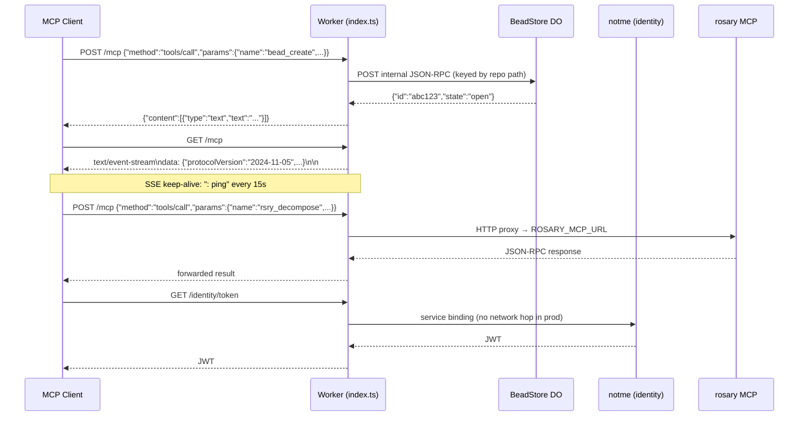
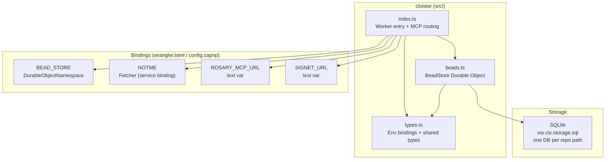
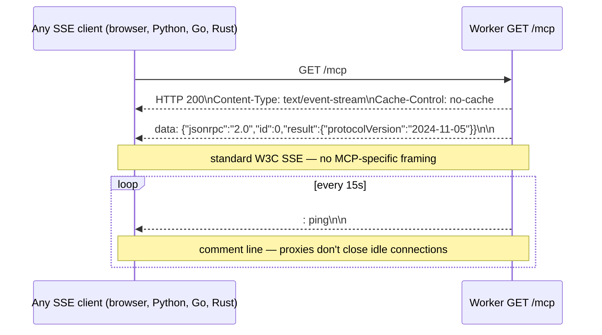
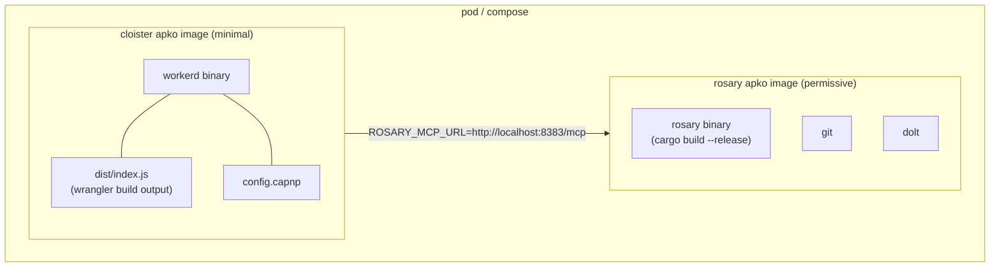

# Architecture

cloister is a workerd-based MCP gateway. Same TypeScript bundle runs locally via the `workerd` binary and on Cloudflare Workers in production — no code changes, only config differs.

## Runtime model



The code is identical. Storage differs: local disk vs Cloudflare-managed Durable Object SQLite. Both use the same DO SQL API (`ctx.storage.sql`).

## Request routing



## Component map



## Bead store per repo

Each repo gets its own Durable Object instance, keyed by repo path:

```mermaid
graph LR
    GW["Gateway"]
    GW -->|idFromName('/repos/rosary')| R["BeadStore\n/repos/rosary\nSQLite: beads, comments"]
    GW -->|idFromName('/repos/mache')| M["BeadStore\n/repos/mache\nSQLite: beads, comments"]
    GW -->|idFromName('/repos/crumb')| C["BeadStore\n/repos/crumb\nSQLite: beads, comments"]
```

Isolation is physical: separate SQLite files, separate DO instances, no shared state.

## SSE (Server-Sent Events)



SSE uses `ReadableStream<Uint8Array>` with standard `data: ...\n\n` framing. Any language's EventSource implementation works without MCP-specific libraries.

## Packaging (melange + apko)

cloister and rosary have different security profiles and are packaged separately:



cloister: no shell, no subprocesses, non-root, read-only FS — fully hardenable.
rosary: needs subprocess caps (git, dolt, claude-cli), writable volumes — separate profile.

## Non-workerd backends

Services that don't run in workerd are reached via HTTP URL env vars:

| Var | Service | Notes |
|-----|---------|-------|
| `ROSARY_MCP_URL` | rosary (Rust) | Orchestration, decompose, dispatch |
| `SIGNET_URL` | signet (Go) | Key exchange — not yet deployed |

`ley-line-open` is a Rust library, not a service — linked into rosary, not proxied.

## Security surface

| Layer | Risk | Mitigation |
|-------|------|-----------|
| MCP endpoint | Unauthenticated in local dev | Add notme JWT middleware before prod deploy |
| BeadStore SQL | Parameterized queries throughout | No injection risk |
| notme proxy | SSRF? | NOTME is a service binding (not user-controlled URL) |
| rosary proxy | SSRF | ROSARY_MCP_URL is an env var, not a request param |
| CORS | `*` in local dev | Tighten to specific origins before prod |
