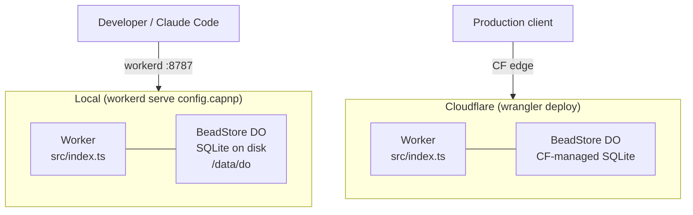
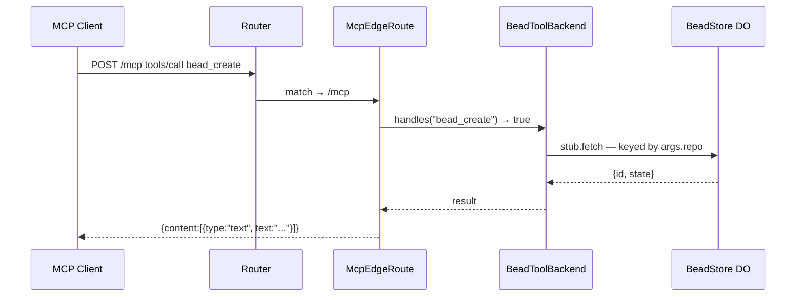
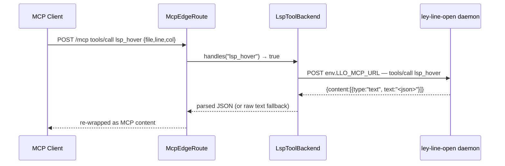
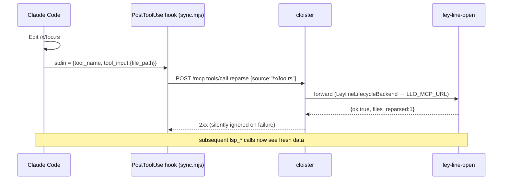
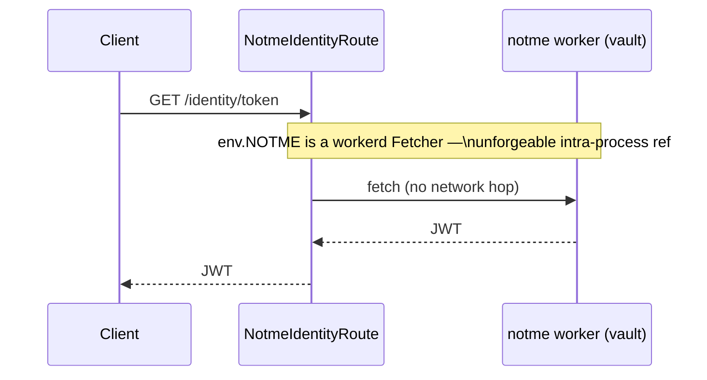
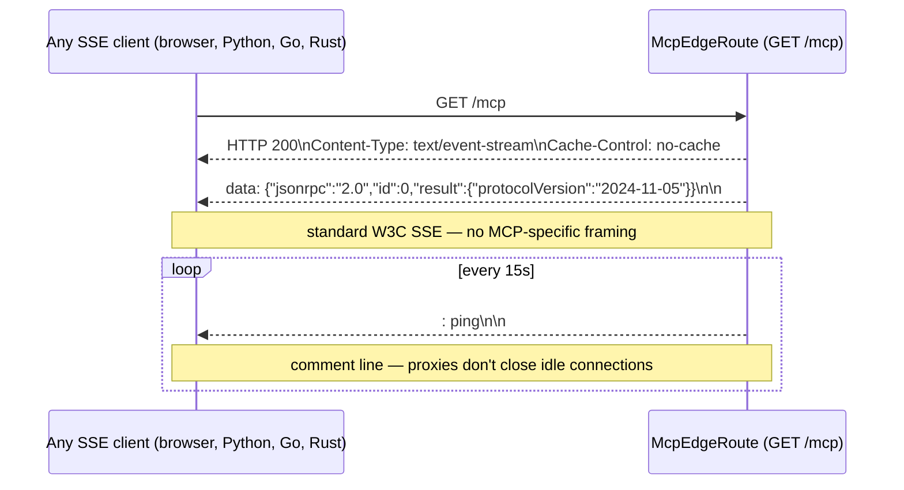
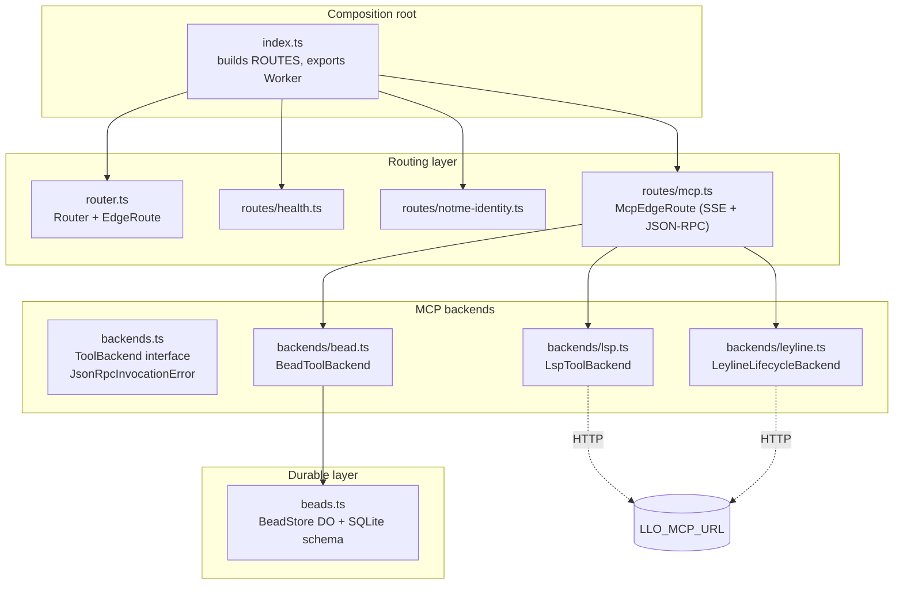
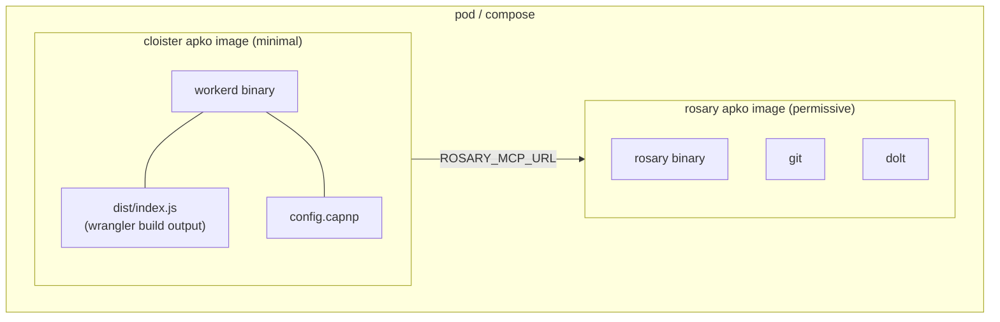

# Architecture

cloister is an SSE/HTTP edge router that runs on workerd. The same
TypeScript bundle runs locally via the `workerd` binary and on Cloudflare
Workers in production — no code changes, only config differs.

This document covers the runtime model and request routing as implemented
today. The decisions behind it are in the ADRs:

- [ADR-0001](adr/0001-workerd-mcp-gateway.md) — why workerd
- [ADR-0002](adr/0002-edge-router-protocol-agnostic-backends.md) — why edge
  router with protocol-agnostic backends, not "an MCP gateway"

If you're trying to *run* cloister rather than understand its shape, start
at [../GETTING-STARTED.md](../GETTING-STARTED.md).

## Runtime model



The code is identical. Storage differs: local disk vs Cloudflare-managed
Durable Object SQLite. Both use the same DO SQL API (`ctx.storage.sql`).

## Request routing — two layers

ADR-0002 introduces two small interfaces. The outer layer dispatches HTTP
requests to `EdgeRoute`s. The MCP edge route, in turn, dispatches tool
calls to `ToolBackend`s.

```mermaid
graph TB
    REQ["incoming Request"]
    R["Router (ordered table)"]
    H["HealthRoute\nGET /health"]
    I["NotmeIdentityRoute\n/identity/*"]
    M["McpEdgeRoute\nGET|POST /mcp"]

    B["BeadToolBackend\nbead_*\n→ env.BEAD_STORE DO"]
    L["LspToolBackend\nlsp_*\n→ env.LLO_MCP_URL"]
    F["LeylineLifecycleBackend\nreparse | enrich | status\n→ env.LLO_MCP_URL"]

    REQ --> R
    R -->|first match wins| H
    R --> I
    R --> M
    M -->|handles(name)| B
    M --> L
    M --> F
```

### EdgeRoute — HTTP/SSE multiplexing

Each `EdgeRoute` answers `match(request)` and `handle(request, env)`. The
router tries them in order; the first match wins, and falls through to a
404. Routes never see one another and never call back into the Router.

### ToolBackend — MCP tool dispatch

`McpEdgeRoute` aggregates a list of `ToolBackend`s. For `tools/list` it
returns the *union* of every backend's `tools()`. For `tools/call` it finds
the first backend whose `handles(name)` returns true and delegates
`invoke(name, args, env)`.

The route throws at construction if two backends advertise the same tool
name — duplicate-tool-name shadowing is loud, not silent.

## Sequence diagrams

### bead_create — local DO



### lsp_hover — HTTP forward to ley-line-open



### reparse — fired by the CC plugin



### /identity/* — service binding to notme



The notme vault has *no network*. It is reachable only through this service
binding, which is an unforgeable reference. cloister is the only thing on
the network in front of it. See ADR-0002 §"Capability boundary".

## SSE (Server-Sent Events)



Any language's EventSource implementation works without MCP-specific
libraries.

## Component map



`router.ts`, `backends.ts`, and the four route/backend modules are the
*entire* abstraction surface. New tenants are new files in `routes/` or
`backends/` plus one line in `index.ts`'s ROUTES table. There is no
plugin loader, manifest, or registry. ADR-0002 details the contract.

## Bead store per repo

Each repo gets its own Durable Object instance, keyed by repo path:

```mermaid
graph LR
    GW["BeadToolBackend"]
    GW -->|idFromName('/repos/rosary')| R["BeadStore\n/repos/rosary\nSQLite: beads, comments"]
    GW -->|idFromName('/repos/mache')| M["BeadStore\n/repos/mache\nSQLite: beads, comments"]
    GW -->|idFromName('/repos/crumb')| C["BeadStore\n/repos/crumb\nSQLite: beads, comments"]
```

Isolation is physical: separate SQLite files, separate DO instances, no
shared state.

## Bindings

Bindings live in two files that must stay in sync — one source of truth for
each launcher:

| Binding          | Type                        | Where                                       | Used by                                        |
| ---------------- | --------------------------- | ------------------------------------------- | ---------------------------------------------- |
| `BEAD_STORE`     | `DurableObjectNamespace`    | `wrangler.toml`, `config.capnp`             | `BeadToolBackend`                              |
| `NOTME`          | `Fetcher` (service binding) | `wrangler.toml`, `config.capnp`             | `NotmeIdentityRoute`                           |
| `LLO_MCP_URL`    | text var                    | `wrangler.toml`, `config.capnp`             | `LspToolBackend`, `LeylineLifecycleBackend`    |
| `ROSARY_MCP_URL` | text var                    | `wrangler.toml`, `config.capnp`             | (future) rosary passthrough                    |
| `SIGNET_URL`     | text var                    | `wrangler.toml`, `config.capnp`             | (future) signet binding                        |

## Packaging (melange + apko)

cloister and rosary have different security profiles and are packaged
separately:



cloister: no shell, no subprocesses, non-root, read-only FS — fully
hardenable. rosary: needs subprocess caps (git, dolt, claude-cli),
writable volumes — separate profile.

## Security surface

| Layer            | Risk                                | Mitigation                                                |
| ---------------- | ----------------------------------- | --------------------------------------------------------- |
| `POST /mcp`      | Unauthenticated in local dev        | Add notme JWT middleware before prod deploy (ADR-0001 work item) |
| BeadStore SQL    | Parameterized queries throughout    | No injection risk                                         |
| notme proxy      | SSRF?                               | `NOTME` is a service binding (not a user-controlled URL)  |
| LLO HTTP         | SSRF                                | `LLO_MCP_URL` is an env var, not a request param          |
| rosary proxy     | SSRF                                | `ROSARY_MCP_URL` is an env var                            |
| CORS             | `*` in local dev                    | Tighten to specific origins before prod                   |
| notme vault      | Side channel                        | Vault has no network — only reachable via service binding |

## Where to next

- Set it up: [../GETTING-STARTED.md](../GETTING-STARTED.md)
- Add a new MCP tool family: see `LspToolBackend` / `LeylineLifecycleBackend`
  for templates, register in `src/index.ts`'s `McpEdgeRoute([...])`
- Add a new HTTP tenant: implement `EdgeRoute`, append to `ROUTES`
- Plugin contract: [../hooks/README.md](../hooks/README.md)
