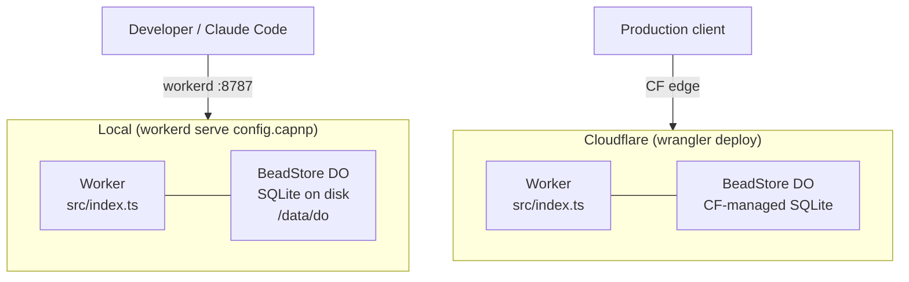
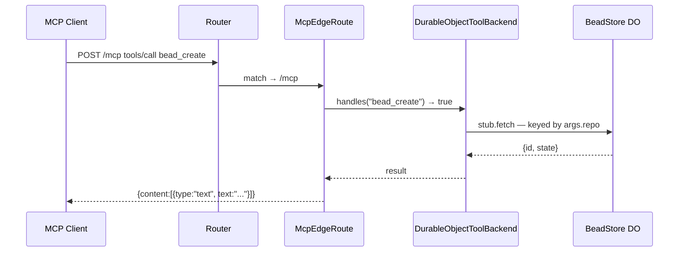
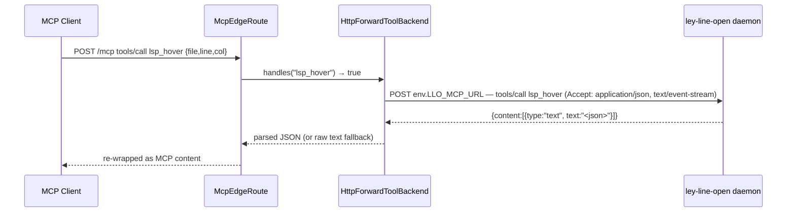
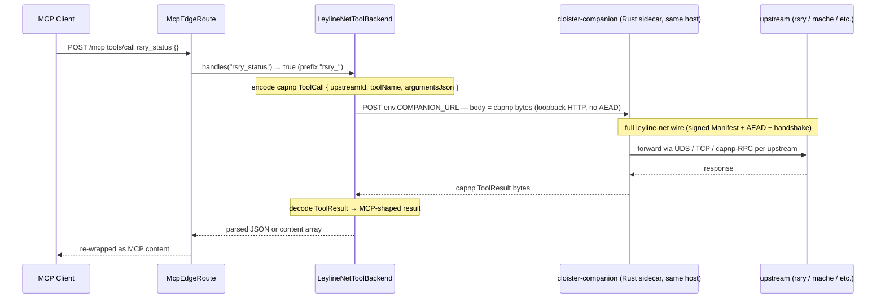
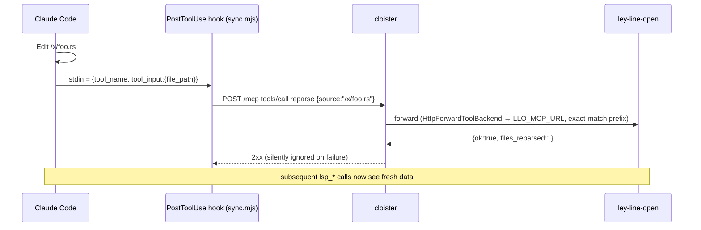
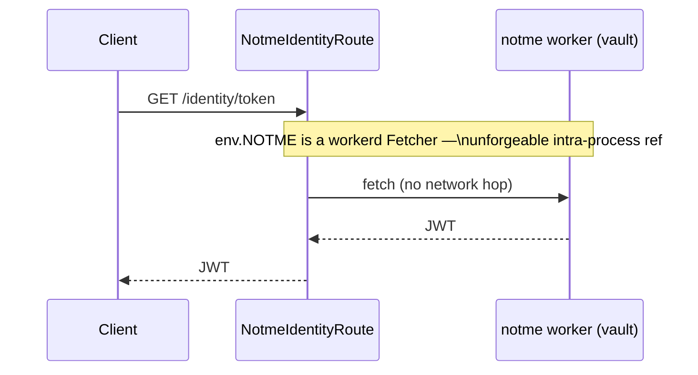
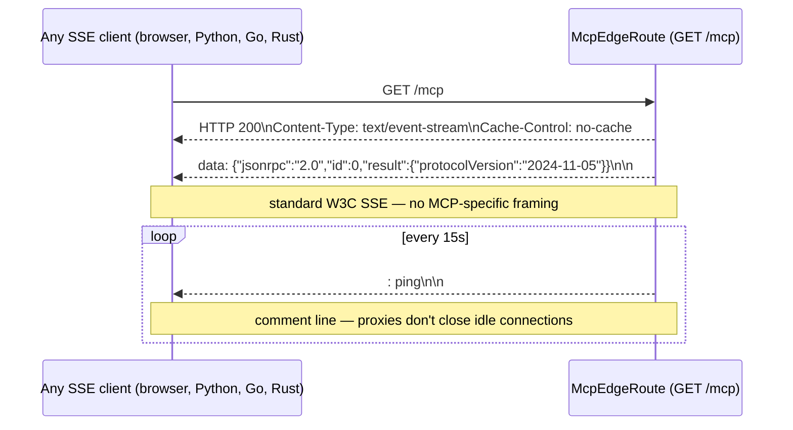
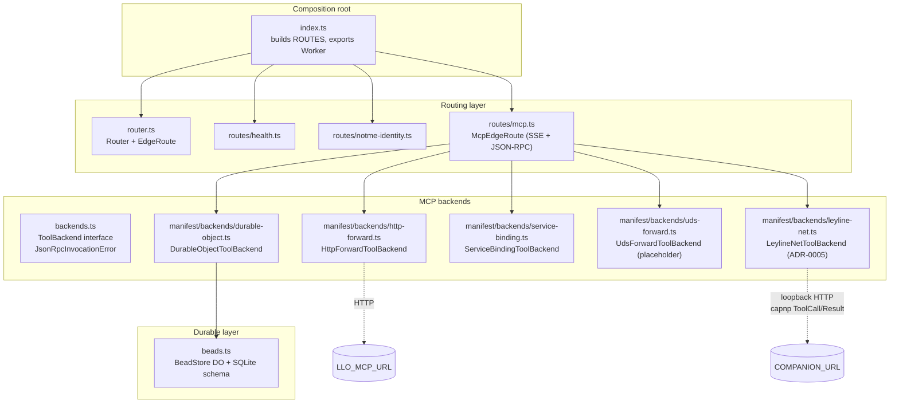
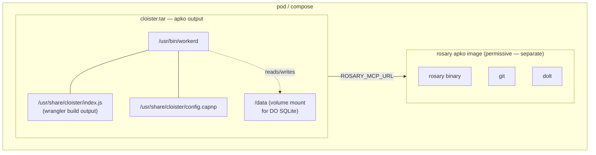

# Architecture

cloister is a **v8-isolate hypervisor**: it hosts workerd Workers,
wires them into clusters via service bindings, mediates their access
to identity and credentials, and routes external traffic to them. The
same TypeScript bundle runs locally via the `workerd` binary and on
Cloudflare Workers in production — no code changes, only config
differs. The MCP/JSON-RPC face is **one tenant** of the public pipe;
the substrate underneath (declarative routing, capability
distribution, state-boundary attestation, Interlace identity) is the
hypervisor layer per
[ADR-0011](adr/0011-hypervisor-bundle-boundary.md).

This document covers the runtime model and request routing as
implemented today. The decisions behind it are in the ADRs:

- [ADR-0001](adr/0001-workerd-mcp-gateway.md) — why workerd
- [ADR-0002](adr/0002-edge-router-protocol-agnostic-backends.md) — why edge
  router with protocol-agnostic backends, not "an MCP gateway"
- [ADR-0003](adr/0003-content-addressed-bead-store.md) — substrate-free bead
  storage as content-addressed DAG + CAS refs (Phase 1 landed; Phase 2 planned)
- [ADR-0004](adr/0004-capnp-manifest.md) — Cap'n Proto manifest replacing the
  TS registration site. **Shipped**: `cloister.capnp` at the repo root is the
  source of truth for routes; `task manifest` compiles it to
  `src/generated/manifest.ts`; `src/index.ts` instantiates from there.
- [ADR-0005](adr/0005-internal-wire-leyline-net.md) — internal wire = leyline-net
  (signed capnp) at the cloister↔companion seam; MCP only at the public face.
  Open subset of leyline-net extracted into `ley-line-open` as `leyline-wire`;
  raptorq + sqlite-blast stay closed in `ley-line` proper. (planned)
- [ADR-0006](adr/0006-derived-tool-schemas.md) — dynamic tools/list
  passthrough with TTL cache; Asserted-vs-Derived schema evidence.
- [ADR-0007](adr/0007-interlace-substrate.md) — **Interlace identity +
  attestation + discovery** (Proposed). Lease ≠ state factoring;
  `.well-known/interlace/index.json` (shipped at `3ccbea5`); CF Tunnel /
  WARP off-platform deployment doc (shipped at `44a935a`); audit
  amendment 2026-05-08 (revocation read, lease counter, prev_self_ref).
- [ADR-0008](adr/0008-companion-pool.md) — companion pool / load
  balancing (Proposed; orthogonal to Interlace — the lease layer
  authorizes the call, attestation logs the state change, LB picks
  where to send the call).
- [ADR-0009](adr/0009-compute-substrate-portability.md) — Linux /
  Firecracker / WASM / unikernel as deployment knob (Proposed). The
  bundle is the unit that varies across substrates.
- [ADR-0010](adr/0010-vault-and-bundle-clusters.md) — **vault as scoped
  slices, bundles as the unit of trust, clusters as the unit of
  identity** (Proposed). Reframes today's `EdgeRoute`/`ToolBackend`
  abstraction as the degenerate one-bundle-one-cluster case;
  introduces `Bundle`, `Cluster`, `VaultSliceGrant` as manifest
  primitives. KEK derived from `SigningAuthority` master (no env-var
  bootstrap). Tracking bead: `cloister-97610c`.
- [ADR-0011](adr/0011-hypervisor-bundle-boundary.md) — **hypervisor vs
  bundle responsibilities, and the k8s comparison made precise**
  (Proposed). Formalizes the three-criterion test for
  hypervisor-layer code, lists what's hypervisor-only vs bundle-only
  vs neither, and enumerates where the k8s analogy actually holds vs
  breaks down. Use this as the answer to "where should this code go?"
  and "do we need a `cloister.capnp` slice in repo X?".

The forward arc: ADRs 0007 + 0010 together replace today's env-var
bindings (`LLO_MCP_URL`, `MACHE_MCP_URL`, `INTERLACE_MASTER_PUBKEY`,
etc.) with vault-slice reads scoped per-bundle, all rooted in the same
Ed25519 master that's already born-in-CF inside notme's `SigningAuthority`
DO. The runtime described in this document is the *current* shape;
the ADRs describe where it's going.

If you're trying to *run* cloister rather than understand its shape, start
at [../GETTING-STARTED.md](../GETTING-STARTED.md). If you want the
"why" of any specific decision, walk into the linked ADR — they're the
source of truth.

## Runtime model



The code is identical. Storage differs: local disk vs Cloudflare-managed
Durable Object SQLite. Both use the same DO SQL API (`ctx.storage.sql`).

## Request routing — two layers

ADR-0002 introduces two small interfaces. The outer layer dispatches HTTP
requests to `EdgeRoute`s. The MCP edge route, in turn, dispatches tool
calls to `ToolBackend`s.

```mermaid
graph TB
    REQ["incoming Request"]
    R["Router (ordered table)"]
    H["HealthRoute\nGET /health"]
    I["NotmeIdentityRoute\n/identity/*"]
    M["McpEdgeRoute\nGET|POST /mcp"]

    B["DurableObjectToolBackend\nbead_*\n→ env.BEAD_STORE DO"]
    L["HttpForwardToolBackend\nlsp_*\n→ env.LLO_MCP_URL"]
    F["HttpForwardToolBackend\nreparse | enrich | status\n→ env.LLO_MCP_URL"]
    LN["LeylineNetToolBackend\n(spec-declared)\n→ env.COMPANION_URL\n→ cloister-companion → backend"]

    REQ --> R
    R -->|first match wins| H
    R --> I
    R --> M
    M -->|handles(name)| B
    M --> L
    M --> F
```

### EdgeRoute — HTTP/SSE multiplexing

Each `EdgeRoute` answers `match(request)` and `handle(request, env)`. The
router tries them in order; the first match wins, and falls through to a
404. Routes never see one another and never call back into the Router.

### ToolBackend — MCP tool dispatch

`McpEdgeRoute` aggregates a list of `ToolBackend`s. For `tools/list` it
returns the *union* of every backend's `tools()`. For `tools/call` it finds
the first backend whose `handles(name)` returns true and delegates
`invoke(name, args, env)`.

The route throws at construction if two backends advertise the same tool
name — duplicate-tool-name shadowing is loud, not silent.

## Sequence diagrams

### bead_create — local DO



### lsp_hover — HTTP forward to ley-line-open



### rsry_status — leylineNet via cloister-companion (ADR-0005)



The cloister↔companion hop is **IPC** (loopback HTTP, no AEAD) per
ADR-0005's 2026-04-30 amendment. The full leyline-net wire — signed
capnp manifests, ChaCha20-Poly1305 AEAD, X25519 handshake — lives at
the companion↔backend hop where bytes traverse a real network.

### reparse — fired by the CC plugin



### /identity/* — service binding to notme



The notme vault has *no network*. It is reachable only through this service
binding, which is an unforgeable reference. cloister is the only thing on
the network in front of it. See ADR-0002 §"Capability boundary".

## SSE (Server-Sent Events)



Any language's EventSource implementation works without MCP-specific
libraries.

## Component map



`router.ts`, `backends.ts`, and the four route/backend modules are the
*entire* abstraction surface. New tenants are new files in `routes/` or
`backends/` plus one line in `index.ts`'s ROUTES table. There is no
plugin loader, manifest, or registry. ADR-0002 details the contract.

## Bead store per repo

Each repo gets its own Durable Object instance, keyed by repo path:

```mermaid
graph LR
    GW["DurableObjectToolBackend (bead_*)"]
    GW -->|idFromName('/repos/rosary')| R["BeadStore\n/repos/rosary\nSQLite: beads, comments"]
    GW -->|idFromName('/repos/mache')| M["BeadStore\n/repos/mache\nSQLite: beads, comments"]
    GW -->|idFromName('/repos/crumb')| C["BeadStore\n/repos/crumb\nSQLite: beads, comments"]
```

Isolation is physical: separate SQLite files, separate DO instances, no
shared state.

## Bindings

Bindings live in two files that must stay in sync — one source of truth for
each launcher:

| Binding            | Type                        | Where                                       | Used by                                        |
| ------------------ | --------------------------- | ------------------------------------------- | ---------------------------------------------- |
| `BEAD_STORE`       | `DurableObjectNamespace`    | `wrangler.toml`, `config.capnp`             | `BeadToolBackend`                              |
| `NOTME`            | `Fetcher` (service binding) | `wrangler.toml`, `config.capnp`             | `NotmeIdentityRoute`                           |
| `LLO_MCP_URL`      | text var                    | `wrangler.toml`, `config.capnp`             | `LspToolBackend`, `LeylineLifecycleBackend`    |
| `ROSARY_MCP_URL`   | text var                    | `wrangler.toml`, `config.capnp`             | (future) rosary passthrough                    |
| `SIGNET_URL`       | text var                    | `wrangler.toml`, `config.capnp`             | (future) signet binding                        |
| `ALLOWED_ORIGINS`  | text var (optional)         | env-only (unset in wrangler/capnp defaults) | `pickAllowedOrigin` in `src/cors.ts`           |

## Packaging (melange + apko)

cloister ships as a **distroless OCI image** built by `task image`. The
recipe lives in `melange.yaml` (APK build) + `apko.yaml` (image compose).



What `task image` produces:

- workerd binary + the wrangler-built JS bundle + `config.capnp`
- no shell, no package manager, no subprocesses
- runs as `uid 65532` (non-root)
- entrypoint `workerd serve --experimental /usr/share/cloister/config.capnp`
- two architectures: `x86_64` + `aarch64`
- per-origin layering — same upstream packages share a layer, so updates
  pull only the changed layer (~70% smaller deltas)

cloister's security profile is fully hardenable. rosary lives in its own
image because it needs subprocess caps (git, dolt, claude-cli) and writable
volumes.

`task image:check` parses `melange.yaml` + `apko.yaml` end-to-end without
running a real build — useful in CI before bumping versions.

## Lease verification (ADR-0007 / cloister-bd7770)

Every authenticated `POST /mcp` call is verified by
`src/routes/lease-middleware.ts:verifyAndUpsertLease` before reaching
the JSON-RPC dispatch. The pipeline:

1. **Header parse** — `Authorization: Signet <base64-cert-DER>`,
   `X-Signet-Sig`, `X-Signet-Ts`, `X-Signet-Nonce`. Malformed headers
   short-circuit to JSON-RPC error code -32001 / HTTP 401.
2. **Cert chain verify** — `verifyCertChain` (TS wrapper around
   wasm32-built `leyline-sign`) checks the cert is signed by the active
   master in the CA bundle, falling back to the previous master during
   a rotation window. Source: `rs/crates/sign/src/cert_chain.rs` →
   `src/wire/signet-verify.ts`.
3. **Claims required** — Phase 1 mandates `epoch` + `peer_fp` + `scope`
   (Interlace OID extensions at `1.3.6.1.4.1.99999.1.{4,5,6}`). Certs
   without them fail closed.
4. **Epoch currency** — `isCertEpochCurrent` accepts the current bundle
   epoch and (during a rotation window) `bundle.epoch - 1`.
5. **Validity window** — server clock ∈ `[not_before, not_after]`.
6. **Request signature** — `crypto.subtle.verify("Ed25519", …)` over
   `canonicalRequestBytes(method, url, ts, nonce, body)`. Web Crypto's
   raw-key import path; no extra wasm hop.
7. **Scope match** — `scopeAllows(cert.scope, deriveRequestScope(...))`.
   Glob semantics: `X:*` matches any `X:Y`; `*` matches anything (admin
   only).
8. **Lease counter UPSERT** — `TrustStore.upsertLeaseCounter(...)` via
   workerd RPC. ADR-0007 §13.2: every authenticated call is recorded so
   silence is evidence.

The `INTERLACE_DEV_BYPASS` escape hatch was removed by the 2026-05-08
ADR-0007 amendment. Auth is always-on in production. Dev workflow mints
short-lived dev certs through `notme` against a real master.

The substrate (header parse, canonical bytes, cert verify, sig verify,
scope, TrustStore upsert) is end-to-end tested in
`test/routes/lease-middleware.test.ts`. Wiring into the McpEdgeRoute
hot path lives behind a follow-up bead — it requires the notme bundle
fetcher and migration of unauthenticated test fixtures.

## Security surface

| Layer            | Risk                                | Mitigation                                                |
| ---------------- | ----------------------------------- | --------------------------------------------------------- |
| `POST /mcp`      | Unauthenticated request execution   | `verifyAndUpsertLease` (lease middleware) runs the wasm32 cert-chain verifier + Web Crypto Ed25519 request-sig + scope match + TrustStore counter upsert. ADR-0007. Substrate tested; wiring into mcp.ts pending. |
| BeadStore SQL    | Parameterized queries throughout    | No injection risk                                         |
| TrustStore SQL   | Singleton DO, parameterized queries | No injection risk; per-DO ACID                            |
| notme proxy      | SSRF?                               | `NOTME` is a service binding (not a user-controlled URL)  |
| LLO HTTP         | SSRF                                | `LLO_MCP_URL` is an env var, not a request param          |
| rosary proxy     | SSRF                                | `ROSARY_MCP_URL` is an env var                            |
| CORS             | `*` in local dev                    | `ALLOWED_ORIGINS` env var enables a literal+`:*`-port allowlist; disallowed origins receive `null` sentinel — see `src/cors.ts` |
| notme vault      | Side channel                        | Vault has no network — only reachable via service binding |
| Container surface| Shell, pkgmgr, root                 | Distroless apko image; no shell, no pkgmgr, runs as uid 65532 |

## Where to next

- Set it up: [../GETTING-STARTED.md](../GETTING-STARTED.md)
- Add a new MCP tool family: see `LspToolBackend` / `LeylineLifecycleBackend`
  for templates, register in `src/index.ts`'s `McpEdgeRoute([...])`
- Add a new HTTP tenant: implement `EdgeRoute`, append to `ROUTES`
- Plugin contract: [../hooks/README.md](../hooks/README.md)
