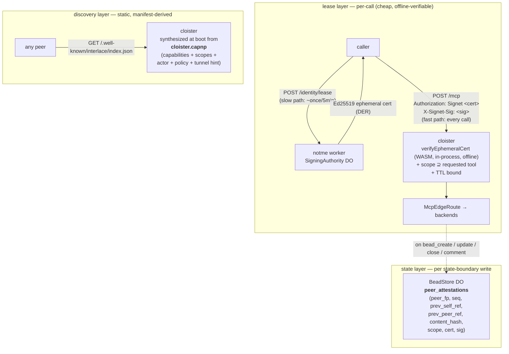
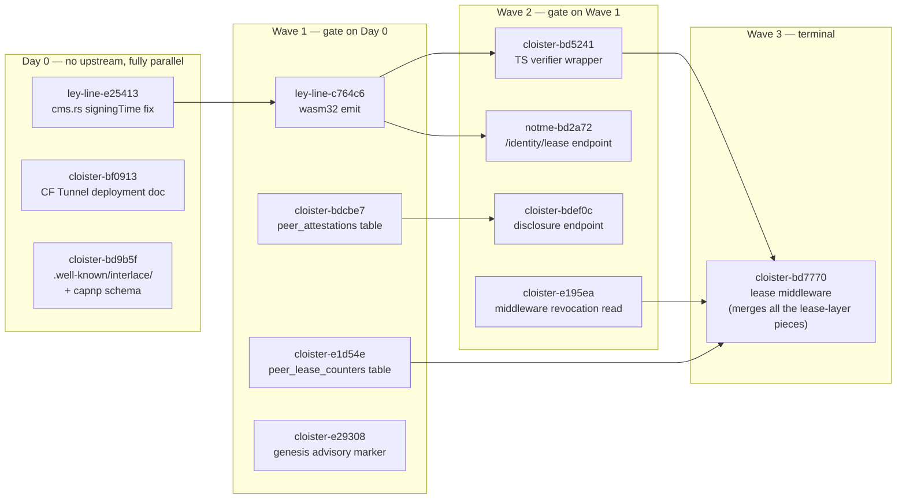

## Context

Cloister has a public face (MCP/JSON-RPC over HTTP/SSE), an internal IPC
seam (capnp ToolCall/ToolResult to cloister-companion per ADR-0005
amendment), and a backend wire (companion's choice per upstream — UDS,
capnp-RPC, leyline-net AEAD). What it does not have is a coherent story
for **who is allowed to call which tool**, **what evidence is left behind
when state changes**, and **how a peer discovers what cloister offers
without out-of-band configuration**.

ADR-0001 listed "notme JWT middleware on POST /mcp" as an open work item.
ADR-0005 deferred "authentication at the public face." Both punts have
aged. The Interlace protocol spec (Draft v0.2.0, May 2026) lays out a
peer-to-peer pattern that addresses all three concerns: Signet identity
+ ephemeral leases, bilateral attestation chains, `.well-known`
discovery. Reviewing the spec against cloister's current shape produced
three load-bearing reframings:

**1. WG ≈ CF Tunnel; CF anycast is the network.** Interlace §7 assumes
WireGuard tunnels per relationship with NAT traversal via Hyperswarm DHT
or libp2p relays. Cloister doesn't run a WireGuard userspace daemon —
workerd has no kernel access and the distroless apko image runs as uid
65532 with no NET_ADMIN. WARP is literally WireGuard managed by
Cloudflare; CF Tunnel is the asymmetric "origin → edge" variant. For
cloister↔backend in production the CF platform IS the network (anycast
in, Hyperdrive/service-bindings/`connect()` out). For off-platform
peers, CF Tunnel + WARP fill the WG slot with CF as the rendezvous, and
the off-platform peer does not need to run anything kernel-privileged
either. Userspace WG never lives inside cloister.

**2. Lease ≠ state.** Reading Interlace §6 ("every interaction = a
commit") at MCP rates explodes — `reparse` fires on every Edit; `lsp_*`
and `mache_*` are read-heavy. The right factoring separates the
**lease layer** (per-call authorization, cheap, ephemeral) from the
**state layer** (cluster boundary, durable, attested). Signet's
two-step model (master → ephemeral) was always shaped for this:
master attests *that the actor can mint leases for boundary X*; the
ephemeral *is* the lease for one call within X. Attestation lives at
state-boundary writes (`bead_create` / `bead_update` / `bead_close` /
`bead_comment`) — not on `lsp_hover` reads. This dissolves Interlace
§16-Q5 ("asymmetric interaction patterns") for cloister.

**3. notme is not on the hot path.** Signet verification is offline:
`crypto.subtle.verify(Ed25519, masterPubkey, certBytes, certSig)` plus
TTL/scope checks. Pure CPU, no I/O, no service-binding hop per request.
notme is touched only when an actor refreshes its lease (every 5 min,
by the actor — not by cloister). The verifier code is platform-portable
and falls out as the same artifact that runs in workerd, in
cloister-companion (Rust), in the `ll sign` CLI, and in any third-party
auditor. This is exactly Interlace's "third party verifies
non-interactively" property — it isn't a separate goal you bolt on.

The fourth observation is that **almost all the substrate already exists:**

- `notme/worker/src/signing-authority.ts` ships a `SigningAuthority`
  Durable Object holding the Ed25519 master ("Zero-copy: key is born in
  CF and never leaves"). This IS the Master CA per Interlace §5.1.
- `notme/worker/src/cert-authority.ts::mintBridgeCertPair` mints 5-min
  ephemeral certs signed by the master, with X.509 KeyUsage / EKU /
  custom-OID extensions. This IS Interlace §5.2 ephemeral certs.
- `notme/worker/src/auth/verify-proof.ts` does generic OIDC + X.509
  proof verification.
- `notme/worker/src/auth/dpop*.ts` do DPoP-style proof of possession
  (= Interlace §5.3).
- `notme/worker/src/revocation.ts` handles CA bundle epochs (= Interlace
  revocation per §5.1, §11.3).
- `ley-line/rs/crates/sign/` (`leyline-sign`) is `crate-type = ["cdylib",
  "staticlib", "rlib"]` with `wasm32-unknown-unknown` build cache
  present. CMS/PKCS#7 + X.509 + Ed25519 in pure Rust, used by
  `ll sign` (CLI) and slated for the notme worker via `notme/wasm/`
  (an empty slot waiting for the wasm32 artifact).

What's missing in cloister specifically: a route table entry for
`.well-known/interlace/`, a verifier middleware on POST /mcp wired to
the existing Master CA, a Durable-Object table that records
state-boundary attestations, a selective-disclosure read endpoint, and
a wasm32 emit of `leyline-sign`.

## Decision

Adopt Interlace as the identity / attestation / discovery substrate at
cloister's public face, factored along three axes — **lease**,
**state**, **discovery** — with a single shared crypto artifact under
all three.

### Three-axis factoring



### What each layer owns

**Lease layer.** Every authenticated request to POST /mcp carries a
Signet ephemeral cert + a request signature. Verification happens
in-process via the WASM-compiled `leyline-sign` against a pinned
`INTERLACE_MASTER_PUBKEY` env binding. Auth is **always-on** in
production wrangler/apko — there is no `INTERLACE_DEV_BYPASS`. Dev
workflow uses `notme` to mint short-lived dev certs against a real
master, exercising the same path.

Scope derivation:

- `tools/list` → `tools:list` (always allowed for any valid cert)
- `tools/call name=<X> args=<Y>` → `<X>:<repo-or-resource>` (e.g.
  `bead_create:/repos/rosary`)
- Mismatch between cert scope and derived scope → `403 -32002
  scope_denied`

The cert-mint endpoint is a narrow reshape of notme's existing
`mintBridgeCertPair`: single signing cert, scope and peer-fingerprint
pushed into the existing custom-OID arc (`1.3.6.1.4.1.99999`).

**State layer.** The BeadStore Durable Object grows a
`peer_attestations` table:

```
peer_fingerprint TEXT    NOT NULL
seq              INTEGER NOT NULL
prev_self_hash   TEXT
prev_peer_ref    TEXT
content_hash     TEXT    NOT NULL
content_type     TEXT    NOT NULL
scope            TEXT    NOT NULL
cert             BLOB    NOT NULL
sig              BLOB    NOT NULL
created_at       INTEGER NOT NULL
PRIMARY KEY (peer_fingerprint, seq)
```

Rows are written **only on state-boundary mutations** (bead_create,
bead_update, bead_close, bead_comment), inside the same SQL transaction
as the underlying state change. Read-only / lease-only calls (lsp_*,
mache_*, get_overview, etc.) leave no row — the lease check is
sufficient.

`prev_self_hash` is the chain hash of this actor's previous attestation
across all peers. `prev_peer_ref` is the last seq the peer wrote, taken
either from the peer's request envelope or from the peer's disclosure
endpoint. Genesis row for a new `(actor, peer)` pair sets
`prev_peer_ref = NULL` and `content_hash = sha256(<peer's
.well-known/interlace/index.json at first contact>)`.

Selective disclosure is `WHERE peer_fingerprint = ?` — SQL row-level
scoping plays the role of Interlace's
`refs/interlace/peers/<fingerprint>` git-ref isolation (§9.2). A
GET /interlace/peers/{fingerprint} endpoint streams that filtered view
plus the master pubkey, so a third party can verify offline without
seeing the actor's other relationships.

**Discovery layer.** A new EdgeRoute serves
`GET /.well-known/interlace/index.json`. The body is synthesized at
boot from the typed manifest module (`src/generated/manifest.ts`,
compiled from `cloister.capnp`). Adding a `policy` block and an `actor`
block to the schema makes the manifest the single source of truth for
the discovery doc — capabilities, scopes, max_cert_lifetime, pinned
fingerprint, optional tunnel endpoint.

### Single shared crypto artifact

`leyline-sign` compiles to wasm32 and lands at `notme/wasm/`. The same
WASM module is consumed by:

- notme worker (replaces or augments `auth/verify-proof.ts`)
- cloister worker (`src/wire/signet-verify.ts` is a thin TS wrapper)
- cloister-companion (Rust, native crate dep)
- `ll sign` CLI (Rust, native crate dep)
- third-party auditors (any WASM host — browser, Wasmtime, etc.)

This is the concrete substrate-portability proof that ADR-0009
(compute-substrate portability) was reaching for: same crypto bytes,
identity-portable across V8 / Wasmtime / native Rust / unikernel /
Firecracker.

### What the spec calls for vs what we adopt

| Interlace spec (§) | Cloister adoption |
|---|---|
| Master keypair (§5.1) | `SigningAuthority` DO (✓ shipped) |
| Ephemeral cert (§5.2) | `mintBridgeCertPair` reshaped → `/identity/lease` |
| PoP (§5.3) | request-sig header verified by WASM (`X-Signet-Sig`) |
| `.well-known/interlace/` (§4.1) | new EdgeRoute, body from cloister.capnp |
| mDNS / DHT (§4.2) | n/a — CF anycast is the rendezvous |
| Bilateral chain (§6) | `peer_attestations` DO table, write-on-state-change |
| Genesis attestation (§6.5) | first row per (actor,peer); content_hash = peer's `.well-known` |
| Concurrency / diamond DAG (§6.3) | natural — SQL doesn't enforce single-parent |
| Divergence detection (§6.4) | `/interlace/peers/{fp}/divergence` endpoint |
| `refs/interlace/peers/<fp>` selective disclosure (§9.2) | SQL row-level scope on read endpoint |
| WireGuard tunnels (§7) | **not adopted** — CF Tunnel / WARP for off-platform peers |
| Hyperswarm DHT NAT traversal (§7.4) | **not adopted** — CF anycast |
| Epoch rollups (§9.4) | couples to ADR-0003 Phase 2 (deferred) |
| Per-actor CA (§10) | `SigningAuthority` DO (✓ shipped) |
| Revocation (§5.1, §11.3) | `revocation.ts` epoch bundle (✓ shipped) |

## Mapping to existing infrastructure

| Sigstore | Interlace | Cloister stack |
|---|---|---|
| Fulcio (CA) | per-actor local CA | `SigningAuthority` DO in notme |
| Rekor (log) | bilateral git chain | `peer_attestations` DO table in cloister |
| Cosign | `interlace` CLI + git trailers | `leyline-sign` WASM + `ll sign` CLI |
| OIDC bridge | Signet authority | `auth/verify-proof.ts` in notme |
| CT replication | git mirroring | per-peer scoped read endpoint |

Cloister sits in the same ecosystem position k8s does, minus the
networking and load-balancing layer. ADR-0008 covers the LB layer;
ADR-0007 (this doc) covers identity / attestation / discovery; the
networking is the CF platform.

## Consequences

**Positive:**

- **The ADR-0001 auth work item closes.** No JWT middleware — Signet
  cert middleware, sharing the same Master CA notme already ships.
- **No reimplementation of CMS/X.509/Ed25519 in TypeScript.** The
  `leyline-sign` Rust crate becomes the single source of truth via
  WASM; one audit surface, not two.
- **Third-party verification falls out for free.** The verifier is
  platform-portable; any auditor with the master pubkey can replay the
  chain. This is Interlace's central property and we get it without
  extra work.
- **Implementation budget is small** — ~400 LOC across the three
  layers, plus the wasm32 build target in ley-line. Most of the heavy
  crypto is already shipped.
- **No notme hot-path coupling.** Lease verification is offline. notme
  can be down between mints; cloister keeps serving until existing
  leases expire.
- **k8s parallel becomes literal.** ConfigMap = `cloister.capnp`,
  Service = EdgeRoute, Deployment = workerd + bundle, StatefulSet =
  Durable Objects, Secret/SA = notme + Signet ephemeral cert, RBAC =
  cert scope ⊆ tool scope. The 20% missing was networking + identity;
  CF platform fills the first, this ADR fills the second.

**Negative / risks:**

- **Always-on auth is a real boundary.** Any broken dev workflow
  surfaces immediately. We accept this trade — silent dev bypass in
  prod is a worse failure mode.
- **The `leyline-sign` wasm32 build is gating.** Until that artifact
  lands, cloister can't run the new middleware. Phase ordering matters.
- **Cross-epoch interlock is unsolved.** When `SigningAuthority`
  rotates an epoch (per `revocation.ts`), peer chains referencing the
  old epoch need a migration story. Tracked as an open question; couples
  to ADR-0003 Phase 2.
- **Revocation propagation is unsolved.** When notme bumps an epoch,
  how do third parties learn? Push over SSE? Polling the `.well-known`
  endpoint? Out of scope for this ADR; design note to follow.
- **Off-platform deployment story is documentation-shaped.** CF Tunnel
  works today; the `cloudflared` sidecar in apko is opt-in, not default.
  Self-hosted deployments without an existing CF account need a
  fallback (separate bead).

**Out of scope for this ADR:**

- **Load balancing / companion pool** — separate primitive, separate
  ADR (cloister-be29e6 → ADR-0008). Interlace is bilateral and
  pool-unaware; coupling LB into the trust layer is wrong.
- **Compute substrate portability** — separate ADR (cloister-be90ad →
  ADR-0009). The `leyline-sign` WASM emit is one worked example, but
  the broader substrate dimension is its own decision.
- **Authentication at the cloister↔companion seam** — per ADR-0005
  amendment, that hop is IPC inside the trust boundary; no auth needed.
- **Multi-party Session Lead model** (Interlace §13.1) — not v1; punt
  until there is a concrete N-party use case in the constellation.

## Work items

Tracked under decade `interlace-substrate`:

- [ ] **ley-line-c764c6** — Compile `leyline-sign` → wasm32, emit to
      `notme/wasm/`. Gating dependency.
- [ ] **notme-bd2a72** — Reshape `mintBridgeCertPair` into
      `POST /identity/lease` with `{scope, peer}` extensions on the
      existing custom-OID arc.
- [ ] **cloister-bd5241** — Thin TS wrapper over the WASM verifier
      (`src/wire/signet-verify.ts`).
- [ ] **cloister-bd7770** — POST /mcp (and GET /mcp upgrade) lease
      middleware, always-on. Cert in `Authorization: Signet`,
      sig in `X-Signet-Sig`. Replay defense via nonce window.
- [ ] **cloister-bd9b5f** — `GET /.well-known/interlace/index.json`
      EdgeRoute, body from `cloister.capnp`. Add `actor` and `policy`
      blocks to the schema.
- [ ] **cloister-bdcbe7** — `peer_attestations` table on BeadStore DO;
      writes on state-boundary mutations only.
- [ ] **cloister-bdef0c** — `GET /interlace/peers/{fingerprint}`
      selective-disclosure endpoint plus `/divergence` sibling.
- [ ] **cloister-bf0913** — CF Tunnel / WARP deployment doc + optional
      `cloudflared` sidecar in apko.

Phase ordering: ley-line wasm emit gates the cloister verifier and the
notme lease verifier. Once the WASM artifact exists, notme + cloister
work can fan out in parallel.

## Amendment 2026-05-08 — theoretical-foundations audit

After Proposed status landed, ran a fundamental-correctness audit against
the source spec (`interlace-protocol-spec.md` Draft v0.2.0), the existing
notme + `leyline-sign` codebases, and the companion ADRs (0001-0006).
Five findings — three critical, two sub-critical. **Verdict: sound enough
to ship with three additions, not a redesign.** Decisions baked into this
amendment; corrective beads tracked under decade `interlace-substrate`.

### Findings and decisions

**1. The pinned master pubkey is revocation-blind. — DECISION: read the
epoch bundle.**

Original framing (line 269) claimed "notme can be down between mints" as
a positive. notme's own verifier reads the live `CABundle` from KV
(`revocation.ts:223`) and rejects `epoch_mismatch` against the cert's
epoch OID (`1.3.6.1.4.1.99999.1.4`, `cert-authority.ts:267`); revocation
propagation is bounded to `BUNDLE_MAX_AGE_MS ≈ 5 min`. Cloister's
verifier as originally specified inherited none of that.

**The amended contract:** cloister's lease middleware MUST fetch the
notme CA bundle on a refresh interval not exceeding 4 minutes (one minute
inside `BUNDLE_MAX_AGE_MS`). Bundle is read via service binding to notme
(`env.NOTME` Fetcher; intra-process, unforgeable, no network hop).
Per-instance cache. The verifier itself remains a pure-crypto WASM
call; the middleware passes the current bundle epoch in and rejects
`epoch_mismatch`. **"Notme down between mints" is qualified:** the
runtime tolerates notme outages up to one bundle TTL; beyond that, fail
closed.

This bounds the worst-case acceptance window for a revoked master to
the bundle TTL — same guarantee notme itself provides. Tracked as
`cloister-e195ea`.

**2. Read-side amnesia breaks §13.2. — DECISION: add per-peer lease
counter.**

The original `peer_attestations` table is write-on-state-change only.
A peer who only invokes `lsp_hover` / `mache_search` / `bead_search`
leaves zero rows. Spec §13.2 (Mutual Assured Accountability) requires
silence to be evidence — the absence of a chain on one side is
cryptographic proof of misbehavior. Write-on-state-change makes
"silence on reads" indistinguishable from "we never interacted," and a
malicious peer can rewind the relationship to zero.

**The amended schema:** add a second table, `peer_lease_counters`,
with one row per peer (not one per call) and a hash-chained counter
updated on every authenticated request:

```
peer_lease_counters (
  peer_fingerprint TEXT PRIMARY KEY,
  seq              INTEGER NOT NULL,
  last_chain_hash  TEXT NOT NULL,    -- sha256(prev_chain_hash || cert_fp || nonce || ts)
  last_cert_fp     TEXT NOT NULL,
  updated_at       INTEGER NOT NULL
)
```

Single SQL UPDATE per call inside the verifier middleware, after cert
verification succeeds. Selective disclosure now exposes both tables for
a peer; divergence detection compares both sides' counter chains and
attestation logs.

This restores §13.2 over read-heavy traffic at the cost of one row-write
per request — well within DO write budget. Tracked as `cloister-e1d54e`.

**3. `prev_self_hash` global-vs-per-peer contradiction. — DECISION:
per-peer. Rename to `prev_self_ref`.**

Original prose (line 181-182) described `prev_self_hash` as the chain
hash of this actor's previous attestation across all peers (global). The
mapping table (line 188-191) claimed equivalence to git
`refs/interlace/peers/<fp>` isolation (per-peer). Both can't be true; a
globally-chained value disclosed to peer B reveals hash sequences
influenced by writes on peers/<C>'s chain, breaking §9.2 "selective
disclosure without revealing existence of other relationships."

**The amended schema renames `prev_self_hash` → `prev_self_ref` and
makes it per-peer.** Lookup becomes `WHERE peer_fingerprint = ? AND
seq = current - 1`. Selective disclosure is intact. Tracked as
`cloister-e207d7`.

**4. `leyline-sign::cms.rs` hardcodes signingTime. — DECISION: omit
signingTime in v1; reintroduce later only with a documented WASM
contract.**

`ley-line/rs/crates/sign/src/cms.rs:256-262` returns the literal
`b"250101000000Z"`. The function comment admits "Fixed time for
deterministic output in tests." Once the wasm32 build of `leyline-sign`
publishes to `notme/wasm/`, every cert ships frozen at 2025-01-01 forever
and spec Appendix B step 2 (`cert.not_before ≤ attestation.timestamp ≤
cert.not_after`) becomes trivially true.

**Spec adoption is amended:** in the cloister adoption, signingTime in
CMS SignedAttributes is omitted. RFC 5652 §5.3 makes it an unauthenticated
useful-attribute; legal to skip. Temporal binding is enforced via the
attestation row's `created_at` (server timestamp at write) compared to
the cert's `not_before` / `not_after` extensions — these are signed by
the master and bound at mint time. The `peer_lease_counters.updated_at`
similarly anchors the lease layer.

If a future revision wants signingTime in CMS, the WASM contract must
be: `js_sys::Date::new_0().get_time()` in V8, `wasi:clocks/wall-clock`
in WASI hosts, `SystemTime::now()` native. Cargo feature flags per
target. Tracked as `ley-line-e25413` — must land before the wasm32
artifact publishes.

**5. Genesis hash moves under `cloister.capnp` regeneration. —
DECISION: genesis is advisory.**

Anchoring genesis to `sha256(<peer's .well-known/interlace/index.json>)`
made the first-contact body's bytes part of the chain. The body is
synthesized at boot from `cloister.capnp`; any capability addition,
scope rename, or `actor` block edit changes the hash and silently
triggers divergence-detection false-positives on existing peers.

**The amended divergence model:** the genesis row records the body hash
at first contact, but divergence detection skips genesis row matching.
Genesis becomes "we both observed each other at this snapshot" without
a strong content invariant. Snapshot-per-epoch machinery (the spec-
aligned answer) is deferred — manifest changes are operational and rare,
and the cost of false-positive divergence is operational, not
cryptographic. Tracked as `cloister-e29308`.

### What changes vs the original ADR

| Surface | Original | Amended |
|---|---|---|
| Lease verifier | pin `INTERLACE_MASTER_PUBKEY`, fully offline | pin pubkey + read CA bundle on 4-min refresh; epoch-aware |
| Hot path | "no notme coupling" | notme tolerated down for ≤ bundle TTL; beyond that, fail closed |
| `peer_attestations` | only writes | + `peer_lease_counters` table, UPDATE per call |
| Spec §13.2 mapping | "rows are §13.2 evidence" | rows + counter chain are §13.2 evidence |
| `prev_self_hash` | global chain | renamed `prev_self_ref`, per-peer chain |
| Spec §9.2 mapping | "SQL row-level scoping ≡ git ref isolation" | true after rename |
| CMS `signingTime` | implicit (assumed live) | omitted; temporal binding via `not_before`/`not_after` + row `created_at` |
| Genesis attestation | content-addressed strict | advisory; divergence skips genesis |

### Wave plan for parallel implementation

The audit reshapes dependencies enough that the wave graph is worth
documenting explicitly so beads can dispatch in parallel:



File-overlap detection in rsry serializes within a wave where beads
share files (e.g. `lease-middleware.ts` is touched by `bd7770` and
`e195ea`); cross-wave parallelism is the gating constraint. Audit
beads have been redistributed across the existing surface threads
(`identity-lease`, `attestation`, `discovery`) rather than living in a
single `audit` thread, so dispatch can fan out.

### What was wrong in the original framing

Two over-statements:

1. **"No notme hot-path coupling"** (line 269) was wrong by 5 minutes.
   Verification of cert *signature* is offline (pure crypto against
   pinned pubkey, true). Verification of cert *currency* (epoch) is
   not — it needs the live bundle. The amended verifier reads the
   bundle on a 4-min cycle; this is still effectively offline for the
   overwhelming majority of requests but bounds revocation propagation
   to ≤5min worst case. The amended phrasing: "notme is on the cool
   path, not the hot path."

2. **"Every state-write attests" was correct but too narrow.** The
   spec assumes every interaction attests; we coarsened to state-only
   without flagging the §13.2 weakening. The lease counter restores
   the property at the cost of one row-update per call — a cost that
   was always available, just unbudgeted.

Neither over-statement was load-bearing for the framing; both are
fixable in a single amendment without touching the three-axis
factoring, the Sigstore parallel, or the WASM-as-shared-artifact
decision.

### Out of scope (still)

- Snapshot machinery for genesis hashes (deferred; advisory genesis
  is sufficient for v1).
- Migration story for cross-epoch interlock when notme rotates an
  epoch (still couples to ADR-0003 Phase 2).
- Push-based revocation propagation; the 4-min bundle poll is the
  v1 answer.

## See also

- [ADR-0001](0001-workerd-mcp-gateway.md) — workerd choice; closes the
  open "notme JWT middleware on POST /mcp" work item from this ADR.
- [ADR-0002](0002-edge-router-protocol-agnostic-backends.md) —
  EdgeRoute / ToolBackend abstractions; the lease middleware wraps the
  McpEdgeRoute without changing the seam.
- [ADR-0003](0003-content-addressed-bead-store.md) — content-addressed
  bead store; Phase 2 (planned) gives `peer_attestations` a natural
  git-DAG materialization.
- [ADR-0004](0004-capnp-manifest.md) — capnp manifest; this ADR adds
  `actor` + `policy` blocks and threads scopes through capability
  declarations.
- [ADR-0005](0005-internal-wire-leyline-net.md) — leyline-net wire at
  the companion↔backend hop; the `leyline-sign` crate this ADR adopts
  is the same family as the leyline-wire spec.
- [ADR-0006](0006-derived-tool-schemas.md) — Derived tool schemas; the
  scopes in `.well-known/interlace/` are derived from the same
  manifest the dynamic-tools cache reads.
- [ADR-0008 (proposed)](0008-companion-pool.md) — companion pool /
  load balancing; orthogonal axis.
- [ADR-0009 (proposed)](0009-compute-substrate-portability.md) —
  compute substrate portability; the `leyline-sign` WASM emit is its
  first worked example.
- `interlace-protocol-spec.md` (Draft v0.2.0, May 2026) — the source
  spec being adopted, with cloister-specific deviations recorded above.
- Bead `cloister-bc8b0f` — this ADR's tracking bead.
- Decade `interlace-substrate` — eleven beads, three repos, five
  threads. See `rsry_thread_list --decade interlace-substrate`.
