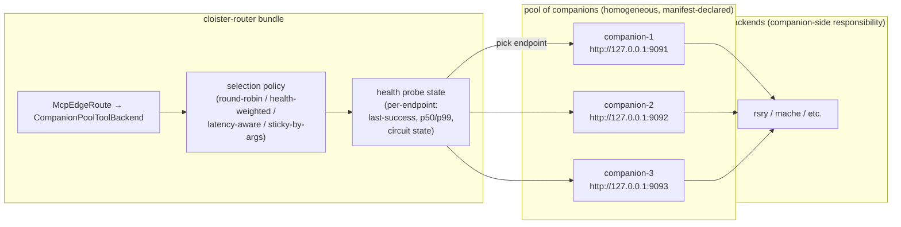

## Context

[ADR-0005](0005-internal-wire-leyline-net.md) introduced
**cloister-companion** — a Rust sidecar reachable over loopback HTTP
(IPC seam, per the 2026-04-30 amendment) that bridges cloister's
workerd-side traffic to backends speaking real network wire. The
manifest's `leylineNet` backend kind names exactly one companion
endpoint.

[ADR-0007](0007-interlace-substrate.md) introduced Interlace identity
+ attestation + discovery: per-relationship leases, bilateral chains,
selective disclosure. Interlace is **bilateral** — the trust topology
is `(A, B)` pairs, not pools.

Two questions remain unaddressed:

1. **What if you have multiple companions?** A multi-tenant deploy
   might want one companion per tenant for resource isolation; a
   high-availability deploy might want N companions for failover. The
   manifest today names exactly one URL per `leylineNet` backend.
2. **What if a backend has multiple replicas?** rosary-the-MCP-server
   could run with N instances for HA. Today there's no way to express
   "round-robin / health-weighted / latency-aware across these N
   endpoints" in the manifest.

These are both **load-balancing concerns**. Interlace doesn't help —
Interlace is per-relationship trust, not pool routing. Coupling LB
into the trust layer would be wrong: lease verification, attestation
logging, and pool selection are three orthogonal axes that benefit
from being independently composable.

ADR-0011 places "companion pool / load balancing" at the hypervisor
layer (it mediates between bundles and outside; compromise affects
multiple backends; one logical pool per cluster). This ADR takes that
classification and works out the actual primitive.

## Decision

Add a `companionPool` backend kind to the manifest. It wraps
`leylineNet` with **N endpoint candidates + a selection policy**.



### Manifest schema addition

```capnp
struct Backend {
  name          @0 :Text;
  handlesPrefix @1 :Text;
  kind :union {
    durableObject  @2 :DoBackend;
    httpForward    @3 :HttpForwardBackend;
    serviceBinding @4 :ServiceBindingBackend;
    udsForward     @5 :UdsForwardBackend;
    leylineNet     @6 :LeylineNetBackend;
    companionPool  @7 :CompanionPoolBackend;   # NEW
  }
}

struct CompanionPoolBackend {
  # Pool members. Each is a leylineNet-shaped endpoint (companion URL +
  # upstream id). All members route to the SAME upstreamId; the pool
  # is fronts for ONE logical backend, not a multiplexer across multiple.
  endpoints      @0 :List(LeylineNetBackend);

  # Selection policy. Default: roundRobin.
  selection      @1 :SelectionPolicy;

  # Health probe configuration.
  healthCheck    @2 :HealthCheckSpec;

  # Circuit-breaker thresholds. Default: 3 failures over 30s opens; half-
  # open after 60s; one probe to close.
  circuit        @3 :CircuitSpec;

  # Tools — same shape as leylineNet's tools list. Aggregated across
  # the pool because all members serve the same upstream.
  tools          @4 :List(McpTool);
}

enum SelectionPolicy {
  roundRobin    @0;  # boring, predictable, no per-call state
  healthWeighted @1;  # weight = recent success rate / open circuit = 0
  latencyAware  @2;  # weight = inverse p99; rebalances each minute
  stickyByArgs  @3;  # hash of normalized args → endpoint; keeps
                    # session-shaped traffic on one companion
}

struct HealthCheckSpec {
  # GET <companion>/health every <intervalMs>. 200 = healthy.
  intervalMs    @0 :UInt32;  # default 5000
  timeoutMs     @1 :UInt32;  # default 1000
  # Number of consecutive failures that mark unhealthy.
  failuresToOpen @2 :UInt32; # default 3
}

struct CircuitSpec {
  # Window over which to count failures (rolling).
  windowMs       @0 :UInt32;  # default 30000
  # Failures within window that trip the circuit.
  threshold      @1 :UInt32;  # default 3
  # How long the circuit stays open before half-open probe.
  halfOpenAfterMs @2 :UInt32; # default 60000
}
```

### Where the LB code lives

The pool selection runs **in the cloister-router bundle**, not inside
companion. Reasoning:

1. **Workerd has fetch + smart placement.** Endpoint selection is
   cheap there; the runtime's job description.
2. **Companion is single-host concerned.** Each companion handles
   its own per-endpoint connection pooling (within its
   leylineNet wire stack); cross-companion selection is hypervisor
   concern, not companion concern.
3. **Manifest runs in cloister-router.** Health state lives where the
   manifest is instantiated; co-locating reduces the surface area
   the runtime has to expose to companion.

`CompanionPoolToolBackend` is a new TS class that wraps N
`LeylineNetToolBackend` instances and dispatches per the selection
policy. Health state is a per-instance Map keyed by endpoint URL.

### Topology updates

V1: pool topology is **static** — fixed at manifest build, requires
a redeploy to change. Health state is dynamic (per-runtime, observed
at request time); pool MEMBERSHIP is not.

Live topology pushes (e.g. companion-3 added/removed without
redeploy) is a future concern. v2 if needed.

### Sticky vs stateless upstreams

The `requiresSession` flag from ADR-0006's `HttpForwardBackend`
matters here too. Some upstreams (mache, rsry per `mark3labs/mcp-go`)
require session-id continuity — once a request lands on companion-N,
follow-up requests for the same session must land on companion-N too.

For these, `selection = stickyByArgs` is the right policy. The hash
function uses the JSON-RPC method's "session-binding key" — for
`tools/call`, that's `(name, args.repo)` or similar; document the
exact normalization per upstream.

### Observability

Pool decisions ARE observable but NOT attested. The pool emits
structured logs: `endpoint_selected`, `endpoint_failed`,
`circuit_opened`, `circuit_closed`. They go to standard worker
logging, not to the `peer_attestations` table. Per ADR-0011's
boundary criteria, LB is operational concern; attestation is for
state-boundary writes. If the LB lays a request on companion-2 and
companion-2 corrupts state, the **state-write attestation** carries
the integrity check, not the LB decision.

## Consequences

**Positive:**

- **HA story is concrete.** Multiple companions for failover or
  multi-tenant isolation is a manifest edit, not a code change.
- **Per-bead-id parallel dispatch story improves.** rsry's per-bead
  dispatch can target different companions for genuine concurrency,
  not just task-pool concurrency on one process.
- **Sticky-by-args fixes the session-id problem cleanly.** mache and
  rsry's `requiresSession=true` upstreams get correct sticky routing
  in the manifest, not in custom code per backend.
- **Orthogonal to Interlace.** Trust verification, attestation
  logging, and pool selection compose without polluting each other.

**Negative / risks:**

- **Health-state durability.** A worker restart blanks health state.
  For long-lived workerd processes this is fine; for CF Workers
  isolate cycling, the health observation horizon is shorter than
  intended. Mitigated by: (a) probes are continuous, so health is
  re-observed quickly, (b) circuit half-open after 60s lets a
  cycled isolate try a "newly unhealthy" endpoint without too long
  a wait.
- **Sticky-by-args is fragile.** If args normalization isn't
  byte-stable, sticky breaks. Per-upstream documentation must specify
  the normalization rule and a hash test.
- **Companion-pool config is per-cluster, not per-bundle.** Today
  each cluster has one set of companion endpoints. Per-bundle pool
  membership is future scope.

**Out of scope for this ADR:**

- **Live topology updates** — manifest reload + workerd restart is
  the v1 path.
- **Cross-cluster LB** — Interlace + CF Tunnel addresses cross-cluster
  reachability; cross-cluster LB is its own primitive (e.g. CF
  anycast with health-weighted DNS).
- **Per-tenant resource quotas at the pool level** — adjacent concern.
  Belongs in the per-bundle CPU / memory quota work that ADR-0011
  flags as future scope.
- **Attestation of LB decisions** — explicit non-goal. LB is
  operational; attestation is for state-boundary writes.

## See also

- [ADR-0005](0005-internal-wire-leyline-net.md) — leyline-net wire +
  cloister-companion. This ADR adds a pool layer on top of `leylineNet`.
- [ADR-0006](0006-derived-tool-schemas.md) — derived tool schemas;
  the pool members must agree on the schema (homogeneous pool).
- [ADR-0007](0007-interlace-substrate.md) — Interlace identity. Pool
  selection is operational; Interlace is trust. They don't compose.
- [ADR-0010 (proposed)](0010-vault-and-bundle-clusters.md) — vault +
  bundles + clusters. Pool selection is a hypervisor-layer
  responsibility per ADR-0011.
- [ADR-0011 (proposed)](0011-hypervisor-bundle-boundary.md) — places
  companion pool / LB at the hypervisor layer using the three-criterion
  test.

## Open questions

1. **First-pass selection policy default.** `roundRobin` is the safest
   default but `healthWeighted` is more useful. Pick at implementation
   time based on what's easier to test deterministically.
2. **Probe protocol.** Companion exposes `GET /health` already; should
   the pool probe a different path (e.g. `GET /health/quick`) to
   avoid contending with real traffic? v1 says no; revisit if probes
   measurably affect serving.
3. **Endpoint identity.** Today each `LeylineNetBackend` is identified
   by its URL string. Future: companion has its own Signet identity,
   pool selection happens against verified companions. That's a
   separate ADR; for now the manifest's URL is the identity.

## Tracking bead

`cloister-be29e6` — this ADR's tracking bead. Implementation beads
will follow once the schema field lands and `CompanionPoolToolBackend`
is sketched.
