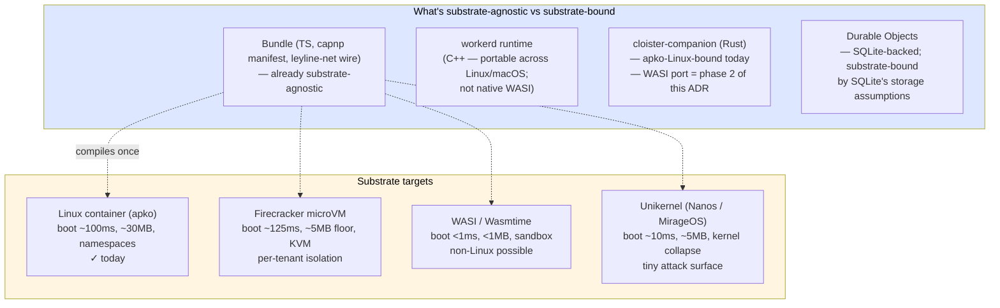
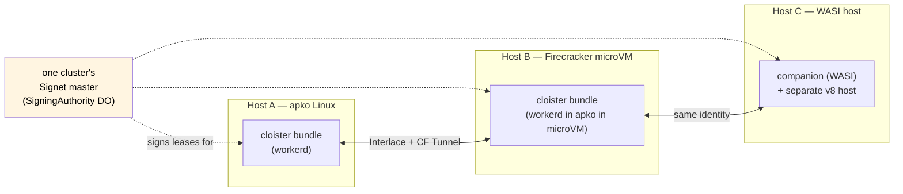

## Amendment 2026-05-10 — Phase 1 architectural commit (cloister-be0607)

The original ADR listed FOUR substrate targets (apko / Firecracker / WASI / unikernel). The 2026-05-10 architectural review locks **Phase 1 to workerd-on-OCI only**. The other three targets stay as the ADR's long-term map but do NOT ship in `be0607`.

### What's decided

- **Packaging**: OCI images via apko/melange. Each bundle (cloister-router, mache, rosary, notme) ships as its own image.
- **Runtime**: containerd-compatible (containerd directly, or podman, or nerdctl, or k8s kubelet). NOT docker specifically — OCI spec, not docker the product.
- **Bundle composition**: `cluster.capnp` (new typed schema, sibling to `cloister.capnp`) declares N bundles + their inter-bundle wires + storage volumes.
- **Inter-bundle wire**: capnp ToolCall/ToolResult over UDS (plain, no AEAD) per [ADR-0005](0005-internal-wire-leyline-net.md)'s amendment. The `udsForward` backend kind in the manifest already exists.
- **Bundle boundary types**:
  - **Cluster tier-2 bundles** (mache Go, rosary Rust, notme): OS process + container namespace per bundle. NOT v8 isolates — they can't be without WASM compile + losing native dependencies (FUSE, dolt).
  - **Hypervisor tier-1 inside cloister-router**: v8 isolates within one workerd binary (cloister-router itself + future TS/JS tool bundles).
- **Identity**: notme runs as a tier-1 bundle by default (every cluster mints its own master). Federation across clusters via leylineNet is for cross-cluster, not intra-pod.
- **Storage**: shared volume mount for DO SQLite at `/var/lib/cloister/do/`. Survives pod restarts.
- **Deployment shapes from one source-of-truth (`cluster.capnp`)**:
  - `task dev:all` — Mac native binaries + UDS in `/tmp/cloister-dev/`
  - `task cluster:up` — Linux nerdctl-compose / podman compose
  - `kubectl apply pod.yaml` — k8s multi-container pod

### What's NOT in Phase 1 (deferred)

- **WASM-everything path** — mache (Go) and rosary (Rust + dolt) can't compile cleanly to WASM. Re-architecting those services for WASM is a sub-project; defer.
- **Firecracker / Unikernel** — still in the ADR's long-term map below, but no ship requirement. If a self-hoster asks, file a follow-up bead.
- **Multi-replica clustering** — Phase 1 is single-pod. Replicas break the DO singleton contract; that's a separate design informed by [ADR-0010](0010-vault-and-bundle-clusters.md) vault-clustering.
- **Per-bundle CPU/memory enforcement** — workerd doesn't enforce these; that's a containerd/k8s/cgroup concern. Document the knobs, don't implement them.
- **CNAB packaging** — too niche. Plain OCI + emitted compose/pod manifests instead.

### Why this is right

1. **v8 isolates stay lightweight inside cloister-router** — the "V8 is our IPC isolation" framing applies to the router's internal composition. For sibling services (Go, Rust), process+container isolation is the only honest answer without re-architecting them.
2. **capnp-over-UDS is faster than HTTP-over-UDS** — already designed in [ADR-0005](0005-internal-wire-leyline-net.md)'s amendment; tooling exists in `src/wire/`.
3. **OCI / containerd is k8s-compatible without locking us into k8s** — `task cluster:up` works without any k8s; `kubectl apply` works without changes to the image.
4. **Notme-as-tier-1-bundle** = "cluster is its own identity authority" — the OSS pitch ("docker compose up = working cluster with its own master") with no external services required.

### Implementation

Tracked as cloister-be0607 with three sub-deliverables (a/b/c). See the bead for scope + acceptance.

---

## Context

cloister runs as workerd today, packaged in a distroless apko Linux
image (per [ADR-0001](0001-workerd-mcp-gateway.md) +
`apko.yaml`/`melange.yaml`). The same TypeScript bundle also runs
unmodified on Cloudflare Workers in production. That's two
deployments off one bundle — already substrate-fluid at the **runtime
layer** (workerd is portable across hosts that can run a Linux ELF +
its CA bundle).

What's NOT portable today: **cloister-companion** — the Rust sidecar
introduced in [ADR-0005](0005-internal-wire-leyline-net.md). Companion
is currently apko-Linux-bound (uses libc dynamically; full Linux
syscall surface). When the leyline-net wire wants to run on a non-
Linux host, or when a deployment wants tighter per-tenant isolation
than namespaces give, the companion is the gating piece.

Three new pressures push for substrate portability:

1. **ADR-0010 (vault + bundles)** introduces *bundles* as the unit
   of v8 isolation. The bundle abstraction wants to be substrate-
   agnostic — same bundle should run on workerd, in a Firecracker
   microVM, or as a WASI module — without changing the manifest.
2. **ADR-0007 (Interlace identity)** anchors cluster identity in
   the `SigningAuthority` master, born-in-CF. That identity needs to
   travel with a cluster across substrates without re-bootstrapping.
3. **OSS readiness.** A self-hosted cloister deployment may not
   have Cloudflare available. Firecracker + apko or pure WASI hosts
   become realistic targets.

Most platforms lock you to one substrate:

- **Kubernetes** = Linux containers (with `runc` / `containerd`).
- **AWS Lambda** = Firecracker microVMs.
- **Cloudflare Workers / Fastly Compute** = V8 / WASM.
- **Fly.io** = Firecracker microVMs.

cloister has a structural opportunity to be substrate-fluid:
the **bundle**, the **manifest** (capnp), and the **wire** (capnp
+ leyline-net) are all already substrate-agnostic. Only the
companion's host runtime is locked.

## Decision

Treat substrate as an **explicit deployment dimension**, not a
hardcoded property of cloister. The manifest-level primitive
(`Bundle.substrate` per ADR-0010) carries an optional substrate
hint; the apko/melange recipe matrix gains a substrate axis.

### Substrate matrix

| Substrate | Boot | Footprint | Isolation | Linux-only? | What runs there |
|---|---|---|---|---|---|
| **Linux container (apko)** | ~100ms | ~30MB image | namespaces | yes (host) | workerd + bundle + companion |
| **Firecracker microVM** | ~125ms | ~5MB floor | KVM | yes (host) | apko inside microVM; per-tenant boundaries enforced by KVM |
| **WASI / Wasmtime** | <1ms | <1MB | sandbox | no | companion-as-WASM (when ported); workerd stays on host |
| **Unikernel (Nanos)** | ~10ms | ~5MB | kernel collapse | varies | workerd + bundle + companion fused into one image |

### Phased adoption

**Phase 1 — apko Linux is default; substrate field declared.** Manifest
gets `Bundle.substrate :Text` (already in ADR-0010 schema). Default
"workerd". Build pipeline picks the right artifact. No code change in
v1; this is the boundary-stake.

**Phase 2 — companion → WASI.** Recompile the Rust companion against
WASI (`wasm32-wasip2`). The leyline-net open subset (Manifest +
Ed25519 + ChaCha20-Poly1305 + X25519 + capnp encode/decode) is mostly
pure compute; raptorq + sqlite-blast (the closed parts cloister
doesn't need per ADR-0005) stay native and Linux-bound. WASI
contract: companion's HTTP listener + per-upstream transport
abstractions get target-conditional impls (Linux: `tokio` + `hyper`;
WASI: `wasi:http/incoming-handler`).

**Phase 3 — Firecracker recipe.** Add a melange recipe variant that
emits an apko image + ignition config suitable for Firecracker. This
is mostly packaging — Firecracker runs Linux; the same apko works.
Useful for per-tenant isolation in multi-tenant deploys
(coordinates with ADR-0008's companion pool: one Firecracker microVM
per pool member gives KVM-level boundaries between members).

**Phase 4 — unikernel exploration.** Nanos (Rust toolchain support)
or MirageOS. Highly speculative; defer until a real reason emerges
(typical: hardened-edge deploy where attack surface beyond cloister's
own bundle is intolerable).

### What stays host-bound, regardless of substrate

- **workerd** is C++ targeting Linux/macOS hosts. It does not natively
  run as WASI. A "fully-WASI cloister" would require either: (a)
  swap workerd for a different JS engine that does run as WASI
  (Wasmtime with QuickJS, jco, or wasmer-js); (b) accept a hybrid
  where v8-host stays Linux while companion goes WASI. (b) is fine —
  the cloister↔companion seam is loopback HTTP either way (ADR-0005
  amendment) so a substrate split across the seam doesn't change
  the contract.

- **Durable Object storage** is workerd-specific (`ctx.storage.sql`
  is its own SQLite layer). A non-workerd host needs an equivalent
  KV+SQL primitive. Out of scope for this ADR; it's the gating
  blocker on a fully-WASI cloister and worth its own ADR if/when
  someone tries.

- **CF Workers production** is the all-CF deployment. Substrate
  portability is for **self-hosted cloister**; CF Workers production
  uses CF's runtime regardless.

### Identity-portable workloads

Combined with ADR-0007 (Interlace identity), substrate portability
means **workloads keep their identity across substrates**:

The Signet master is in `SigningAuthority` DO, which is workerd-
runtime today. A bundle on host A and a bundle on host B can both be
"the same actor" if they share the same master, even if they run on
different substrates. Interlace + CF Tunnel handle the cross-host
trust + reachability. Leyline-sign as a portable WASM artifact
(per cloister-9ad9eb's vault precedent + the eventual leyline-sign
lift) is the concrete proof that crypto travels across substrates.

## Consequences

**Positive:**

- **Substrate is a deployment knob, not a code branch.** Same bundle,
  different host. Operators choose based on isolation / performance
  / OS constraints.
- **Concrete answer to "is this k8s?"** Per ADR-0011, the substrate
  axis is one of the things k8s does (containers in pods on nodes)
  that cloister handles by being substrate-agnostic. cloister's
  declarative manifest + portable bundle replaces k8s's
  imperative-per-node lifecycle management.
- **OSS-friendly.** Self-hosted cloister doesn't require Cloudflare;
  apko + Firecracker + WASI all work on standard infrastructure.
- **Identity portability falls out.** With Interlace identity at the
  cluster layer, bundles on different substrates can carry the same
  cluster identity — workloads that were previously
  substrate-locked become substrate-fluid.

**Negative / risks:**

- **Companion's WASI port is real Rust work.** ~1-2 weeks of
  porting, not days. The leyline-net open subset compiles cleanly to
  wasm32-wasip2 in principle; the integration with HTTP listener +
  per-upstream transport is what takes the time.
- **DO storage substrate-bound.** Until there's a non-workerd
  equivalent of `ctx.storage.sql`, a fully-WASI cloister isn't
  achievable. Hybrid (workerd-host + WASI-companion) is the
  realistic v2 target.
- **Test surface multiplies.** Each substrate target wants its own
  smoke test. v1: apko-Linux only; phases 2-4 add CI matrix entries
  per phase.
- **Manifest substrate hint is advisory in v1.** Phase 1 declares
  the field; the build pipeline doesn't yet act on it. Risk: hint
  drifts from actual deploy. Mitigation: make `task image` validate
  that the apko image's substrate matches `manifest.substrate` at
  build time.

**Out of scope for this ADR:**

- **A non-workerd JS engine for cloister.** If/when a fully-WASI
  cloister is needed, swapping workerd for a WASI-native JS engine
  (or a different runtime entirely) is its own decision.
- **Substrate-specific feature gates.** Some features (e.g.
  Firecracker per-tenant memory limits) are substrate-specific
  primitives. Their integration with cloister is per-substrate
  follow-up work.
- **Build matrix for the apko + Firecracker + WASI + unikernel
  outputs.** Phase 3 starts to formalize this; phase 1 is just the
  field-declaration.

## See also

- [ADR-0001](0001-workerd-mcp-gateway.md) — workerd choice + apko
  packaging. This ADR generalizes the substrate axis.
- [ADR-0005](0005-internal-wire-leyline-net.md) — companion is the
  gating piece for substrate portability; the seam is substrate-
  agnostic by design.
- [ADR-0007](0007-interlace-substrate.md) — identity portability is
  what makes substrate portability useful (workloads carry their
  identity across substrate boundaries).
- [ADR-0010 (proposed)](0010-vault-and-bundle-clusters.md) — bundle
  is the substrate-portable unit. Manifest's `Bundle.substrate`
  field is declared there; this ADR specifies what the field means.
- [ADR-0011 (proposed)](0011-hypervisor-bundle-boundary.md) — the
  hypervisor/bundle boundary is the seam across which substrate
  varies. Bundles can run on different substrates; the hypervisor
  layer is what coordinates them.

## Open questions

1. **First non-workerd substrate to actually port.** Companion-on-
   WASI is the most useful (closes the leyline-sign portability
   loop) and the most tractable. Firecracker is mostly packaging.
   v2 likely starts with WASI.

2. **Where does the manifest's `substrate` field actually take
   effect?** Today it's documentary (`workerd` everywhere). When
   we add Firecracker, the build pipeline reads the field and
   selects the right ignition / apko variant. Document the read in
   `scripts/build-manifest.mjs` when it lands.

3. **What does "the same cluster on host A and host B" actually
   mean operationally?** ADR-0007 handles trust (same Signet master
   signs leases for both). Cross-host state is a separate concern —
   bead state in DOs is per-host today; cross-host bead replication
   would be a substrate-of-substrate problem (raptorq+sqlite-blast
   was designed for this; see ADR-0005). Defer.

## Tracking bead

`cloister-be90ad` — this ADR's tracking bead. Implementation beads
will follow when phase 2 (companion-WASI port) becomes concrete.
