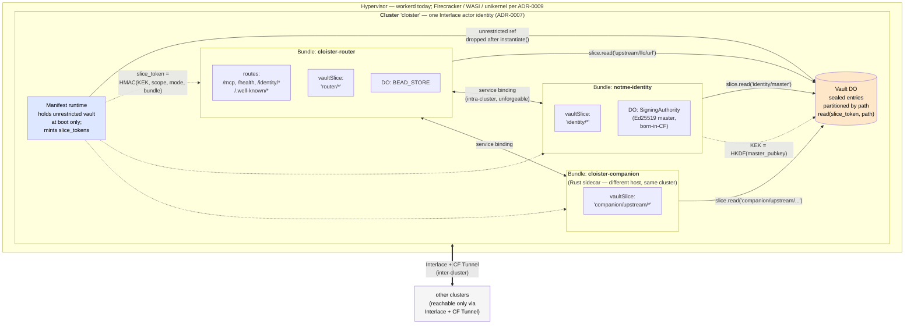

## Status amendment — 2026-05-10 (updated post-ADR-0013)

Stays **Proposed for manifest-side concerns only**. The
**enforcement-model question** that originally gated this ADR — what
"slice grant" means operationally — was resolved by
[ADR-0013](0013-slice-grant-enforcement.md) (Accepted same day).

What ADR-0013 ratified:

- The vault primitive already exists at `cloister/vault/` (lifted per
  `cloister-9ad9eb`, closed 2026-05-09). HKDF + AES-256-GCM envelope
  encryption, per-credential `allowedSubs` glob lists, plaintext-in-DO.
- Slice-grant *enforcement* is V8 isolate + service-binding-as-syscall
  (per notme/docs/design/009). No new cryptographic envelope; no
  signed slice tokens; no Interlace-lease integration for in-cluster
  vault access. The substrate gives the guarantee.
- The prompt-injection demo (`cloister-74ce00`) is structured against
  this model — single-session work, not multi-week.

What's **still open** under this ADR:

1. Whether `Bundle.vaultSlice` should appear in `cluster.capnp` as a
   *manifest hint* (tooling support — e.g. `task cluster:emit`
   generates the right service bindings + records the slice
   association in container labels). NOT for enforcement — workerd
   bindings + vault `allowedSubs` enforce.
2. Multi-cluster vault federation. Today vault is single-cluster
   per ADR-0011 tier-classification.

Until those manifest-side concerns get answered, this ADR records the
*shape* the primitive will take in the manifest layer. The
*enforcement-side* answer is in ADR-0013 + the running code.

**Citation guidance** (updated):

- For the **substrate security claim** (slice grants hold against a
  compromised bundle): cite **ADR-0013** and the demo test.
- For the **architectural framing** (vault as scoped slices, bundle
  as unit of trust, cluster as unit of identity): cite this ADR.
- For the **vault primitive itself**: cite `cloister/vault/` source
  + `cloister-9ad9eb` lift bead.

## Context

ADR-0002 framed cloister as an edge router with `EdgeRoute`s and
`ToolBackend`s. ADR-0007 added Interlace identity at the public face,
with `INTERLACE_MASTER_PUBKEY` as an env-var binding. ADR-0009
(proposed) sketched compute-substrate portability — Linux / Firecracker
/ WASM / unikernel as deployment knobs.

Three observations force a re-frame:

**1. Env vars are bearer tokens.** `LLO_MCP_URL`, `MACHE_MCP_URL`,
`ROSARY_MCP_URL`, `SIGNET_URL`, `COMPANION_URL`,
`INTERLACE_MASTER_PUBKEY`, `ALLOWED_ORIGINS` — every binding in
`wrangler.toml` and `config.capnp` is a string globally readable inside
the process. Whoever can read env has every capability cloister has.
No scoping, no rotation without redeploy, no audit, no caller binding.
The "secret store" is a flat list of strings.

**2. notme has a real vault.** `notme/vault/` ships an AES-GCM
envelope-encryption vault with KEK derived from a Worker secret via
HKDF, random per-entry DEKs, sealed-blob storage, an adversarial test
suite. It is its own package with its own Worker entry — purpose-built
for this problem.

**3. cloister is not "an MCP gateway with backends." It is a v8
hypervisor.** What cloister actually does, looked at from the right
height, is **host v8 bundles, wire them into clusters, and route
external traffic to them**. The `EdgeRoute`/`ToolBackend` framing
hides this: a `ToolBackend` is sometimes an in-process Durable Object
(BeadStore — actually a sibling bundle), sometimes an external HTTP
service (LLO daemon — actually another cluster's bundle), sometimes a
service binding (notme — actually a sibling bundle in the same
cluster). Treating these uniformly as "backends" obscures the trust
boundaries.

The "vault into cloister" question that triggered this ADR — once
posed correctly — is two questions:

1. **Where does the vault live?** (storage primitive question)
2. **What capability does each tenant have on it?** (trust-boundary
   question)

(1) is downstream of (2). If access to the vault is scoped per
**tenant** — and the tenant primitive is the **v8 bundle** — then
where the DO lives is operational. If access is unscoped (one Vault
object handed to everything), the vault is a single bag of secrets
and any compromise inside the hypervisor leaks all of them. That's
worse than env vars, not better.

## Decision

Adopt three coupled primitives:



The three primitives:

1. **Bundle** — a unit of v8 isolation: a worker entry + its declared
   capabilities + its routes. Today's "cloister-router," "notme-identity,"
   and "cloister-companion" are bundles.
2. **Cluster** — a set of bundles wired together via service bindings,
   sharing one Interlace actor identity. Cross-cluster traffic uses
   Interlace + CF Tunnel; intra-cluster uses service bindings (already
   unforgeable per workerd's runtime).
3. **Vault Slice** — a capability handle granting read/write within a
   path-globbed scope. Issued per bundle at instantiation; bundles
   never see the unrestricted vault interface.

The vault DO lives in the cloister cluster (alongside the manifest
runtime that mints slice tokens). The vault is **not** a sibling-of-
cloister Worker — it's an internal DO managed by the routing layer.
The license-relevant code (the vault crypto + KEK/DEK envelope) is
lifted from `notme/vault/` (Apache 2.0) into `cloister/src/vault/`
(AGPL-3.0).

### Bundles, formally

```capnp
struct Bundle {
  # Stable name within the cluster (e.g. "cloister-router",
  # "notme-identity"). Used to construct service-binding refs.
  name           @0 :Text;

  # Content hash of the bundle's worker JS — CAS-addressed for
  # supply-chain integrity. Empty string for bundles deployed
  # out-of-band (today's notme-bot service binding).
  contentHash    @1 :Text;

  # Routes this bundle owns. Other bundles cannot serve these paths.
  # Empty list = bundle is callable only via service binding from
  # sibling bundles, never via the public face.
  routes         @2 :List(Text);

  # Vault slice — path-glob scope this bundle's slice token covers.
  # Empty string = no vault access. Globs match POSIX-style.
  vaultSlice     @3 :Text;

  # Service bindings: which sibling bundles this one can call.
  # Each entry names the target bundle and a local handle.
  serviceBindings @4 :List(ServiceBindingDecl);

  # Durable-Object namespaces this bundle owns or accesses.
  durableObjects @5 :List(DoBindingDecl);

  # Optional substrate hint (ADR-0009): "workerd" | "firecracker" |
  # "wasi" | "unikernel". Empty = workerd default.
  substrate      @6 :Text;
}
```

### Clusters, formally

```capnp
struct Cluster {
  # Tenant name. One cluster = one Interlace actor identity.
  name     @0 :Text;

  # Bundles in this cluster. Order is irrelevant for correctness;
  # routing is per-route, not per-cluster-position.
  bundles  @1 :List(Bundle);

  # Cluster-level Interlace identity (ADR-0007). The cluster's master
  # signs ephemeral certs for sibling bundles when they need to
  # represent the cluster externally.
  actor    @2 :Actor;
  policy   @3 :InterlacePolicy;
}

struct Gateway {
  metadata @0 :Metadata;
  clusters @1 :List(Cluster);
}
```

(Today's `Gateway.routes` flattens the bundle layer. The migration
makes `routes` a property of bundles. See "Migration shape" below.)

### Vault slices, formally

```capnp
struct VaultSliceGrant {
  # POSIX-style glob over vault paths. Examples:
  #   "router/*"             — anything under router/
  #   "identity/master/pub"  — exact single key
  #   "upstream/llo/*"       — namespaced per upstream
  scope    @0 :Text;

  # Read/write capability mode. Default read-only; write requires
  # explicit grant in the manifest.
  mode     @1 :SliceMode;
}

enum SliceMode {
  read      @0;
  readWrite @1;
}
```

The vault DO holds an HMAC key derived from the cluster's KEK. At
boot the manifest runtime mints a `slice_token = HMAC(scope, mode,
bundle_name)` for each bundle and passes it via the bundle's
runtime-provided `VaultSlice` handle. The bundle calls
`slice.read(path)` → vault DO verifies the token, checks the path
matches the scope, returns the blob or `ScopeViolation`.

The unrestricted vault interface is held by the manifest runtime for
exactly the duration of bundle instantiation. After
`instantiate(manifest)` returns, the unrestricted reference is
unreachable — closed over only inside the runtime's setup function,
which is no longer invoked. There is no API surface that can resurface
it.

### KEK derivation: from the Signet master

The vault's KEK is derived via HKDF from the cluster's Signet master
public key, with a salt and an info string fixed in cloister source:

```
KEK = HKDF-SHA256(
  IKM  = SigningAuthority.master_pubkey_spki_bytes,
  salt = "cloister-vault-kek-v1",
  info = cluster.name || ":vault-kek",
  L    = 32 bytes,
)
```

This means:
- **No env-var bootstrap.** The cluster has one root (the Ed25519
  master, born-in-CF in `SigningAuthority` DO). The vault has no
  separate seed.
- **Rotation via Signet epoch.** When the master rotates (per
  `revocation.ts` epoch bundle), KEK rotates; DEKs are re-wrapped;
  payloads are not re-encrypted.
- **One audit trail.** Every capability — identity certs, vault
  reads — chains back to the same root, observable through the same
  attestation chain (per ADR-0007).

If a deploy explicitly opts out of Signet (cluster runs without an
identity authority), an alternative KEK source — TPM/HSM, or a
fallback Worker secret — can be declared per-cluster in the manifest.
Default = Signet master.

### Migration shape: today's "backends" → bundles

Today's `cloister.capnp` declares routes, each route's `kind` resolves
to a `Backend` for `mcp` routes. The migration:

1. Wrap today's content in a single `Cluster` named `"cloister"`
   containing a single `Bundle` named `"cloister-router"`.
2. Move the `routes` field from `Gateway` onto `Bundle`.
3. Each existing `mcp` `Backend` becomes either:
   - A **sibling bundle in the same cluster** (notme — already a
     service binding; bd9b5f's `actor` block already names it).
   - An **external bundle** representing another cluster (LLO, mache,
     rsry, signet — they may or may not be cloister-cluster bundles
     depending on deployment topology). External bundles are reachable
     only through their cluster's public face + Interlace.
4. The `Backend` abstraction stays as an internal helper for the
   `cloister-router` bundle — it represents how that bundle reaches
   sibling bundles for tool dispatch. But it is NO LONGER the
   manifest-level primitive.

The TS runtime's `instantiate(manifest)` becomes:
- Per cluster, mint slice tokens for each bundle.
- Per bundle, construct its `VaultSlice` handle, its service-binding
  handles, its DO references.
- For the `cloister-router` bundle specifically, also build its
  `Router` (today's outer-layer dispatch) over the bundle's `routes`.

### License: lift to AGPL-3 (vault) — keep notme Apache-2.0

`notme/vault/` is Apache 2.0. We own the copyright; we may relicense
copies we make. The lifted code in `cloister/src/vault/` is AGPL-3.0
(matching cloister's license). notme's history retains Apache; notme
itself remains Apache 2.0 and **drops its dependency on `vault/`** —
its own internal sealed storage (OAuth token wrap in
`connections.ts`, etc.) moves to a small ad-hoc DO-resident
sealed-credential helper, ~200 LOC of crypto-only code. This avoids
making notme depend on cloister.

The cleaner alternative — notme calls cloister's vault via a service
binding — is **not** v1: it inverts today's dep direction (cloister
calls notme) and adds a runtime hop. Defer until there's a use case.

## Consequences

**Positive:**

- **The lateral-movement concern is closed.** Bundles get scoped
  slices. A compromised bundle leaks one slice's worth of secrets,
  not the cluster's. The manifest is the audit trail — the blast
  radius of any bundle is readable in capnp.
- **No env-var bearer tokens on the hot path.** `urlBinding`,
  `pubkeyBinding`, `companionUrlBinding` all become `vaultSlice`
  paths in their declaring bundle's grant.
- **Substrate portability is concrete.** A bundle is the unit of
  isolation. Today bundles run in workerd; tomorrow some run in
  Firecracker microVMs (per ADR-0009). The capability surface stays
  the same — only the host changes.
- **Interlace identity has a natural carrier.** A cluster = an actor.
  Bundles are sub-identities. The actor block from ADR-0007 lives on
  `Cluster`, not on the (degenerate) `Gateway`.
- **The dep direction stays clean.** cloister depends on notme for
  identity ops (already the case). notme does not depend on cloister.
  The vault is in cloister.
- **Multi-tenant deploy is a manifest edit.** Today's `cloister.capnp`
  is one cluster. A multi-tenant deploy declares N clusters. Each
  has its own Signet master, its own vault DO, its own bundles, its
  own slice scopes. No code changes.

**Negative / risks:**

- **The schema migration is a real edit.** `Gateway.routes` →
  `Cluster.bundles[*].routes` changes the top-level shape. We have
  no external consumers (cloister has not been deployed; 45 commits,
  0 external users), so this is the cheapest moment to do it. Past
  this window the migration would be a deprecation cycle.
- **Slice-token cryptography is small but new code.** ~150 LOC of
  HMAC + path-glob matching + verify in the vault DO. Risk is
  bounded; the failure mode (rejected legitimate read) is loud, not
  silent.
- **Closure-based unforgeability is JS-shaped.** It works because v8
  isolate boundaries + closure scope + lack of `Function.prototype.toString`
  reflection on closures keep the unrestricted ref unreachable from
  callers. In a Rust companion this would be a different mechanism
  (move semantics + private struct fields). The vault DO is the
  cross-language ground truth — token verification is the actual
  capability check.
- **Signet master rotation triggers vault re-wrap.** When
  `revocation.ts` bumps an epoch, KEK rotates, DEKs re-wrap. This is
  cheap (DEKs are 32 bytes each), but it's an extra transactional
  step. The vault DO performs it inside the rotation handler.

**Out of scope for this ADR:**

- **OSS readiness checklist** — CONTRIBUTING.md, SECURITY.md,
  CODE_OF_CONDUCT.md, .github/workflows/, public README polish.
  Tracked as a separate bead under the same decade.
- **Inter-cluster traffic accounting / billing** — this ADR establishes
  the cluster as the unit, not a billing model.
- **Hot bundle replacement** — workerd today loads bundles at startup.
  Live bundle replacement is a future runtime concern; the manifest
  primitive supports it but the runtime doesn't yet.
- **Per-bundle resource limits (CPU / memory ceiling)** — orthogonal
  to capability scoping. Belongs in a future ADR alongside companion
  pool / load balancing (ADR-0008).

## Migration plan

Phase 1 — **before vault touches the hot path**:
- OSS-readiness sweep (separate bead). LICENSE/README already in
  place; add CONTRIBUTING/SECURITY/CODE_OF_CONDUCT, .github/workflows,
  CLAUDE.md / AGENTS.md.
- Lift `notme/vault/` → `cloister/src/vault/` under AGPL-3.0. Do NOT
  wire it in yet.

Phase 2 — **add Bundle/Cluster grammar to manifest schema**:
- Schema additions in `manifest/cloister.capnp`.
- TS mirror in `src/manifest/types.ts`.
- `cloister.capnp` consumer wraps existing routes in a single
  `cluster: { bundles: [router-bundle] }`.
- `task manifest` regenerates; runtime is rewritten to instantiate
  per-cluster, per-bundle. Existing routes/backends behavior is
  preserved.

Phase 3 — **wire vault-DO + slice tokens**:
- Vault DO class + schema + slice-token mint/verify.
- KEK derivation from `SigningAuthority` master pubkey (depends on
  ADR-0007 Phase 1).
- Vault slice handle exposed to bundles via runtime.

Phase 4 — **migrate env-var bindings to vault paths**:
- Per-binding sweep: `LLO_MCP_URL`, `MACHE_MCP_URL`,
  `ROSARY_MCP_URL`, `SIGNET_URL`, `COMPANION_URL`,
  `INTERLACE_MASTER_PUBKEY` → vault entries with bundle-scoped slices.
- Drop the env-var fields from `wrangler.toml` and `config.capnp`.

Phase 5 — **notme cleanup**:
- notme drops vault dependency. Internal sealed storage moves to a
  small ad-hoc DO helper. notme stays Apache 2.0.

Each phase is gated on the previous; phases 1–3 must land before any
ADR-0007 work that would otherwise read `INTERLACE_MASTER_PUBKEY` from
env. The ADR-0007 amendment 2026-05-08 (audit deltas) becomes a
function of vault-slice reads instead of env reads — a small
re-shape of the implementation beads, no architectural change.

## See also

- [ADR-0001](0001-workerd-mcp-gateway.md) — workerd choice; bundles
  are the formal name for what `config.capnp` calls "Workers."
- [ADR-0002](0002-edge-router-protocol-agnostic-backends.md) —
  EdgeRoute/ToolBackend abstractions. This ADR re-frames `Backend` as
  an internal helper of the `cloister-router` bundle, not a
  manifest-level primitive.
- [ADR-0004](0004-capnp-manifest.md) — capnp manifest as source of
  truth. This ADR adds Cluster + Bundle + VaultSliceGrant.
- [ADR-0005](0005-internal-wire-leyline-net.md) — leyline-net wire at
  the companion ↔ backend hop. Companion becomes a bundle in the
  cloister cluster.
- [ADR-0007](0007-interlace-substrate.md) — Interlace identity.
  Cluster carries the actor identity; bundles are sub-identities.
  ADR-0007's `actor` block migrates from `Gateway` to `Cluster`.
- [ADR-0009 (proposed)](0009-compute-substrate-portability.md) —
  substrate portability. Bundle is the unit that varies across
  substrates.
- `notme/vault/` — Apache-2.0 source we are lifting from. Origin
  history retained; cloister copy is AGPL-3.0.

## Open questions

1. **Glob grammar.** POSIX-style (`upstream/*`, `identity/master/pub`)
   is the obvious answer. Are there capability paths where a more
   expressive grammar is needed (e.g. `upstream/{llo,mache}/*`)? v1
   says no — single-component wildcards only. Revisit if real use
   cases emerge.
2. **External bundles.** A bundle that represents "another cluster's
   public face" (e.g. mache running on a different host) needs a
   marker. Probably `Bundle.contentHash = ""` + a new
   `Bundle.externalEndpoint` field. Sketched here, formalized in
   the migration phase.
3. **Slice-token revocation.** Today: tokens issued at boot, valid
   for the lifetime of the runtime. If a bundle's scope changes, a
   reload is required. Live revocation requires a token-version
   counter in the vault DO. Defer until needed.
