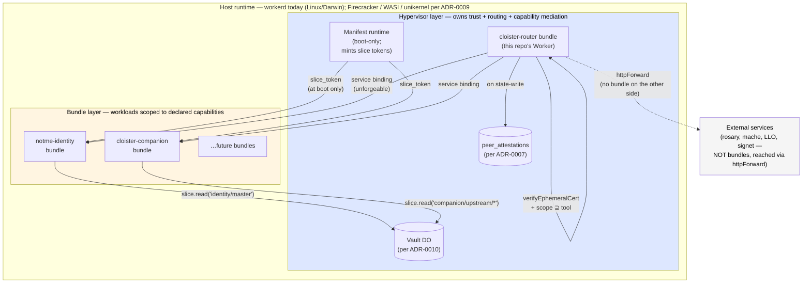

## Context

[ADR-0010](0010-vault-and-bundle-clusters.md) introduced **Bundle**,
**Cluster**, and **VaultSliceGrant** as the manifest's unit primitives.
What it didn't formalize: **which responsibilities live at the
hypervisor layer vs which live at the bundle layer**, and how that
boundary compares to a comparable boundary in Kubernetes.

Without that boundary written down:

- New code lands in `src/` ambiguously — is "request signing" a router
  responsibility or a per-bundle responsibility?
- The answer to "do we need a `cloister.capnp` slice in repo X" varies
  with reader (handled informally in conversation 2026-05-08).
- "We're like k8s minus the networking" is a frame the team uses but
  not a rule anyone can apply mechanically.

This ADR fixes the boundary in writing.

## Decision

### The two layers

**Hypervisor layer** = code that mediates trust, routing, and capability
distribution across bundles. It is single-instance per cluster, runs at
boot, and holds references nothing else gets.

**Bundle layer** = workloads. Each bundle is one v8 isolate (today —
or one Firecracker microVM, or one WASI module per ADR-0009) with
capabilities the manifest declared for it.

### Hypervisor responsibilities (formal list)

A responsibility is hypervisor-layer if it satisfies all three:

1. It mediates between bundles or between the cluster and the outside.
2. Compromising it would compromise multiple bundles' security
   posture, not just one.
3. There is exactly one of it per cluster.

By that definition, the hypervisor owns:

- **Public-face routing.** EdgeRoute dispatch over `/mcp`, `/health`,
  `/identity/*`, `/.well-known/*`, `/interlace/peers/{fp}`. Per
  [ADR-0002](0002-edge-router-protocol-agnostic-backends.md).
- **Lease verification.** Verify Signet ephemeral certs against the
  pinned master + the freshly-fetched epoch bundle (per
  [ADR-0007](0007-interlace-substrate.md) audit amendment 2026-05-08).
  Bundles see only the verified `cert` + the resolved `scope` —
  they don't run their own verifier.
- **Capability distribution.** The manifest runtime mints
  `slice_token`s at boot for each bundle's declared `vaultSlice`,
  passes them through closure scope, drops the unrestricted vault
  reference. Bundles never hold `Vault` directly.
- **State-boundary attestation.** When a bundle performs a
  state-changing operation, the hypervisor's middleware writes the
  attestation row + lease-counter row. Bundles don't write their own
  attestations (otherwise a compromised bundle could fabricate them).
- **Inter-bundle service-binding wiring.** Service bindings are
  declared in the manifest; the host runtime (workerd) provides the
  unforgeable Fetcher refs. The hypervisor doesn't *run* the
  bindings; it *configures* them.
- **Inter-cluster identity.** Interlace handshake, `.well-known/`
  publication, `peer_attestations` disclosure endpoint. The cluster
  has one identity (one Signet master in the `SigningAuthority` DO);
  the hypervisor mediates use of it.

### Bundle responsibilities

A responsibility is bundle-layer if any of these is true:

1. It's specific to one bundle's capability scope.
2. Compromising it leaks at most that bundle's slice + its declared
   service-binding endpoints.
3. There can be many of them per cluster.

By that definition, bundles own:

- **Tool implementations.** `bead_create` lives in cloister-router's
  BeadStore DO; `mintBridgeCertPair` lives in notme-identity's
  `SigningAuthority` DO. Each bundle implements its own tools.
- **Bundle-scoped state.** Each bundle has its own DO namespaces
  declared in the manifest. Cross-bundle state access is explicit via
  service bindings + manifest declarations, not implicit.
- **Per-bundle vault reads.** Bundle calls `slice.read(path)`. The
  vault DO verifies the slice_token against the bundle's declared
  scope. A read outside the scope returns `ScopeViolation`.
- **Per-bundle business logic.** Whatever the bundle's tools do, they
  do it inside the isolate boundary. The hypervisor doesn't peek.
- **Per-bundle internal storage.** Bundles can have their own DO
  tables, KV namespaces, R2 buckets — declared in the manifest and
  scoped to the bundle's name.

### What runs in neither layer

- **External services** (rosary, mache, ley-line-open, signet, future
  third-party MCP servers). They have their own runtimes and release
  cycles. Cloister wraps them via `httpForward` (with Asserted or
  Derived schemas — see ADR-0006) or `leylineNet` (via cloister-
  companion). They do **not** ship a `cloister.capnp` slice and they
  do **not** receive a vault slice; they sit outside the cluster
  entirely.

## Comparison to Kubernetes

Cloister is **not** 1:1 with Kubernetes. There are real similarities
and real differences worth being precise about.

### Where the analogy holds

| k8s primitive | Cloister equivalent | Where it matches |
|---|---|---|
| ConfigMap | `cloister.capnp` consumer manifest | Declarative config that drives runtime structure |
| Service | `EdgeRoute` (capnp-declared) | Path-or-name addressable entry point |
| Deployment | workerd Worker bundle | Replicable workload spec |
| StatefulSet | Durable Objects (per-key) | Identity-bound state |
| Secret / ServiceAccount | notme `SigningAuthority` DO + Signet ephemeral cert | Identity-bearing capability handle |
| Ingress | public-face routes (`/mcp`, `/.well-known/*`, etc.) | Outside-to-inside boundary |
| RBAC | cert scope ⊆ tool scope check in lease middleware | Per-action authorization |
| NetworkPolicy | `EdgeRoute.match()` + `Backend.handles()` | Which workload sees which request |
| CSI / sidecar | cloister-companion (Rust sidecar in apko) | Out-of-process I/O for workloads |
| CRD | backend kinds (`durableObject`, `httpForward`, `leylineNet`, etc.) | Extensible type system for workloads |

### Where the analogy breaks down

These are **not** 1:1:

| k8s feature | Cloister status | Why |
|---|---|---|
| Pods + scheduling | n/a | Bundles are v8 isolates managed by workerd's runtime, not pods scheduled across nodes |
| Replica counts / horizontal scaling | n/a (today) | CF Workers are inherently horizontally scaled by the platform; locally workerd is single-process |
| LoadBalancer / Service mesh | partial — handled by CF anycast for production; ADR-0008 covers companion-pool LB | The networking layer that k8s needs explicit primitives for is mostly the platform's job |
| Namespaces | tentative — Cluster (per ADR-0010) is the closest analog | Multi-tenant cloister deploys would be N clusters, each its own actor identity |
| Resource limits (CPU / memory ceiling per pod) | not modeled in the manifest | workerd has its own CPU-time limits; per-bundle CPU quota is future work |
| Labels + selectors | not present | The manifest is structural (route + backend), not selector-based |
| etcd | n/a | The manifest is a build-time TS literal, not a live key-value store; mutations require a redeploy |
| Liveness / readiness probes | partial (`/health`) | One liveness probe at the cluster face; per-bundle probes don't exist |
| Daemonsets | n/a | No "run on every node" notion since there are no nodes in the k8s sense |

### The framing that's actually accurate

Cloister is a **v8-isolate hypervisor that subsumes the parts of
Kubernetes that benefit from being declarative + capability-shaped**,
and **delegates the parts that benefit from infrastructure-shaped
primitives** (anycast, LB, replica scheduling) **to the host
platform** (Cloudflare in production; the operator's apko deployment
locally).

That subsumption is most defensible in the layers k8s itself models
declaratively (ConfigMap, Service, Deployment, RBAC) and least
defensible in the layers k8s models imperatively (kubelet, scheduler,
networking, container lifecycle). Cloister doesn't need a kubelet
because workerd is the kubelet equivalent for v8 isolates; cloister
doesn't need a scheduler because CF's edge does it.

### The 80% framing as a heuristic

Earlier conversation captured cloister as "80% of k8s without the
networking." That's a useful heuristic, with this caveat: the **80%**
that cloister covers is the **declarative + capability-shaped** 80%.
The **20%** it doesn't cover is the **infrastructure-shaped** 20%
(scheduling, networking, lifecycle), and the host platform fills it.

## Consequences

**Positive:**

- **A clear test for "where should this go?"** New code goes to the
  hypervisor if the three "hypervisor responsibility" criteria all
  apply; otherwise it goes in a bundle.
- **The k8s comparison stops being load-bearing rhetoric.** It's a
  grounded analogy, with the breakdowns enumerated explicitly.
- **External services are unambiguous.** rosary / mache / LLO are not
  bundles, do not ship `cloister.capnp` slices, do not receive vault
  slices. The boundary is just "do you run as a workerd Worker
  inside the cloister cluster?" — yes → bundle; no → external upstream
  reached via httpForward / leylineNet.
- **Future ADR scope is clearer.** Anything that crosses the
  hypervisor↔bundle boundary needs an ADR (the boundary is the seam
  where compromise propagates). Anything that lives entirely inside
  one layer doesn't.

**Negative / risks:**

- **The boundary requires manifest discipline.** A bundle that
  inadvertently holds a hypervisor reference (e.g. by the runtime
  passing it through a closure mistakenly) collapses the model. The
  vault DO's slice-token verification is the cross-language ground
  truth; the in-process closure boundary is JS-shaped — porting
  cloister to a non-JS host means re-establishing the boundary in
  that language's primitives.
- **Multi-bundle clusters don't exist yet.** The first bundle in a
  cloister cluster is `cloister-router`. ADR-0010 phases will add
  notme-identity and cloister-companion. Until those are real,
  the hypervisor/bundle distinction is theoretical for cloister
  itself.
- **The k8s comparison can mislead newcomers.** Anyone expecting pods
  + scheduling + service mesh will be confused by what cloister
  doesn't have. The "where it breaks down" table here is the
  authoritative answer.

**Out of scope for this ADR:**

- Per-bundle resource limits (CPU / memory). Belongs in a future ADR
  alongside the load-balancing work in ADR-0008.
- Live bundle replacement / hot reload. workerd loads bundles at
  startup; live replacement is a future runtime concern.
- Cross-cluster bundle migration. Not a concept that has a use case
  yet.

## See also

- [ADR-0001](0001-workerd-mcp-gateway.md) — workerd as the host
  runtime; bundles are formally what `config.capnp` calls "Workers."
- [ADR-0002](0002-edge-router-protocol-agnostic-backends.md) —
  EdgeRoute / ToolBackend abstractions are hypervisor-layer
  primitives.
- [ADR-0007](0007-interlace-substrate.md) — Interlace identity is
  hypervisor-layer (lease verification + attestation logging).
- [ADR-0008 (proposed)](0008-companion-pool.md) — companion pool / LB
  is hypervisor-layer too, but is its own decision (it's the part of
  the networking story the platform doesn't cover).
- [ADR-0009 (proposed)](0009-compute-substrate-portability.md) —
  hypervisor layer is substrate-agnostic; bundles are what changes
  per substrate.
- [ADR-0010 (proposed)](0010-vault-and-bundle-clusters.md) —
  introduces Bundle / Cluster / VaultSliceGrant; this ADR formalizes
  how those primitives are USED.
