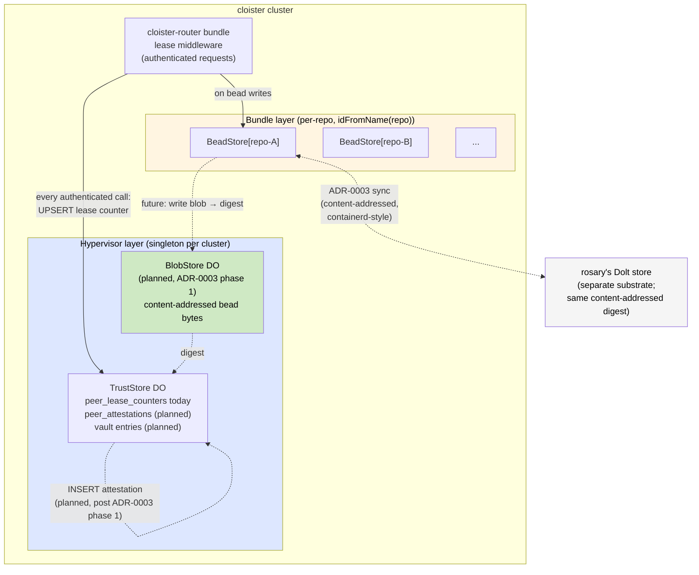

## Context

[ADR-0010](0010-vault-and-bundle-clusters.md) introduced bundles + clusters
+ vault-slice grants. [ADR-0011](0011-hypervisor-bundle-boundary.md)
formalized which responsibilities live at the hypervisor layer vs the
bundle layer using a three-criterion test:

> A responsibility is hypervisor-layer if it satisfies all three: (1) it
> mediates between bundles or to the outside; (2) compromise blast-radius
> is multi-bundle; (3) **there is exactly one of it per cluster**.

The 2026-05-09 audit amendment to ADR-0007 added two trust-state tables:
- `peer_lease_counters` (per-peer hash-chained counter, UPSERT per
  authenticated request).
- `peer_attestations` (per-(actor, peer) chain row on state-boundary writes).

Both were initially placed in `BeadStore` — the per-repo Durable Object
that already held `beads` and `comments`. That worked as a starting
point because the audit amendment was authored before ADR-0010 / ADR-0011
existed.

A subsequent proposal (filed in conversation, never committed) was to
split: drop `beads` + `comments` from cloister entirely, treat rosary's
Dolt-backed bead store as the canonical home, and create a dedicated
`TrustStore` DO for trust-state tables.

The user's instinct was that the proposal "smelled like a sankey chart
of DO wiring" — the simple "two stores" framing concealed cross-DO
transactional flows. An adversarial review by the
theoretical-foundations agent (2026-05-09) found the proposal had
**two catastrophic problems** and three significant ones:

1. **Cross-DO transaction breakage.** ADR-0007:154 specifies attestation
   rows are written *"inside the same SQL transaction as the underlying
   state change."* Workerd's DO ACID is per-DO; cross-DO writes have no
   distributed transaction. Splitting bead writes from attestation
   writes turns §13.2's "silence is evidence" cryptographic invariant
   into a routine consequence of network jitter.

2. **Misapplied ADR-0011 criteria.** BeadStore is per-repo
   (`idFromName(repo)`) — many instances per cluster — which classifies
   it as **bundle-layer** by ADR-0011's third criterion. The proposal
   correctly identified that *trust state* needs a hypervisor-layer
   home, but incorrectly concluded that bead state therefore must move
   too. Two independent decisions had been welded together.

3. **ADR-0003 retraction.** ADR-0003 (content-addressed bead store)
   frames cloister and rosary as **two substrates** of the same
   content-addressed abstraction — same digest, same canonical form.
   Dropping cloister's beads silently retracts the substrate-
   independence thesis. The "schema matches rosary's bead model so
   cross-tool reads are trivial" comment in `src/beads.ts:5` was
   documenting a **digest invariant**, not a duplication.

4. **Schema-level dependencies.** `peer_attestations.content_hash` is
   `sha256(canonical bead bytes)` per ADR-0007. Beads in rosary +
   attestations in cloister means the hash is computed by cloister
   AFTER a round-trip to rosary; that's a third process call per
   transaction with its own timing window, and the canonical-bytes
   function only exists in cloister's TS — rosary's Dolt would need to
   adopt it.

5. **Smoke-test regression.** `GETTING-STARTED.md:92-98` documents
   `bead_create` as the first-touch test that "uses the BEAD_STORE
   Durable Object — no network." Dropping cloister's beads requires
   rosary running for any bead operation. The user-facing zero-upstream
   workflow goes away.

## Decision

Adopt the corrected factoring from the adversarial review:

### Three DO classes, three keying scopes

| DO | Layer | Keying | Holds |
|---|---|---|---|
| `BeadStore` | Bundle | `idFromName(repo)` | `beads`, `comments` (work-item state) |
| `TrustStore` | Hypervisor | singleton per cluster | `peer_lease_counters`; future: `peer_attestations`, vault entries |
| `BlobStore` | Hypervisor | content-addressed | bead canonical bytes → digest (per ADR-0003 phase 1; not yet implemented) |

### Cross-DO consistency: content-addressed handoff (deferred to ADR-0003 phase 1)

`peer_attestations` writes need to reference a `content_hash`. The
adversarial review's recommended pattern, drawn from ADR-0003:

1. **bead_create writes the canonical bead bytes to BlobStore** (CAS;
   idempotent — same bytes → same digest).
2. **BlobStore returns the digest.**
3. **BeadStore writes the row referencing the digest** (per-repo DO; ACID
   inside that DO).
4. **TrustStore writes the `peer_attestations` row referencing the digest**
   (singleton DO; ACID inside that DO).

Failure between steps is **recoverable**: the blob is content-addressed, so
step 1 is idempotent; a missing `peer_attestations` seq is exactly the
§13.2 cryptographic evidence ADR-0007's amendment was designed to detect,
not network jitter masquerading as misbehavior.

This requires **ADR-0003 phase 1 (BlobStore)** to land before
`peer_attestations` can be transactionally safe across the
BeadStore/TrustStore boundary. Until then, only `peer_lease_counters`
writes (which don't reference bead state) are landed in TrustStore;
`peer_attestations` waits.

### What this ADR explicitly does NOT change

- **Cloister's `beads` and `comments` tables stay in BeadStore.** Per
  ADR-0003, cloister and rosary are two substrates of the same content-
  addressed abstraction, not primary and proxy.
- **Cloister's `bead_*` MCP tools continue to work standalone** without
  rosary running, preserving `GETTING-STARTED.md`'s zero-upstream smoke
  test.
- **Rosary remains an external service** reached via httpForward (per
  ADR-0011's external-services category), not a runtime dependency for
  bead operations.
- **The substrate-independence thesis from ADR-0003 stands.** A future
  cloister↔rosary sync would be containerd-style content-addressed
  ("do you have this digest? send it"), not master-slave.

## Consequences

**Positive:**

- **Trust state lands in the right home.** Hypervisor-layer DO,
  singleton per cluster, by ADR-0011's three-criterion test.
- **Bead state stays where it works.** Per-repo, ACID-clean, zero-
  upstream `task dev`.
- **§13.2 invariant preserved.** Lease counter UPSERTs and (future)
  attestation rows live in their own ACID-clean DO; the only cross-DO
  write is content-addressed, idempotent, and uses ADR-0003 phase 1's
  recoverability story.
- **ADR-0003 substrate independence preserved.** No silent retraction.
- **The wave plan continues.** `cloister-bd7770` (lease middleware)
  writes to TrustStore; `cloister-bdcbe7` (peer_attestations)
  writes to TrustStore; `cloister-bdef0c` (disclosure endpoint) reads
  from TrustStore.

**Negative / risks:**

- **`peer_attestations` writes are not yet cross-DO-transactionally
  safe.** Until ADR-0003 phase 1 (BlobStore) lands, attestations in
  TrustStore would have a partial-write window vs bead writes in
  BeadStore. The mitigation: **don't ship `peer_attestations` until
  phase 1 is in place.** Lease counter writes are unaffected (no cross-
  DO reference to bead state).

- **Two DO classes is more state to manage.** Rotation, migrations,
  schema versioning each have to consider BeadStore + TrustStore. Less
  code reuse than a single DO. Acceptable cost for the ADR-0011
  boundary.

- **TrustStore singleton-per-cluster locks future multi-tenant
  topologies into one cluster.** Multi-cluster deploys (per ADR-0010
  Phase 4) will key TrustStore by the cluster's actor fingerprint.
  Schema migration when that lands is mechanical (rename the singleton
  key, add a constraint that the actor fingerprint matches the cluster
  identity).

- **BlobStore is now a hard prerequisite for the attestation portion of
  the wave.** ADR-0003 phase 1 was previously "Phase 1 landed, Phase 2
  planned." This ADR promotes Phase 1 from "landed" to "load-bearing
  for ADR-0007." If the existing Phase 1 implementation doesn't expose
  the canonical-bytes hashing surface ADR-0003 promises, it needs a
  small hardening pass first.

**Out of scope for this ADR:**

- **The actual implementation of `peer_attestations` writes.** That's
  cloister-bdcbe7, which now depends on ADR-0003 phase 1 being
  hardened.
- **A future cloister↔rosary content-addressed sync protocol.** ADR-0003
  sketches it; it's a separate decision when needed.
- **Vault DO implementation per ADR-0010 phase 3.** Same DO class
  (TrustStore) but a different table or sub-DO; design is in ADR-0010.

## Concrete actions taken

This ADR's adoption coincides with these code changes (commit follows
this ADR):

1. **`src/trust-store.ts` (new, ~95 lines)** — TrustStore DO class.
   Initializes the same `peer_lease_counters` schema; reserves the DO
   for future `peer_attestations` + vault tables. Singleton per
   cluster, accessed via `env.TRUST_STORE.idFromName("cluster")`.

2. **`src/beads.ts`** — `SCHEMA_PEER_LEASE_COUNTERS` import + concat
   removed. `beads` + `comments` schema unchanged. New comment block
   documents the bundle/hypervisor split + this ADR.

3. **`src/types.ts`** — `Env.TRUST_STORE: DurableObjectNamespace`
   added.

4. **`src/index.ts`** — `export { TrustStore }` so workerd discovers the
   DO class.

5. **`wrangler.toml`** — `TRUST_STORE` binding + new SQLite migration
   tag (`v2`). Both DOs declared in `[durable_objects]`.

6. **`config.capnp`** — same binding additions for the workerd-direct
   path.

7. **`src/storage/peer-lease-counters.ts`** — unchanged. The pure-
   function helpers accept any `SqlExecutor`; lease middleware will
   call them with the TrustStore DO's `sql()` handle.

8. **`task lint` continues to pass: 24 test files / 343 tests.** No
   semantic change to the table or its tests; only the DO it lives in.

## Migration impact on in-flight beads

- **`cloister-bd7770` (lease middleware)** — UPDATE to write
  `peer_lease_counters` to TrustStore (via `env.TRUST_STORE`), not
  BeadStore.
- **`cloister-bdcbe7` (peer_attestations)** — Schema lands in
  TrustStore. **Now blocked on ADR-0003 phase 1 hardening.**
- **`cloister-bdef0c` (disclosure endpoint)** — Reads from TrustStore.

## See also

- [ADR-0003](0003-content-addressed-bead-store.md) — content-addressed
  bead store; this ADR cites it as the substrate-independence thesis
  and as the cross-DO consistency story for attestation writes.
- [ADR-0007](0007-interlace-substrate.md) — Interlace identity. The
  bolded transactional contract at line 154 is what motivated this
  ADR's defense of cross-DO consistency.
- [ADR-0010](0010-vault-and-bundle-clusters.md) — bundle/cluster
  primitives. TrustStore is the first concrete hypervisor-layer DO
  that this ADR formalizes.
- [ADR-0011](0011-hypervisor-bundle-boundary.md) — three-criterion test
  for hypervisor vs bundle layer. This ADR applies the criteria
  correctly to BeadStore (bundle) and TrustStore (hypervisor).
- 2026-05-09 adversarial review — `_agent_log/theoretical-foundations-analyst_2026-05-09_agent_log.md`
  (gitignored; transcript of the seven-attack adversarial review that
  drove this ADR's framing).
