# Off-platform peers

How a cloister deployment talks to peers that don't live on Cloudflare's
edge — laptops, IoT devices, agents in another constellation, self-hosted
services behind NAT. Decided in [ADR-0007](../adr/0007-interlace-substrate.md);
this doc is the operational shape.

## TL;DR

- **Cloister never runs a userspace WireGuard daemon.** workerd is V8 (no
  kernel access); `cloister-companion` runs distroless apko as uid 65532
  without `NET_ADMIN`. CF anycast handles inbound; CF Tunnel + WARP handle
  the off-platform edge.
- **Off-platform peers run `cloudflared` (server-shaped) or `WARP`
  (client-shaped).** Both punch outbound to Cloudflare's edge — no inbound
  port required at the peer. The fabric *is* the rendezvous.
- **Discovery layers on top.** Once a peer is reachable via a CF hostname,
  Interlace `.well-known/interlace/index.json` (per ADR-0007) negotiates
  identity, capabilities, and policy. Same protocol as for on-platform
  peers; only the transport underneath differs.

## Why no userspace WireGuard

[Interlace §7](../adr/0007-interlace-substrate.md) calls for WG tunnels
per relationship. WARP is literally WireGuard, run by Cloudflare; CF
Tunnel is the asymmetric origin→edge variant. Either way, the protocol
the spec asks for is the protocol Cloudflare's edge already speaks. Three
reasons cloister itself stays out of the WG userland:

1. **workerd has no kernel access.** No syscalls beyond `fetch`. WG would
   live in companion or in a sidecar.
2. **Companion runs unprivileged.** apko image, uid 65532, no
   `NET_ADMIN`. Adding WG would require capabilities the distroless
   posture explicitly excludes.
3. **CF Tunnel achieves the same goal cheaper.** Encrypted pipe through
   NAT to a fabric, with the fabric handling routing and discovery. The
   peer side handles its own NAT traversal via cloudflared/WARP.

The protocol invariant from Interlace — "encrypted, authenticated channel
between two actors with mutual identity verification" — is preserved.
What changes is *who runs the tunneling daemon*: the peer, not cloister.

## Topology

```mermaid
flowchart LR
    PEER["off-platform peer<br/>(laptop / IoT / agent host)"]

    subgraph cf ["Cloudflare edge (anycast)"]
        CL["cloister.example.com<br/>(Worker)<br/><br/>/.well-known/interlace/<br/>/mcp<br/>/identity/*<br/>/interlace/peers/&#123;fp&#125;"]
    end

    PEER ==>|"outbound cloudflared<br/>or WARP — punches hole"| cf
    cf ==>|"encrypted tunnel back<br/>(WireGuard / TLS)"| PEER
    PEER -.->|"HTTPS<br/>(via the tunnel CF holds open)"| CL

    style cf fill:#f5d4a0,color:#000
    style CL fill:#fff5e1,color:#000
```



The peer's outbound `cloudflared` connection is the tunnel. CF holds the
connection open and routes inbound requests for the peer's public hostname
back through it. From cloister's side it looks like a normal HTTPS request
to the peer's `https://peer.example.com/...`; CF terminates TLS at the
edge and forwards through the tunnel.

## Setting up the peer side

Two patterns, depending on whether the peer is a long-running service or a
client-shaped device.

### Pattern A — service-shaped peer (cloudflared)

For a peer running its own HTTP service that wants to receive cloister
calls (e.g. another cloister instance, an APAS agent host, a self-hosted
ll-open daemon).

```sh
# Install cloudflared on the peer.
brew install cloudflared       # macOS
# or: sudo apt install cloudflared
# or: download a release binary

# Authenticate against your CF account (one-time).
cloudflared tunnel login

# Create a tunnel and route a hostname to it.
cloudflared tunnel create my-peer
cloudflared tunnel route dns my-peer peer.example.com

# Run the tunnel, forwarding to the local service.
cloudflared tunnel run --url http://localhost:8788 my-peer
```

Once running, `https://peer.example.com/.well-known/interlace/index.json`
resolves through CF anycast and reaches the peer's local service. Cloister
talks to it with normal `fetch()` — no special transport.

### Pattern B — client-shaped peer (WARP)

For a peer that wants outbound access to cloister (and other CF-fronted
services) without exposing an inbound endpoint of its own. This is the
right shape for a laptop running an agent that calls into a cloister.

```sh
# Install the WARP client.
brew install --cask cloudflare-warp        # macOS
# or: download from https://1.1.1.1/

# Connect.
warp-cli register
warp-cli connect
```

The peer is now connected to CF's network via WireGuard (literally — WARP
uses the WG protocol). Outbound `fetch()` to cloister works without
any peer-side network configuration; CF handles routing.

Identity is still required — the peer mints Signet ephemeral certs from
notme and attaches them to MCP requests per ADR-0007. WARP just provides
the underlying tunnel.

## Setting up the cloister side

Cloister's deploy is unchanged. The `apko` image (`task image`) ships the
default workerd runtime; production exposes `cloister.example.com`
through the regular CF Worker hostname or a custom-domain Worker route.

If your cloister is *self-hosted* (running the apko image on your own
infrastructure rather than as a CF Worker), and you want CF Tunnel to
front it without adding inbound ports, run `cloudflared` alongside the
apko container:

```yaml
# docker-compose.yml (illustrative — adapt to your orchestrator)
services:
  cloister:
    image: cloister:latest
    volumes:
      - ./data:/data
    # No port mapping — cloudflared reaches it on the internal network.
    networks:
      - cloister-net

  cloudflared:
    image: cloudflare/cloudflared:latest
    command: tunnel --no-autoupdate run --url http://cloister:8787 my-cloister
    environment:
      - TUNNEL_TOKEN=...   # from `cloudflared tunnel token <id>`
    networks:
      - cloister-net

networks:
  cloister-net:
```

The `apko.yaml` recipe ships an optional commented-out cloudflared
package entry under `# off-platform deployment` — opt in by uncommenting
when building the image, or run `cloudflared` as a separate sidecar
container as above. Either works; the sidecar form is the default
recommendation because it lets you upgrade cloudflared and cloister
independently.

## Handshake flow

Once transport is up, the protocol is identical to on-platform peers:

1. Peer fetches `https://cloister.example.com/.well-known/interlace/index.json`
   to discover capabilities, scopes, and `actor.fingerprint`.
2. Peer requests an ephemeral Signet cert from its own notme
   (`POST /identity/lease { scope, peer: <cloister fingerprint> }`).
3. Peer attaches `Authorization: Signet <cert-der-base64>` and
   `X-Signet-Sig: <sig-base64>` to its `POST /mcp` calls.
4. Cloister verifies offline against its pinned master pubkey + the
   refreshed CA bundle (per ADR-0007 amendment 2026-05-08), checks scope
   ⊇ tool requirement, dispatches.
5. State-boundary writes (bead_create / bead_update / bead_close /
   bead_comment) produce attestation rows; lease-counter UPDATE happens
   on every authenticated call.

Nothing about the protocol changes for off-platform peers. Only the
transport underneath does.

## What this is not

- **Not a way to run WireGuard inside cloister.** Per ADR-0007, cloister
  has no userspace WG. If you have a use case requiring per-peer WG
  tunnels at cloister itself (e.g. tenant isolation requiring kernel-level
  network namespaces), that's a separate primitive — see ADR-0008 (companion
  pool, proposed) for the load-balancing axis.
- **Not the only fabric.** Tailscale, ZeroTier, Nebula, or any other
  mesh/VPN can play the same role. Cloister doesn't care which fabric —
  it cares that the peer's hostname is reachable via HTTPS. CF Tunnel is
  the recommended default because it integrates with the rest of the CF
  edge cloister already lives on; non-CF fabrics work with extra
  configuration.
- **Not a registry.** Discovery is per-peer via `.well-known/interlace/`,
  not via a central directory. A peer learns about cloister out-of-band
  (a URL someone sends, a config file, a referral via `interlace-peer`
  in a third party's attestation chain).

## See also

- [ADR-0007](../adr/0007-interlace-substrate.md) — Interlace substrate
  decision; this doc is its deployment story for off-platform peers.
- [ADR-0007 amendment 2026-05-08](../adr/0007-interlace-substrate.md#amendment-2026-05-08--theoretical-foundations-audit)
  — the audit findings that pinned the always-on auth boundary.
- [ADR-0008 (proposed)](../adr/0008-companion-pool.md) — companion pool
  / load balancing; orthogonal to this doc.
- Cloudflare Tunnel docs: https://developers.cloudflare.com/cloudflare-one/connections/connect-networks/
- WARP docs: https://developers.cloudflare.com/warp-client/
