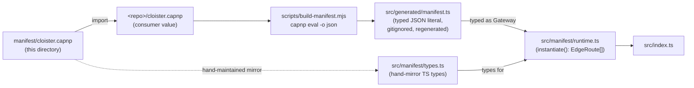

# `manifest/` — Cap'n Proto schema for cloister's gateway

This directory holds the **schema** for cloister's route+backend
manifest. A consumer repo declares a value of `Cloister.Gateway` at the
root of its repo (typically `<repo>/cloister.capnp`); the cloister build
pipeline compiles that value to a typed TS module via `task manifest`,
and the runtime imports the result. **No parsing at runtime.**

## Files

- `cloister.capnp` — the schema itself. Defines `Gateway`, `Route`,
  `Backend`, the per-kind backend specs (`DoBackend`,
  `HttpForwardBackend`, `ServiceBindingBackend`, `UdsForwardBackend`,
  `LeylineNetBackend`), the non-MCP route specs
  (`ServiceBindingProxySpec`, `HttpProxySpec`), and the
  `McpTool`/`Actor`/`InterlacePolicy` records.

## How it gets used

The `Cap'n Proto schema language` is shared with `config.capnp` (the
workerd runtime config in the repo root) — same toolchain, same
schema-evolution rules, no second parser to maintain.

## When to edit

Add a new manifest field, route kind, or backend kind here. Three
linked files must travel together:

1. **`manifest/cloister.capnp`** — the schema (this dir). Add the
   field with the next free ordinal.
2. **`src/manifest/types.ts`** — the hand-mirrored TS types. Add the
   matching interface field.
3. **`src/manifest/runtime.ts`** — the runtime branch handling the new
   variant (if you added a new kind to a union).

After editing: run `task manifest` to regenerate
`src/generated/manifest.ts`, then `task lint` to confirm everything
type-checks. The schema-evolution rules are quoted from
[capnproto.org/language.html § Evolving Your Protocol](https://capnproto.org/language.html)
in the file's header comment — read them before reordering or
reassigning ordinals.

## Decisions

- **Why capnp at all** — [ADR-0004](../docs/adr/0004-capnp-manifest.md)
- **Why a hand-mirrored `types.ts`** — covered in ADR-0004's "negative"
  section; capnp → TS codegen tooling in the JS ecosystem isn't strong
  enough to be the source of truth, and the mirror is small.
- **The schema retains stable file ID `@0xb1d4f67c8c6e3b5a`** — never
  regenerate this; capnp uses it to identify the file across imports.
