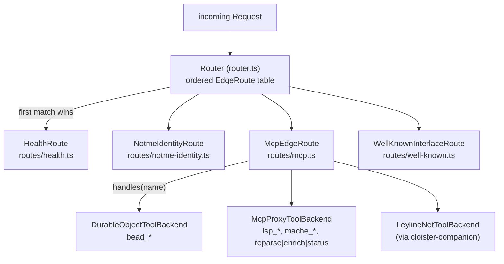

# `src/` — cloister worker source

This is the **cloister-router bundle** (per [ADR-0010](../docs/adr/0010-vault-and-bundle-clusters.md)
terminology) — a workerd Worker that fronts the public face
(MCP/JSON-RPC over HTTP/SSE), routes requests to backends declared in
the typed manifest, and exposes Interlace identity surfaces.

## Layout

```
src/
├── index.ts             # composition root — instantiate(manifest) → router
├── router.ts            # Router + EdgeRoute interface (outer-layer dispatch)
├── backends.ts          # ToolBackend interface (MCP-layer dispatch)
├── beads.ts             # BeadStore Durable Object (per-repo bead state) — DEPRECATED per cloister-c8b907; rsry/bd is forward direction
├── blob-store.ts        # BlobStore Durable Object (content-addressed bytes, ADR-0003)
├── trust-store.ts       # TrustStore Durable Object (lease counters + receipts + CA bundles, ADR-0012)
├── vault-store.ts       # CredentialVault Durable Object (ADR-0013 + ADR-0014)
├── cors.ts              # ALLOWED_ORIGINS allowlist + CORS helpers
├── types.ts             # Env shape (workerd bindings)
│
├── routes/              # EdgeRoute implementations
│   ├── health.ts                  # GET /health
│   ├── mcp.ts                     # GET|POST /mcp (SSE + JSON-RPC)
│   ├── notme-identity.ts          # /identity/* → notme service binding
│   ├── well-known.ts              # GET /.well-known/interlace/index.json
│   ├── well-known-identity.ts     # GET /.well-known/cloister/identity
│   ├── well-known-mcp-registry.ts # GET /.well-known/cloister/mcp-registry (ADR-0016)
│   ├── lease-middleware.ts        # Interlace lease verification (ADR-0007); gates /mcp + disclosure
│   ├── bead-create-orchestrator.ts# Cross-DO bead_create handoff (ADR-0012 / §13.4) — Step 2 routes by BEAD_STORAGE_BACKEND env var (cloister-c8b907)
│   ├── disclosure.ts              # GET /interlace/peers/{fp} (peer attestation chain)
│   ├── ca-bundle.ts               # GET /interlace/ca-bundle/[epoch] (RECEIPTS.md §2.3)
│   ├── receipt-emitter.ts         # Interlace-Receipt header construction (RECEIPTS.md)
│   ├── receipt-stream.ts          # SSE receipt-stream pairing (open_commitment_hash)
│   ├── oci-registry.ts            # OCI Distribution Spec Phase 1+2 (cloister-3a3b0d)
│   └── roots-state.ts             # MCP roots-state helpers
│
├── manifest/            # capnp manifest → runtime EdgeRoute table
│   ├── types.ts             # hand-mirrored Cloister.Gateway TS types
│   ├── cluster-types.ts     # hand-mirrored Cluster.* TS types
│   ├── runtime.ts           # instantiate(manifest): EdgeRoute[]
│   ├── spec.ts              # inputSchemaJson → parsed JSON Schema
│   └── backends/            # ToolBackend factories per kind
│       ├── durable-object.ts
│       ├── mcp-proxy.ts         # formerly httpForward (ADR-0015 Phase 1 rename)
│       ├── service-binding.ts
│       ├── uds-forward.ts       # placeholder, not wired
│       └── leyline-net.ts       # IPC to cloister-companion
│
├── wire/                # hand-rolled capnp codec (ADR-0005)
│   ├── codec.ts             # WireBuilder / WireReader
│   ├── manifest.ts          # encode/decode Manifest (kept for schema parity)
│   ├── tool-call.ts         # encode/decode ToolCall (used by leyline-net.ts)
│   ├── tool-result.ts       # encode/decode ToolResult
│   └── receipts.ts          # Interlace 0.2.0 receipt envelope codec
│
├── storage/             # SQLite-backed helpers used by the DOs (peer-lease-counters,
│                        # actor-ca-bundle, peer-attestations, peer-receipts, bundle-canonical,
│                        # disclosure-cursor, seen-nonces, registry-tags, pending-attestations,
│                        # ca-bundle-cache, notme-bundle-fetcher, typed-cid, canonical, workerd)
│
└── generated/           # gitignored — populated by `task manifest`
    └── manifest.ts      # typed JSON literal of the consumer cloister.capnp
```

## Two-layer dispatch



The outer layer ([ADR-0002 EdgeRoute](../docs/adr/0002-edge-router-protocol-agnostic-backends.md))
dispatches HTTP requests to `EdgeRoute`s. The MCP edge route, in turn,
dispatches MCP tool calls to `ToolBackend`s.

## Where to make changes

| Goal | File(s) |
|---|---|
| Add a new public path | `routes/<name>.ts` + manifest schema entry + `manifest/runtime.ts` branch |
| Add a new MCP backend kind | `manifest/backends/<kind>.ts` + manifest schema field + `manifest/types.ts` mirror + `manifest/runtime.ts` branch |
| Add a new MCP tool to an existing backend | edit the consumer `cloister.capnp` only — schema travels through `task manifest` |
| Touch the wire format | `src/wire/<file>.ts` + `wire/cloister.capnp` schema + regenerate fixtures via `task wire:fixtures` |
| Add a Durable Object | new file alongside `beads.ts`, register in `wrangler.toml` + `config.capnp` (must travel together) |

## Worker entry

`src/index.ts` is the composition root. It imports the typed manifest
from `src/generated/manifest.ts`, hands it to `instantiate()`, and
exports the `default { fetch(...) }` Worker handler.

```ts
const router = new Router(instantiate(manifest));
export default {
  fetch(request, env, ctx): Promise<Response> {
    return router.handle(request, env);
  },
};
```

There is no per-feature flag. The route table is what the manifest says
it is.

## See also

- [`../manifest/`](../manifest/) — capnp schema for what we instantiate
- [`../wire/`](../wire/) — capnp wire schemas (production + test fixtures)
- [`../docs/ARCHITECTURE.md`](../docs/ARCHITECTURE.md) — runtime model, sequence diagrams
- [`../CLAUDE.md`](../CLAUDE.md) — conventions, gotchas, when-to-write-an-ADR rules
