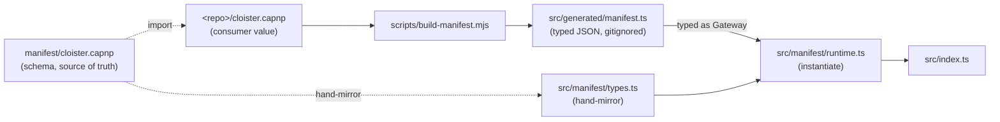

# `src/manifest/` — manifest runtime (TS side)

The TypeScript runtime that consumes the typed JSON literal emitted by
`task manifest` and instantiates a list of `EdgeRoute`s ready to plug
into the `Router`. This dir is the **TS half** of the manifest pipeline.

**Do not confuse this with [`manifest/`](../../manifest/) at the repo
root.** That dir holds the *Cap'n Proto schema* — the source-of-truth
schema file (`manifest/cloister.capnp`) and its README. `src/manifest/`
is the TS runtime that consumes the generated TS bindings produced from
that schema by `scripts/build-manifest.mjs`.

## Files

| File | Responsibility |
|------|----------------|
| `types.ts` | Hand-mirrored TS types for `manifest/cloister.capnp` — `Gateway`, `Route`, `Backend` union, per-kind backend specs, `McpToolSpec`, `Actor`, `InterlacePolicy`. Source of truth for the TS side; the capnp schema is the source of truth for the wire. |
| `cluster-types.ts` | Hand-mirrored TS types for the sibling `manifest/cluster.capnp` schema — `Cluster`, `Bundle`, `Wire`, `StoragePolicy`. Consumed by `scripts/emit-compose.mjs` + `scripts/cluster-dev.mjs`. Per [ADR-0009](../../docs/adr/0009-compute-substrate-portability.md) Phase 1. |
| `runtime.ts` | `instantiate(manifest, env)` — turns a typed `Gateway` into `EdgeRoute[]`. Three phases: re-validate (defense in depth), backend instantiation (kind→factory registry), route instantiation (`McpEdgeRoute` / `HealthRoute` / `NotmeIdentityRoute` / `HttpProxyRoute`). |
| `spec.ts` | `McpToolSpec` → `McpTool` conversion. Parses `inputSchemaJson` (string in capnp) into `McpTool['inputSchema']` once at startup; throws cleanly on invalid JSON. |
| `backends/` | The five backend kind implementations (`durableObject`, `mcpProxy`, `serviceBinding`, `udsForward`, `leylineNet`) — see [`backends/README.md`](backends/README.md) for the per-file map and [`docs/reference/backend-kinds.md`](../../docs/reference/backend-kinds.md) for the operator-facing reference. |

## When to edit

Adding a new manifest field, route kind, or backend kind requires the
three-file move documented in
[`manifest/README.md`](../../manifest/README.md):

1. Add the field with the next free ordinal in `manifest/cloister.capnp`.
2. Add the matching interface field in `types.ts` (this dir).
3. Add the runtime branch in `runtime.ts` if the field is a new union
   variant or backend kind.

Then run `task manifest` to regenerate `src/generated/manifest.ts` and
`task lint` to type-check.

## Decisions

- **Why a hand-mirrored `types.ts`** — capnp→TS codegen in the JS
  ecosystem isn't strong enough to be source of truth; the mirror is
  small enough to maintain by hand. See
  [ADR-0004](../../docs/adr/0004-capnp-manifest.md) "Negative
  consequences."
- **Why instantiation re-validates** — `scripts/build-manifest.mjs`
  validates at build time. Re-validating here is defense in depth: if
  a manifest reaches the runtime through a path that bypassed the
  build (e.g. tests injecting raw structs), we surface the same
  diagnostics as `TypeError` at boot rather than letting bad shape
  reach the network.
- **Why backends live in a sub-directory** — five files, one per
  Backend union variant. Keeping them flat in `src/manifest/` mixes the
  union-variant impls in with the type definitions and the runtime
  dispatcher; the sub-directory makes the kind→file mapping obvious.
