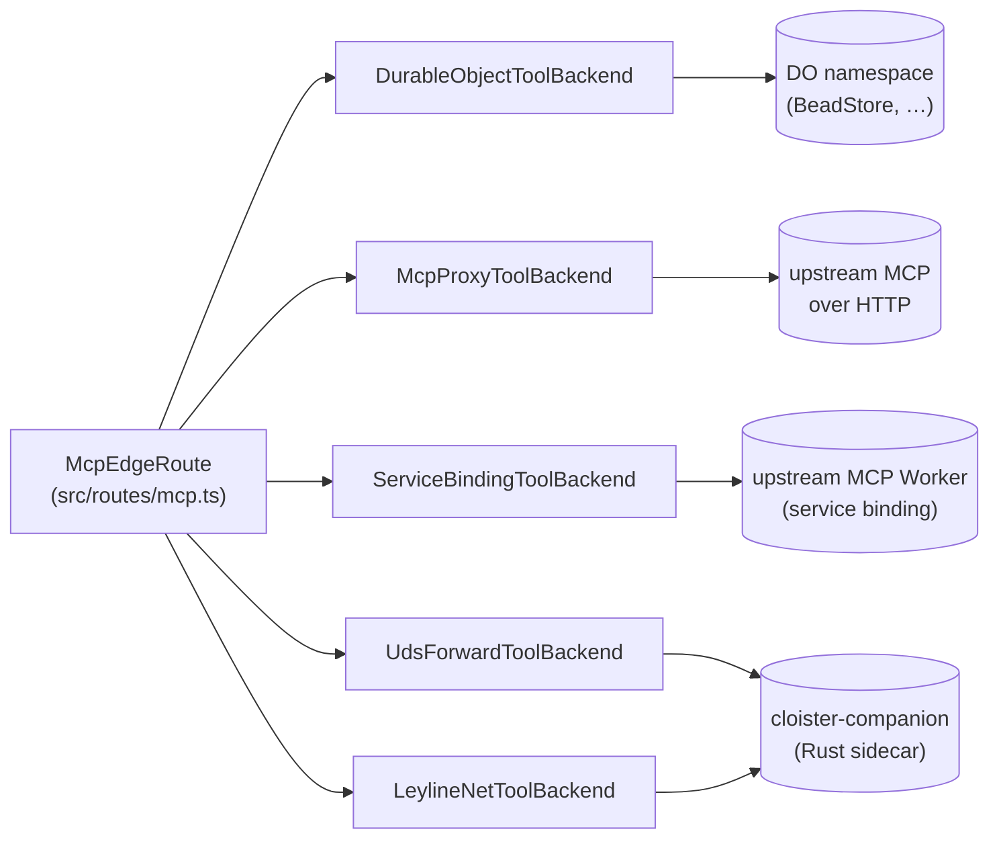

# `src/manifest/backends/` — `ToolBackend` implementations

One file per `kind` in the [`cloister.capnp`](../../../cloister.capnp)
`Backend` union. Each implements the `ToolBackend` interface from
`src/backends.ts` — `handles(toolName)` plus a JSON-RPC dispatch method
— so the MCP edge can hand `tools/call` to whichever backend claimed
the tool. Per [ADR-0002](../../../docs/adr/0002-edge-router-protocol-agnostic-backends.md),
the backend abstraction is the seam that lets cloister speak to
heterogeneous upstream tools without baking transport choices into the
edge.

## Files

| File | `kind` | Transport | Notes |
|------|--------|-----------|-------|
| `durable-object.ts` | `durableObject` | DO RPC | Forwards JSON-RPC inner call to a DO derived from a key argument (e.g. `repo`, `session_id`). Used for BeadStore and other per-key state. |
| `mcp-proxy.ts` | `mcpProxy` | HTTP fetch | POST `tools/call` JSON-RPC to an upstream MCP HTTP endpoint via the global `fetch`. Supports MCP Streamable HTTP session handshake (`requiresSession`) and ADR-0006 derived tools (`dynamicTools`). |
| `service-binding.ts` | `serviceBinding` | workerd `Fetcher` | Same wire shape as `mcpProxy`, but the upstream is another Worker exposed as a service binding — no network hop. |
| `uds-forward.ts` | `udsForward` | capnp over loopback HTTP → companion → UDS | Workerd cannot dial `AF_UNIX`; sends the capnp `ToolCall` to cloister-companion with `X-Cloister-Transport: uds` + `X-Cloister-Socket-Path` and companion opens the UDS. Per ADR-0005 amendment 2026-04-30. |
| `leyline-net.ts` | `leylineNet` | capnp over loopback HTTP → companion | The cloister↔companion IPC seam: encode `ToolCall` via `src/wire/tool-call.ts`, POST to `env[companionUrlBinding]`, decode `ToolResult` via `src/wire/tool-result.ts`. AEAD / signing live at companion's egress face — see [ADR-0005](../../../docs/adr/0005-internal-wire-leyline-net.md). |

## How they fit

A given `tools/call` reaches exactly one backend: the runtime's
`pickBackend(toolName)` returns the first whose `handles(name)` claims
it. The manifest's `handlesPrefix` lets families share a prefix
(`mache_*` → mache backend, `rsry_*` → rsry, …) — see
[ADR-0006](../../../docs/adr/0006-derived-tool-schemas.md) for the
dynamic-tools merge rules.

## When to edit

Adding a new backend kind is a three-file commit (per
[`manifest/README.md`](../../../manifest/README.md)):

1. Add the `kind` + per-kind spec struct in `manifest/cloister.capnp`.
2. Mirror the spec in `src/manifest/types.ts`.
3. Add a file here, implementing `ToolBackend`, and register it in
   `src/manifest/runtime.ts`'s kind→factory map.

The two capnp-wire backends (`udsForward` + `leylineNet`) share
`src/wire/{tool-call,tool-result,manifest}.ts`. If you're adding a new
network-bound backend that talks to companion, you almost certainly
want to reuse that codec, not roll your own — see
[`../../wire/README.md`](../../wire/README.md).
