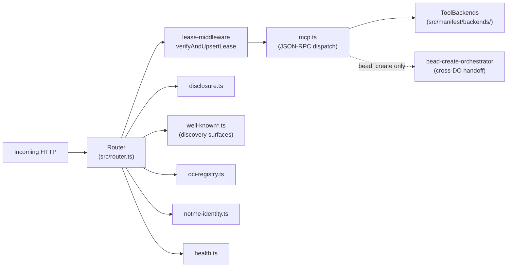

# `src/routes/` — HTTP route handlers

Concrete `EdgeRoute` implementations that the manifest runtime
instantiates and the `Router` dispatches against. Each file owns one
HTTP surface (or one closely related family). The **MCP edge is the
primary public face**; everything else is either a discovery surface,
an auth gate, or a non-MCP tenant on the same router substrate per
[ADR-0002](../../docs/adr/0002-edge-router-protocol-agnostic-backends.md).

Routes are declarative: which routes a deployment exposes is decided
in [`cloister.capnp`](../../cloister.capnp) (the consumer manifest at
the repo root), not in TypeScript. The runtime
([`src/manifest/runtime.ts`](../manifest/runtime.ts)) reads the manifest
and wires the right concrete `EdgeRoute` class into the `Router` chain.

## Files

| File | Surface | Responsibility |
|------|---------|----------------|
| `mcp.ts` | `POST /mcp`, `GET /mcp` | The primary MCP edge: JSON-RPC lifecycle (initialize, ping, tools/list, tools/call), SSE notifications, tool dispatch across registered `ToolBackend`s. Per [ADR-0001](../../docs/adr/0001-workerd-mcp-gateway.md). |
| `lease-middleware.ts` | wraps `POST /mcp` | Always-on auth gate. Header parse → wasm32 cert chain verify → claims/epoch/window/scope → request-sig verify → atomic seen-nonces + lease-counter RPC. Per [ADR-0007](../../docs/adr/0007-interlace-substrate.md). |
| `bead-create-orchestrator.ts` | invoked from `mcp.ts` for `tools/call bead_create` | The one state-boundary write that takes the cross-DO handoff: BlobStore.put → BeadStore.bead_create → TrustStore.applyAttestation → optional pending enqueue. Per [ADR-0012](../../docs/adr/0012-truststore-vs-beadstore.md). |
| `disclosure.ts` | `GET /interlace/peers/{fingerprint}` | Streams a peer's attestation chain + pending state as JSONL with HMAC-signed cursors and constant-time 404s. Lease-gated when `INTERLACE_ROOT_PUBKEY` is set. Threat-model §9. |
| `notme-identity.ts` | `/identity/*` | Service-binding proxy to the notme bot; strips the `/identity` prefix. |
| `well-known.ts` | `GET /.well-known/interlace/index.json` | Interlace discovery doc synthesised from the manifest's `actor` + `policy` + mcp-route capabilities. ADR-0007 §4.1. |
| `well-known-identity.ts` | `GET /.well-known/{openid-configuration,jwks.json,webfinger,nostr.json}`, `POST /oauth/token` | Multi-format identity discovery bridge — OIDC / JWKS / WebFinger / NIP-05 + a working `client_credentials` OAuth2 IdP. |
| `well-known-mcp-registry.ts` | `GET /.well-known/mcp-registry/v0.1/servers[/{name}]` | Surfaces the manifest's upstream catalog under the [MCP Registry](https://modelcontextprotocol.io/registry) OpenAPI shape. Per [ADR-0016](../../docs/adr/0016-cloister-as-private-mcp-registry.md). |
| `oci-registry.ts` | `GET/HEAD /v2/*` | OCI Distribution v1.1 read-only pull path. Blobs live in BlobStore; tags in `TrustStore.registry_tags`. Sibling non-MCP tenant on the ADR-0002 substrate. |
| `health.ts` | `GET /health` | Liveness + configured-backends snapshot for external probes. |

## How they compose

The lease middleware runs **inside** `McpEdgeRoute.handlePost` (per
cloister-b89fdb); other routes opt into auth as needed (disclosure
gates itself when `INTERLACE_ROOT_PUBKEY` is set).

## Decisions

- **Why routes are declarative** — manifest-driven, not hand-coded, so a
  consumer can swap tenants without touching cloister source. See
  [ADR-0002](../../docs/adr/0002-edge-router-protocol-agnostic-backends.md)
  and [`manifest/README.md`](../../manifest/README.md).
- **Why path matching uses `URLPattern`** — Web Platform standard,
  workerd-native, no regex maintenance burden. See top-level
  [`CLAUDE.md`](../../CLAUDE.md).
- **Why bead-create has its own orchestrator** — it's the ONE bead
  method that participates in the §13.4 audit; other bead methods stay
  intra-DO. See
  [`docs/security/threat-model.md`](../../docs/security/threat-model.md)
  §13.4.
- **Why the auth gate has no bypass** — ADR-0007 amendment 2026-05-08
  explicitly removed `INTERLACE_DEV_BYPASS`. Dev uses real short-lived
  certs minted by notme against a real master.
