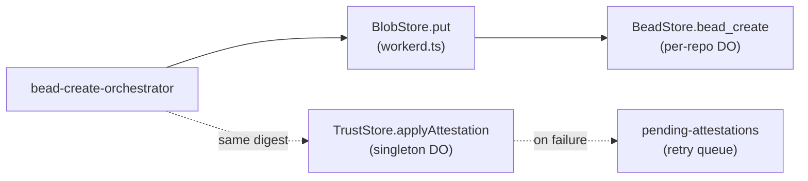

# `src/storage/` — Durable Object storage helpers

The substrate layer for cloister's Durable Objects. Each file is a
focused helper that owns one table, one canonicalization rule, or one
cross-DO contract. The files are deliberately small + composable so a
single DO (BeadStore / TrustStore / BlobStore / CredentialVault) can
import only what it needs and the test surface stays narrow.

The helpers are **substrate-free** above the DO SQLite layer: they take
a `SqlStorage`-shaped object so unit tests can pass an in-memory
substitute. Per
[ADR-0003](../../docs/adr/0003-content-addressed-bead-store.md) the
algebra is BlobStore (immutable monoid) + RefStore (linearizable
single-writer cells); per
[ADR-0012](../../docs/adr/0012-truststore-vs-beadstore.md) the trust
state lives in a hypervisor-tier singleton DO (TrustStore), separate
from per-repo BeadStore, with cross-DO writes mediated by content-
addressed handoff.

## Files by DO

### BeadStore (per-repo) + BlobStore (shared algebra)

| File | Responsibility |
|------|----------------|
| `bead-canonical.ts` | `bead/v1` canonical-bytes encoder. Byte-stable digest both BeadStore and TrustStore compute independently so attestation rows reference the same hash. |
| `bundle-canonical.ts` | CBOR canonical encoding for notme's `CABundle` + signature verification against `INTERLACE_ROOT_PUBKEY`. Byte-equal to notme's `pkg/revocation/checker.go`. |
| `canonical.ts` | Lower-level canonical-bytes primitive: sorted-key JSON, UTF-8, no whitespace, SHA-256 digest. Used by every other canonicalizer. |
| `typed-cid.ts` | Falsifiability stub for the ley-line substrate hypothesis (codec + typeFingerprint + contentHash). Parallel to `Digest` in `types.ts`; promoted-or-deleted per `cloister-df79a5`. |

### TrustStore (singleton per cluster)

| File | Table / Cache | Responsibility |
|------|---------------|----------------|
| `peer_lease_counters.ts` | `peer_lease_counters` | One row per peer; hash-chained counter advanced on every authenticated request. Restores §13.2 "silence is evidence" for read-only-only peers. |
| `peer-attestations.ts` | `peer_attestations` | Per-(peer, seq) bilateral chain entry written on state-boundary mutations. Cross-DO references the BeadStore row by content hash. |
| `pending-attestations.ts` | `pending_attestations` | Retry queue for step-4 failures in the cross-DO handoff. Exponential backoff 30s → 10m; permanent failure surfaces as `attempts >= MAX_RETRY_ATTEMPTS`. |
| `seen-nonces.ts` | `seen_nonces` | Anti-replay ledger keyed on `(cert_fp, nonce)`. `INSERT … ON CONFLICT DO NOTHING RETURNING` for race-free fresh-vs-duplicate detection. |
| `ca-bundle-cache.ts` | per-instance cache | Periodic fetch + Ed25519-verify of notme's `CABundle` for cert epoch / pubkey verification. Fail-closed beyond TTL. |
| `notme-bundle-fetcher.ts` | service-binding | Thin transport wrapper that hands `getCABundle` a `BundleFetcher` callback talking to `env.NOTME`. |
| `disclosure-cursor.ts` | (signing helper) | HMAC-signed pagination cursors + constant-time error helpers for the disclosure endpoint. Closes threat-model §9.2 + §9.4 oracle classes. |

### OCI registry (TrustStore)

| File | Responsibility |
|------|----------------|
| `registry-tags.ts` | `registry_tags` table — `(repo, tag) → manifest digest`. Mutable pointer index sitting next to BlobStore-backed immutable content. Per `cloister-cabd57`. |

### Workerd substrate (shared)

| File | Responsibility |
|------|----------------|
| `workerd.ts` | DO-SQLite-backed `BlobStore` + `RefStore` implementations. Single-threaded DO = consensus boundary; no locks, no Raft. Prefix-namespaced so multiple stores can coexist. |
| `types.ts` | `Digest` (branded hex string), `BlobStore` / `RefStore` interfaces, `asDigest` / `isDigest` guards. The substrate-free algebra. |

The `CredentialVault` DO lives at [`src/vault-store.ts`](../vault-store.ts)
and uses the lifted-from-notme [`vault/`](../../vault/) library; it has
no helpers in this dir today.

## Cross-DO handoff (one canonical write path)

`bead-canonical.ts` produces the digest that flows through both arms.
The fact that the digest is **byte-stable across DOs** is what makes
the handoff content-addressed — ADR-0003 + ADR-0012 + threat-model §6
all depend on this property.

## Decisions

- **Why two DOs not one** —
  [ADR-0012](../../docs/adr/0012-truststore-vs-beadstore.md). Trust
  state is per-cluster; bead state is per-repo. Same-DO would force one
  axis to follow the other.
- **Why content-addressed handoff** —
  [ADR-0003](../../docs/adr/0003-content-addressed-bead-store.md).
  Two ACID writes on two DOs can both reference the same immutable
  content without distributed transactions.
- **Why so many small files** — each closes one finding from
  [`docs/security/threat-model.md`](../../docs/security/threat-model.md)
  §6. The bead trail in commit logs maps file ↔ finding 1:1.
