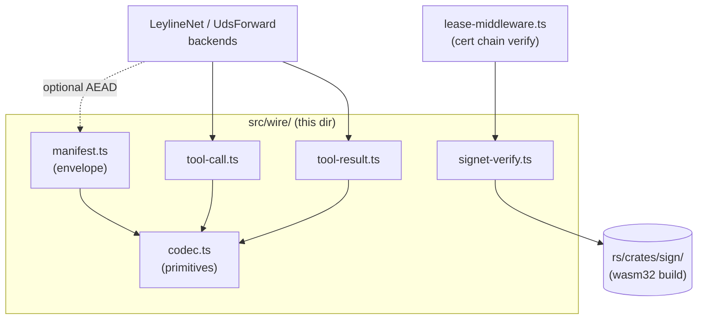

# `src/wire/` — Cap'n Proto codec + signet verifier

The cloister-side encoder/decoder for the inter-bundle wire formats
declared in [`wire/cloister.capnp`](../../wire/cloister.capnp) (the
schema at the repo root) plus a thin wrapper over the in-tree
[`leyline-sign`](../../rs/crates/sign/) wasm32 build used by the lease
middleware to verify CMS/PKCS#7 certificate chains.

The wire formats here are **security-critical**:
[ADR-0005](../../docs/adr/0005-internal-wire-leyline-net.md) defines
the cloister↔companion seam, the
[`interlace-spec/0.1.0/`](../../interlace-spec/0.1.0/) folder pins the
Manifest envelope shape, and
[`docs/security/threat-model.md`](../../docs/security/threat-model.md)
§6 catalogues the lease-pipeline assumptions that depend on this code
being byte-equal to the reference encoders in
[`rs/crates/sign/`](../../rs/crates/sign/) and the Go bindings in
[`clients/go/cloister-schema/`](../../clients/go/cloister-schema/).

## Files

| File | Schema target | Responsibility |
|------|---------------|----------------|
| `codec.ts` | (primitive layer) | Hand-rolled cap'n proto primitives: `WireBuilder` / `WireReader`, segment table framing, struct + list + pointer encoding, fixed-size + composite lists, UTF-8 Text + Data. Single-segment unpacked only. |
| `manifest.ts` | `struct Manifest` | Fixed-176-byte leyline-net per-message header: sequence number + Ed25519 pubkey + signature + content hash. Per ADR-0005. |
| `tool-call.ts` | `struct ToolCall` | Request payload: `upstreamId` + `toolName` + `argumentsJson` (canonical JSON, opaque). Three-pointer, zero data words. |
| `tool-result.ts` | `struct ToolResult`, `Content`, `BinaryContent` | Response payload: `content[]` list + `isError` bool. `Content` is a union over text / binary / resource. Implements composite-list element shape (tag word + inline data+ptr per element). |
| `signet-verify.ts` | (wasm32 FFI) | TypeScript wrapper over the in-tree leyline-sign wasm: `verifyCertChain(certDer, masterPubkey)` with alloc/free in linear memory. **Verification only** — no signing in cloister, no key custody. |

## How they compose

## Decisions

- **Why hand-rolled and not a codegen library** — per
  [ADR-0004](../../docs/adr/0004-capnp-manifest.md) the JS-ecosystem
  capnp codegen tools aren't strong enough to be the source of truth.
  The schema is small (5 structs); hand-rolled stays auditable and
  workerd-portable (no Node-only deps).
- **Why single-segment unpacked only** — sufficient for our payloads;
  full multi-segment + far-pointer support is YAGNI. `codec.ts` will
  throw clearly if a peer sends multi-segment bytes.
- **Why wasm32 for cert verification** — JavaScript doesn't have
  CMS/PKCS#7 primitives, and we already need byte-equal cert handling
  with `signet`/`notme`. Compiling the same Rust crate to wasm32 keeps
  cloister and signet's verifier on identical bytes. Phase 2 of
  `cloister-bd5241`. See [`rs/crates/sign/README.md`](../../rs/crates/sign/README.md).

## Cross-substrate checks

- `test/wire/cross-check.test.ts` — capnp CLI → our decoder
  (Direction 1).
- `scripts/verify-wire-roundtrip.mjs` — our encoder → capnp CLI → our
  decoder (Direction 2).
- `clients/go/cloister-schema/` — the Go-side decoder, exercised by
  `mache` against the same fixtures.

These three together close the byte-equality story across the three
substrates that touch cloister's wire (TS, Rust/wasm, Go).
