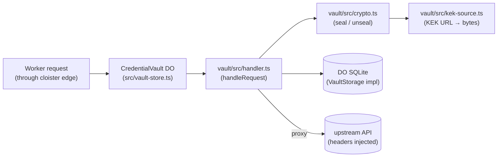

# `vault/` — sealed credential vault library

The vault library that backs cloister's `CredentialVault` Durable
Object. Stores third-party API keys (encrypted with AES-GCM envelope
encryption), proxies outbound requests with identity-scoped access
checks, and never lets plaintext credentials surface in pipelines or
prompts. The library is substrate-free: a thin `VaultStorage` interface
in front of the algorithms, so unit tests use in-memory storage and the
production DO (`src/vault-store.ts`) uses DO SQLite.

This directory was lifted from
[`notme`](https://github.com/agentic-research/notme) on **2026-05-09**
under the original Apache-2.0 license, then re-licensed AGPL-3.0-or-later
to match the rest of cloister. See [NOTICE](NOTICE) for the attribution
required by Apache 2.0 §4(c) and the divergence plan tracked in
`cloister-9ad9eb` / `notme-9af5dd`.

## Files

| File | Responsibility |
|------|----------------|
| `NOTICE` | Apache 2.0 §4(c) attribution + lift provenance + the AGPL re-licensing decision. |
| `src/vault.ts` | CRUD + access logic: get/store/delete credentials, `checkAccess` sub-glob matcher, request building, error envelopes. Storage-agnostic (takes a `VaultStorage`). |
| `src/crypto.ts` | AES-256-GCM envelope encryption. KEK (key-encryption-key) wraps a per-credential DEK (data-encryption-key). Pure Web Crypto — no npm deps. |
| `src/handler.ts` | HTTP request handler: routes `GET /:service`, `PUT /:service`, `DELETE /:service`, `GET /admin/services` to the right vault op with identity + admin gating. |
| `src/kek-source.ts` | Pluggable KEK resolution. Accepts URL-driven sources: `env://NAME`, `file:///path`, `http://helper/...`, `keychain://...`. See ADR-0014. |
| `src/__tests__/` | Vitest suites — vault.test (core CRUD + access), encryption.test (crypto primitives), vault-security.test (privilege boundary), vault-adversarial.test (active-attack scenarios), kek-source.test (URL dispatch). |

## How it's wired in

The library never opens its own network sockets or files. The DO
provides storage; the kek-helper sidecar (or an env binding) provides
the KEK material. See `scripts/kek-helper.mjs` for the macOS-Keychain
sidecar implementation.

## Decisions

- **Why the vault library is its own dir, not under `src/`** — lifted
  from notme as a unit, retains its own NOTICE + license boundary, and
  may diverge or re-merge as the upstream evolves. See `NOTICE`.
- **Why pluggable KEK source** —
  [ADR-0014](../docs/adr/0014-pluggable-kek-source.md). The plaintext
  `VAULT_KEK_SECRET` binding was a footgun on macOS; the URL indirection
  lets operators wire OS keystores without forking the DO.
- **Why the vault is a bundle, not a flat env binding** —
  [ADR-0010](../docs/adr/0010-vault-and-bundle-clusters.md) (manifest
  side, Proposed) and
  [ADR-0013](../docs/adr/0013-slice-grant-enforcement.md) (enforcement,
  Accepted). The vault is the canonical demonstration of slice-grant
  enforcement at the V8-isolate boundary.
- **Threat boundary** — credential exfiltration scenarios are catalogued
  in [`docs/security/threat-model.md`](../docs/security/threat-model.md)
  (§7 vault layer + §11 row table). Multi-bundle isolation invariants
  are exercised by `test/vault/multi-tenant-isolation.test.ts`.
