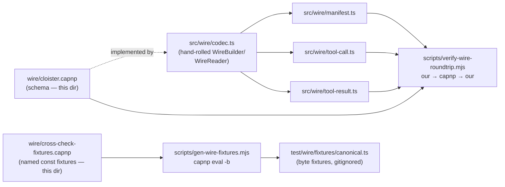

# `wire/` — Cap'n Proto schemas for the cloister↔companion wire

This directory holds the **wire-format schemas** for cloister's
internal communication seam (cloister↔companion) and for substrate-
equivalence test fixtures.

## Files

- `cloister.capnp` — production wire schema. Defines `Manifest`,
  `ToolCall`, `ToolResult`, `Content`, `BinaryContent`. Schema is
  shared with the leyline-net definition that cloister-companion
  emits on its backend face.
- `cross-check-fixtures.capnp` — named const fixtures (canonical and
  edge cases) used to prove byte-level interop between our hand-rolled
  codec and the official capnp CLI.

## What's actually used at runtime

Per [ADR-0005's 2026-04-30 amendment](../docs/adr/0005-internal-wire-leyline-net.md#amendment-2026-04-30--cloistercompanion-is-ipc-not-network-wire):

- **cloister↔companion (IPC, loopback HTTP):** plain `ToolCall` +
  `ToolResult` only. No `Manifest` envelope, no AEAD.
  `src/manifest/backends/leyline-net.ts` POSTs `encodeToolCall(...)`
  with `Content-Type: application/x-capnp; type=ToolCall`.
- **companion↔backend (real network wire):** the full leyline-net
  framing — signed `Manifest` + AEAD-wrapped capnp payload.
  Companion-side; not implemented in this repo.

The `Manifest` codec at `src/wire/manifest.ts` exists, is fully
tested, and is **dead code in cloister production** — kept as the
publicly-shared schema definition so cloister-companion (Rust) can
emit the same struct on its backend face.

## Relationship to `src/wire/`

## Encoding profile

cloister requires **canonical** Cap'n Proto encoding per
[encoding.html § Canonicalization](https://capnproto.org/encoding.html#canonicalization):
single segment, unpacked, composite-list size code 7 for List(struct),
trailing-zero truncation. The decoder rejects multi-segment input
loudly. Read the schema file's header comment for the full rationale.

## Why a hand-rolled codec

Documented in `cloister.capnp:34-46` and ADR-0005:

- `capnp-ts` (npm) is dormant since 2021.
- `capnp-es` (the maintained alternative) is a single-maintainer fork.
- The schema is bounded (5 structs, no parameterized generics, no
  unbounded lists) — ~600 LOC of careful TS gives us encode + decode
  with zero npm deps and exact byte control.
- Substrate equivalence is proven both directions:
  - **Direction 1** (capnp emits, we decode): `test/wire/cross-check.test.ts`
  - **Direction 2** (we emit, capnp decodes): `scripts/verify-wire-roundtrip.mjs`

## When to edit

Add a new wire struct/field here, then update the matching `src/wire/`
codec module. Schema-evolution rules in the file header are quoted
from capnproto.org's "Evolving Your Protocol" guide — read them
before reordering ordinals.

## Decisions

- **Why this seam exists** — [ADR-0005](../docs/adr/0005-internal-wire-leyline-net.md)
  + the 2026-04-30 amendment that downgraded cloister↔companion to IPC
- **The hand-rolled codec choice** — `wire/cloister.capnp:34-46`,
  cross-checked 2026-05-09 (the npm registry survey there is dated)
- **The 12 fixtures and what each represents** — header of
  `cross-check-fixtures.capnp`
